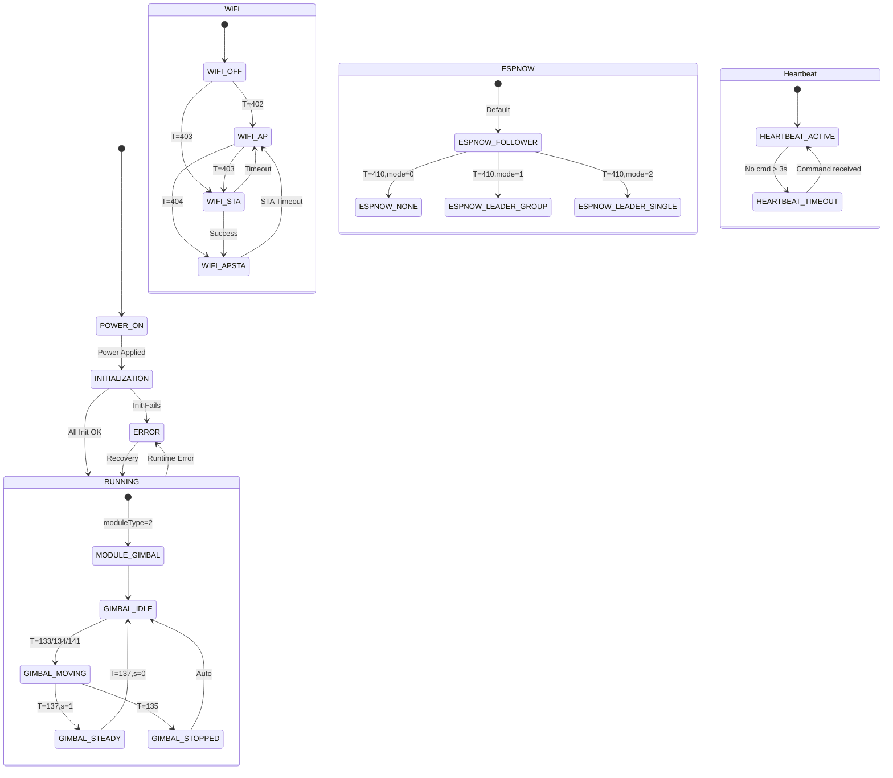

# ESP32 Pan-Tilt Program - Complete State Diagram

**Firmware Version:** 0.9  
**Date:** January 25, 2026

---

## Table of Contents

1. [Overview](#overview)
2. [Main System State Machine](#main-system-state-machine)
3. [Module Type State Machine](#module-type-state-machine)
4. [WiFi State Machine](#wifi-state-machine)
5. [ESP-NOW State Machine](#esp-now-state-machine)
6. [Gimbal Control State Machine](#gimbal-control-state-machine)
7. [Servo Communication State Machine](#servo-communication-state-machine)
8. [Feedback State Machine](#feedback-state-machine)
9. [Heartbeat State Machine](#heartbeat-state-machine)
10. [Mission State Machine](#mission-state-machine)
11. [Complete State Diagram](#complete-state-diagram)

---

## Overview

The ESP32 pan-tilt program operates as a multi-state system with several concurrent state machines managing different aspects of the system:

- **System Lifecycle**: Power-on, initialization, running, error states
- **Module Type**: None, RoArm-M2, Gimbal/Pan-Tilt
- **WiFi**: OFF, AP, STA, AP+STA, Error
- **ESP-NOW**: None, Leader (Group/Single), Follower
- **Gimbal Control**: Idle, Moving, Steady Mode, Stopped
- **Servo Communication**: Connected, Disconnected
- **Feedback**: Enabled, Disabled
- **Heartbeat**: Active, Timeout
- **Mission**: Idle, Playing, Aborted

---

## Main System State Machine

### States

```
┌─────────────┐
│  POWER_ON   │  Initial state on power-up
└──────┬──────┘
       │
       ▼
┌─────────────┐
│INITIALIZATION│  setup() function executing
└──────┬──────┘
       │
       ├─► Serial Init
       ├─► I2C Init
       ├─► Battery Monitor Init
       ├─► Module Config
       ├─► OLED Init
       ├─► IMU Init
       ├─► LED Init
       ├─► LittleFS Init
       ├─► Motion Pins Init
       ├─► Servo Init
       ├─► Servo Status Check
       ├─► WiFi Init
       ├─► HTTP Server Init
       ├─► ESP-NOW Init
       ├─► Encoder Init
       ├─► PID Init
       └─► Boot Mission Execute
       │
       ▼
┌─────────────┐
│   RUNNING   │  loop() function executing continuously
└──────┬──────┘
       │
       ├─► serialCtrl()
       ├─► server.handleClient()
       ├─► moduleType_Gimbal() or moduleType_RoArmM2()
       ├─► jsonCmdReceiveHandler()
       ├─► Motor PID Control
       ├─► OLED Update
       ├─► IMU Update
       ├─► Base Feedback
       └─► Heartbeat Control
       │
       ▼
┌─────────────┐
│    ERROR    │  Error state (recovery or restart)
└─────────────┘
```

### State Variables

- **System State**: Implicit (POWER_ON → INITIALIZATION → RUNNING)
- **Error State**: Detected by error flags (servo communication failures, WiFi timeouts)

### Transitions

| From State | To State | Trigger | Condition |
|------------|----------|---------|-----------|
| POWER_ON | INITIALIZATION | Power applied | Always |
| INITIALIZATION | RUNNING | setup() completes | All init succeeds |
| INITIALIZATION | ERROR | Init failure | Any critical init fails |
| RUNNING | ERROR | Runtime error | Servo comm failure, WiFi timeout |
| ERROR | RUNNING | Recovery | Manual recovery or restart |

---

## Module Type State Machine

### States

```
┌──────────────┐
│ MODULE_NONE  │  moduleType = 0
│   (Base)     │
└──────────────┘

┌──────────────┐
│ MODULE_ROARM │  moduleType = 1
│   (Robot     │
│    Arm)      │
└──────────────┘

┌──────────────┐
│ MODULE_GIMBAL│  moduleType = 2 (CURRENT)
│  (Pan-Tilt)  │
└──────────────┘
```

### State Variables

- **moduleType**: byte (0=None, 1=RoArm, 2=Gimbal)
- **mainType**: byte (1=WAVE ROVER, 2=UGV02, 3=UGV01)

### Transitions

| From State | To State | Trigger | Command |
|------------|----------|---------|---------|
| MODULE_NONE | MODULE_ROARM | Change module type | T=486, cmd=1 |
| MODULE_NONE | MODULE_GIMBAL | Change module type | T=486, cmd=2 |
| MODULE_ROARM | MODULE_GIMBAL | Change module type | T=486, cmd=2 |
| MODULE_GIMBAL | MODULE_ROARM | Change module type | T=486, cmd=1 |
| MODULE_GIMBAL | MODULE_NONE | Change module type | T=486, cmd=0 |

### State Behavior

**MODULE_GIMBAL (Current):**
- Executes `moduleType_Gimbal()` in loop
- Calls `getGimbalFeedback()` every loop
- Calls `gimbalSteady()` if steady mode enabled

**MODULE_ROARM:**
- Executes `moduleType_RoArmM2()` in loop
- Handles ESP-NOW flow control
- Provides robot arm control

---

## WiFi State Machine

### States

```
┌──────────────┐
│  WIFI_OFF    │  WIFI_CURRENT_MODE = 0
│              │  WiFi disabled
└──────┬───────┘
       │
       ├─► T=402 (Set AP)
       │
       ▼
┌──────────────┐
│   WIFI_AP    │  WIFI_CURRENT_MODE = 1
│              │  Access Point mode
│              │  Creates hotspot
└──────┬───────┘
       │
       ├─► T=403 (Set STA)
       │
       ▼
┌──────────────┐
│   WIFI_STA   │  WIFI_CURRENT_MODE = 2
│              │  Station mode
│              │  Connects to WiFi
└──────┬───────┘
       │
       ├─► Connection timeout
       │
       ▼
┌──────────────┐
│ WIFI_APSTA   │  WIFI_CURRENT_MODE = 3
│              │  AP + Station mode
│              │  Both active
└──────┬───────┘
       │
       ├─► Connection timeout
       │
       ▼
┌──────────────┐
│ WIFI_ERROR   │  WIFI_CURRENT_MODE = -1
│              │  Connection failed
└──────┬───────┘
       │
       └─► Falls back to AP mode
```

### State Variables

- **WIFI_CURRENT_MODE**: byte (-1=Error, 0=OFF, 1=AP, 2=STA, 3=AP+STA)
- **WIFI_MODE_ON_BOOT**: byte (0=OFF, 1=AP, 2=STA, 3=AP+STA)
- **connectionStartTime**: unsigned long
- **connectionTimeout**: unsigned long (15000ms default)

### Transitions

| From State | To State | Trigger | Condition |
|------------|----------|---------|-----------|
| WIFI_OFF | WIFI_AP | T=402 (Set AP) | Always |
| WIFI_OFF | WIFI_STA | T=403 (Set STA) | Always |
| WIFI_OFF | WIFI_APSTA | T=404 (Set AP+STA) | Always |
| WIFI_AP | WIFI_STA | T=403 (Set STA) | Always |
| WIFI_AP | WIFI_APSTA | T=404 (Set AP+STA) | Always |
| WIFI_STA | WIFI_AP | Connection timeout | Timeout > 15s |
| WIFI_STA | WIFI_APSTA | Connection success | Auto if first connection |
| WIFI_APSTA | WIFI_AP | STA timeout | Timeout > 15s |
| WIFI_STA | WIFI_ERROR | Connection timeout | Timeout > 15s |
| WIFI_APSTA | WIFI_ERROR | STA timeout | Timeout > 15s |
| WIFI_ERROR | WIFI_AP | Auto fallback | Always |

### State Behavior

**WIFI_AP:**
- Creates hotspot with SSID/password
- IP: 192.168.4.1
- OLED shows: "AP:<ssid>"

**WIFI_STA:**
- Connects to specified WiFi network
- Timeout: 15 seconds
- OLED shows: "ST:<IP_address>"

**WIFI_APSTA:**
- Both AP and STA active simultaneously
- AP: 192.168.4.1
- STA: Gets IP from router
- OLED shows both

**WIFI_ERROR:**
- Connection failed
- Automatically falls back to AP mode

---

## ESP-NOW State Machine

### States

```
┌──────────────┐
│ ESPNOW_NONE  │  espNowMode = 0
│              │  ESP-NOW disabled
└──────┬───────┘
       │
       ├─► T=410, mode=1
       │
       ▼
┌──────────────┐
│ESPNOW_LEADER │  espNowMode = 1
│   (GROUP)    │  Flow-leader (group)
│              │  Broadcasts to all
└──────┬───────┘
       │
       ├─► T=410, mode=2
       │
       ▼
┌──────────────┐
│ESPNOW_LEADER │  espNowMode = 2
│  (SINGLE)    │  Flow-leader (single)
│              │  Sends to one follower
└──────┬───────┘
       │
       ├─► T=410, mode=3
       │
       ▼
┌──────────────┐
│ESPNOW_FOLLOWER│ espNowMode = 3 (DEFAULT)
│              │  Receives commands
└──────┬───────┘
       │
       └─► T=410, mode=0
```

### State Variables

- **espNowMode**: byte (0=None, 1=Leader Group, 2=Leader Single, 3=Follower)
- **ctrlByBroadcast**: bool (allow broadcast control)
- **mac_whitelist_broadcast**: uint8_t[6] (whitelist MAC)

### Transitions

| From State | To State | Trigger | Command |
|------------|----------|---------|---------|
| ESPNOW_NONE | ESPNOW_LEADER_GROUP | Change mode | T=410, mode=1 |
| ESPNOW_NONE | ESPNOW_LEADER_SINGLE | Change mode | T=410, mode=2 |
| ESPNOW_NONE | ESPNOW_FOLLOWER | Change mode | T=410, mode=3 |
| ESPNOW_LEADER_GROUP | ESPNOW_FOLLOWER | Change mode | T=410, mode=3 |
| ESPNOW_LEADER_SINGLE | ESPNOW_FOLLOWER | Change mode | T=410, mode=3 |
| ESPNOW_FOLLOWER | ESPNOW_NONE | Change mode | T=410, mode=0 |

### State Behavior

**ESPNOW_FOLLOWER (Default):**
- Receives ESP-NOW messages
- Processes commands in `OnDataRecv()` callback
- Only processes if `espNowMode == 3`
- Can filter by MAC whitelist

**ESPNOW_LEADER_GROUP:**
- Broadcasts to all devices (MAC: 0)
- Sends joint positions continuously
- Used for synchronized control

**ESPNOW_LEADER_SINGLE:**
- Sends to single follower device
- Sends joint positions continuously
- Used for master-slave control

---

## Gimbal Control State Machine

### States

```
┌──────────────┐
│ GIMBAL_IDLE  │  No active movement
│              │  steadyMode = false
└──────┬───────┘
       │
       ├─► T=133 (Simple Ctrl)
       ├─► T=134 (Move Ctrl)
       ├─► T=141 (User Ctrl)
       │
       ▼
┌──────────────┐
│GIMBAL_MOVING │  Servo moving to position
│              │  steadyMode = false
└──────┬───────┘
       │
       ├─► Movement complete
       ├─► T=135 (Stop)
       ├─► T=137, s=1 (Enable Steady)
       │
       ▼
┌──────────────┐
│GIMBAL_STEADY │  IMU stabilization active
│    MODE      │  steadyMode = true
└──────┬───────┘
       │
       ├─► T=137, s=0 (Disable Steady)
       │
       ▼
┌──────────────┐
│GIMBAL_STOPPED│  Emergency stop
│              │  Torque disabled
└──────┬───────┘
       │
       └─► Torque re-enabled
```

### State Variables

- **steadyMode**: bool (false=disabled, true=enabled)
- **steadyGoalY**: float (target Y angle for steady mode)
- **gimbalPos[2]**: s16 (target positions)
- **gimbalFeedback[2]**: ServoFeedback (current positions)

### Transitions

| From State | To State | Trigger | Command |
|------------|----------|---------|---------|
| GIMBAL_IDLE | GIMBAL_MOVING | Position command | T=133, T=134, T=141 |
| GIMBAL_MOVING | GIMBAL_IDLE | Movement complete | Position reached |
| GIMBAL_MOVING | GIMBAL_STEADY | Enable steady mode | T=137, s=1 |
| GIMBAL_MOVING | GIMBAL_STOPPED | Emergency stop | T=135 |
| GIMBAL_STEADY | GIMBAL_IDLE | Disable steady mode | T=137, s=0 |
| GIMBAL_STOPPED | GIMBAL_IDLE | Torque re-enabled | Auto after 3ms |

### State Behavior

**GIMBAL_IDLE:**
- No active movement
- Servos maintain current position
- `gimbalSteady()` returns early if `steadyMode == false`

**GIMBAL_MOVING:**
- Servos moving to commanded position
- `getGimbalFeedback()` reads current position
- Movement continues until position reached

**GIMBAL_STEADY:**
- IMU stabilization active
- `gimbalSteady()` compensates for pitch angle
- Continuously adjusts tilt axis: `targetY = steadyGoalY - icm_pitch`
- Pan axis remains at 0

**GIMBAL_STOPPED:**
- Emergency stop executed
- Torque disabled for 3ms (SERVO_STOP_DELAY)
- Torque re-enabled automatically

---

## Servo Communication State Machine

### States

```
┌──────────────┐
│SERVO_CONNECTED│  gimbalFeedback[].status = true
│              │  Communication OK
└──────┬───────┘
       │
       ├─► Communication failure
       │
       ▼
┌──────────────┐
│SERVO_DISCONN │  gimbalFeedback[].status = false
│   ECTED      │  No response from servo
└──────┬───────┘
       │
       └─► Communication restored
```

### State Variables

- **gimbalFeedback[0].status**: bool (PAN servo)
- **gimbalFeedback[1].status**: bool (TILT servo)
- **RoArmM2_initCheckSucceed**: bool (initialization check)

### Transitions

| From State | To State | Trigger | Condition |
|------------|----------|---------|-----------|
| SERVO_CONNECTED | SERVO_DISCONNECTED | Communication failure | `st.FeedBack() == -1` |
| SERVO_DISCONNECTED | SERVO_CONNECTED | Communication restored | `st.FeedBack() != -1` |

### State Behavior

**SERVO_CONNECTED:**
- Servo responds to commands
- Feedback data valid
- Position, speed, load, voltage, current, temperature readable

**SERVO_DISCONNECTED:**
- Servo doesn't respond
- `status = false` set
- Error JSON sent: `{"T":1005,"id":X,"status":0}`
- No retry mechanism (single attempt)

---

## Feedback State Machine

### States

```
┌──────────────┐
│FEEDBACK_ENABLED│ baseFeedbackFlow = true
│              │  Sends periodic feedback
└──────┬───────┘
       │
       ├─► T=131, cmd=0
       │
       ▼
┌──────────────┐
│FEEDBACK_DISABLED│ baseFeedbackFlow = false
│              │  No periodic feedback
└──────┬───────┘
       │
       └─► T=131, cmd=1
```

### State Variables

- **baseFeedbackFlow**: bool (true=enabled, false=disabled)
- **feedbackFlowExtraDelay**: int (delay between feedback messages, default 100ms)

### Transitions

| From State | To State | Trigger | Command |
|------------|----------|---------|---------|
| FEEDBACK_ENABLED | FEEDBACK_DISABLED | Disable feedback | T=131, cmd=0 |
| FEEDBACK_DISABLED | FEEDBACK_ENABLED | Enable feedback | T=131, cmd=1 |

### State Behavior

**FEEDBACK_ENABLED (Default):**
- Calls `baseInfoFeedback()` in loop
- Sends JSON with:
  - Pan/Tilt angles
  - IMU data (roll, pitch, yaw)
  - Battery voltage
  - Servo status
- Rate controlled by `feedbackFlowExtraDelay`

**FEEDBACK_DISABLED:**
- `baseInfoFeedback()` not called
- No periodic status updates
- Still responds to T=130 (get feedback once)

---

## Heartbeat State Machine

### States

```
┌──────────────┐
│HEARTBEAT_ACTIVE│ heartbeatStopFlag = false
│              │  Commands received recently
└──────┬───────┘
       │
       ├─► No command for HEART_BEAT_DELAY
       │
       ▼
┌──────────────┐
│HEARTBEAT_TIMEOUT│ heartbeatStopFlag = true
│              │  Motors stopped
└──────┬───────┘
       │
       └─► Command received
```

### State Variables

- **heartbeatStopFlag**: bool (false=active, true=timeout)
- **lastCmdRecvTime**: unsigned long (last command timestamp)
- **HEART_BEAT_DELAY**: int (timeout duration, default 3000ms)

### Transitions

| From State | To State | Trigger | Condition |
|------------|----------|---------|-----------|
| HEARTBEAT_ACTIVE | HEARTBEAT_TIMEOUT | Timeout | `millis() - lastCmdRecvTime > HEART_BEAT_DELAY` |
| HEARTBEAT_TIMEOUT | HEARTBEAT_ACTIVE | Command received | Any command (T=1, T=11, T=13, etc.) |

### State Behavior

**HEARTBEAT_ACTIVE:**
- Commands received within timeout period
- Motors operate normally
- `heartbeatStopFlag = false`
- `lastCmdRecvTime` updated on each command

**HEARTBEAT_TIMEOUT:**
- No commands received for > 3 seconds (default)
- `heartbeatStopFlag = true`
- Motors stopped: `setGoalSpeed(0, 0)`
- Safety feature to prevent runaway

**Commands that reset heartbeat:**
- T=1 (Speed Control)
- T=11 (PWM Input)
- T=13 (ROS Control)
- Any motor control command

---

## Mission State Machine

### States

```
┌──────────────┐
│MISSION_IDLE  │  No mission running
└──────┬───────┘
       │
       ├─► missionPlay()
       │
       ▼
┌──────────────┐
│MISSION_PLAYING│ Executing mission steps
│              │  Looping through steps
└──────┬───────┘
       │
       ├─► Mission complete
       ├─► Serial input received
       │
       ▼
┌──────────────┐
│MISSION_ABORTED│ Mission stopped
│              │  Aborted by user
└──────┬───────┘
       │
       └─► Returns to IDLE
```

### State Variables

- **Mission state**: Implicit (function call state)
- **currentTimes**: int (current repeat count)
- **repeatTimes**: int (-1 = infinite loop)

### Transitions

| From State | To State | Trigger | Condition |
|------------|----------|---------|-----------|
| MISSION_IDLE | MISSION_PLAYING | Start mission | `missionPlay(name, repeats)` |
| MISSION_PLAYING | MISSION_IDLE | Mission complete | All steps executed, repeats done |
| MISSION_PLAYING | MISSION_ABORTED | Serial input | `serialMissionAbort() == true` |
| MISSION_ABORTED | MISSION_IDLE | Function returns | Always |

### State Behavior

**MISSION_IDLE:**
- No mission executing
- System in normal operation

**MISSION_PLAYING:**
- Executing mission file steps sequentially
- Each step is a JSON command
- Can repeat N times or infinite (-1)
- Checks for abort condition each step

**MISSION_ABORTED:**
- Mission stopped by serial input
- Returns to normal operation
- No cleanup needed

**Boot Mission:**
- Automatically executed in `setup()`
- Name: "boot"
- Created if doesn't exist
- Executes once on startup

---

## Complete State Diagram

### Hierarchical State Diagram

```
┌─────────────────────────────────────────────────────────────┐
│                    SYSTEM LEVEL                             │
│  ┌──────────┐    ┌──────────┐    ┌──────────┐             │
│  │ POWER_ON │───►│   INIT   │───►│ RUNNING  │             │
│  └──────────┘    └──────────┘    └────┬─────┘             │
│                                         │                    │
│  ┌─────────────────────────────────────┼──────────────────┐ │
│  │         MODULE TYPE (moduleType)     │                  │ │
│  │  ┌──────────┐  ┌──────────┐  ┌──────▼────┐            │ │
│  │  │  NONE(0) │  │ ROARM(1) │  │ GIMBAL(2) │            │ │
│  │  └──────────┘  └──────────┘  └───────────┘            │ │
│  └───────────────────────────────────────────────────────┘ │
│                                                              │
│  ┌─────────────────────────────────────────────────────────┐ │
│  │         WIFI (WIFI_CURRENT_MODE)                       │ │
│  │  ┌──────┐  ┌──────┐  ┌──────┐  ┌──────┐  ┌──────┐    │ │
│  │  │ OFF  │─►│  AP  │─►│ STA  │─►│AP+STA│  │ERROR │    │ │
│  │  │ (0)  │  │ (1)  │  │ (2)  │  │ (3)  │  │ (-1) │    │ │
│  │  └──────┘  └──────┘  └──────┘  └──────┘  └──────┘    │ │
│  └─────────────────────────────────────────────────────────┘ │
│                                                              │
│  ┌─────────────────────────────────────────────────────────┐ │
│  │         ESP-NOW (espNowMode)                            │ │
│  │  ┌──────┐  ┌──────────┐  ┌──────────┐  ┌──────────┐  │ │
│  │  │ NONE │─►│ LEADER_G │─►│ LEADER_S │─►│ FOLLOWER │  │ │
│  │  │ (0)  │  │   (1)     │  │   (2)     │  │   (3)     │  │ │
│  │  └──────┘  └──────────┘  └──────────┘  └──────────┘  │ │
│  └─────────────────────────────────────────────────────────┘ │
│                                                              │
│  ┌─────────────────────────────────────────────────────────┐ │
│  │         GIMBAL CONTROL (if moduleType=2)               │ │
│  │  ┌──────────┐  ┌──────────┐  ┌──────────┐  ┌────────┐│ │
│  │  │   IDLE   │─►│  MOVING  │─►│  STEADY   │  │ STOPPED││ │
│  │  │          │  │          │   MODE    │  │        ││ │
│  │  └──────────┘  └──────────┘  └──────────┘  └────────┘│ │
│  └─────────────────────────────────────────────────────────┘ │
│                                                              │
│  ┌─────────────────────────────────────────────────────────┐ │
│  │         SERVO COMMUNICATION                             │ │
│  │  ┌──────────┐  ┌──────────┐                           │ │
│  │  │ CONNECTED│◄─►│DISCONNECTED│                         │ │
│  │  └──────────┘  └──────────┘                           │ │
│  └─────────────────────────────────────────────────────────┘ │
│                                                              │
│  ┌─────────────────────────────────────────────────────────┐ │
│  │         FEEDBACK                                        │ │
│  │  ┌──────────┐  ┌──────────┐                           │ │
│  │  │ ENABLED  │◄─►│ DISABLED │                           │ │
│  │  └──────────┘  └──────────┘                           │ │
│  └─────────────────────────────────────────────────────────┘ │
│                                                              │
│  ┌─────────────────────────────────────────────────────────┐ │
│  │         HEARTBEAT                                       │ │
│  │  ┌──────────┐  ┌──────────┐                           │ │
│  │  │  ACTIVE  │─►│ TIMEOUT  │                           │ │
│  │  └──────────┘  └──────────┘                           │ │
│  └─────────────────────────────────────────────────────────┘ │
│                                                              │
│  ┌─────────────────────────────────────────────────────────┐ │
│  │         MISSION                                         │ │
│  │  ┌──────────┐  ┌──────────┐  ┌──────────┐            │ │
│  │  │   IDLE   │─►│ PLAYING  │─►│ ABORTED  │            │ │
│  │  └──────────┘  └──────────┘  └──────────┘            │ │
│  └─────────────────────────────────────────────────────────┘ │
└──────────────────────────────────────────────────────────────┘
```

### State Variable Summary

| Variable | Type | Values | Default | Location |
|----------|------|--------|---------|----------|
| **moduleType** | byte | 0=None, 1=RoArm, 2=Gimbal | 2 | `ugv_config.h` |
| **mainType** | byte | 1=WAVE ROVER, 2=UGV02, 3=UGV01 | 1 | `ugv_config.h` |
| **WIFI_CURRENT_MODE** | byte | -1=Error, 0=OFF, 1=AP, 2=STA, 3=AP+STA | -1 | `wifi_ctrl.h` |
| **WIFI_MODE_ON_BOOT** | byte | 0=OFF, 1=AP, 2=STA, 3=AP+STA | 1 | `wifi_ctrl.h` |
| **espNowMode** | byte | 0=None, 1=Leader G, 2=Leader S, 3=Follower | 3 | `ugv_config.h` |
| **steadyMode** | bool | false, true | false | `ugv_config.h` |
| **baseFeedbackFlow** | bool | false, true | true | `ugv_config.h` |
| **heartbeatStopFlag** | bool | false, true | false | `movtion_module.h` |
| **RoArmM2_initCheckSucceed** | bool | false, true | false | `ugv_config.h` |
| **gimbalFeedback[].status** | bool | false, true | - | `gimbal_module.h` |

### State Transition Matrix

| Current State | Event/Command | Next State | Action |
|---------------|---------------|------------|--------|
| **System** |
| POWER_ON | Power applied | INITIALIZATION | Start setup() |
| INITIALIZATION | All init OK | RUNNING | Start loop() |
| INITIALIZATION | Init fails | ERROR | Log error |
| **Module Type** |
| MODULE_GIMBAL | T=486, cmd=1 | MODULE_ROARM | Change moduleType |
| MODULE_GIMBAL | T=486, cmd=0 | MODULE_NONE | Change moduleType |
| **WiFi** |
| WIFI_OFF | T=402 | WIFI_AP | wifiModeAP() |
| WIFI_AP | T=403 | WIFI_STA | wifiModeSTA() |
| WIFI_STA | Timeout > 15s | WIFI_AP | Fallback to AP |
| WIFI_STA | Connection OK | WIFI_APSTA | Auto if first connection |
| **ESP-NOW** |
| ESPNOW_FOLLOWER | T=410, mode=1 | ESPNOW_LEADER_GROUP | changeEspNowMode(1) |
| ESPNOW_FOLLOWER | T=410, mode=0 | ESPNOW_NONE | changeEspNowMode(0) |
| **Gimbal** |
| GIMBAL_IDLE | T=133/134/141 | GIMBAL_MOVING | gimbalCtrlSimple/Move/UserCtrl |
| GIMBAL_MOVING | T=137, s=1 | GIMBAL_STEADY | gimbalSteadySet(true) |
| GIMBAL_STEADY | T=137, s=0 | GIMBAL_IDLE | gimbalSteadySet(false) |
| GIMBAL_MOVING | T=135 | GIMBAL_STOPPED | gimbalCtrlStop() |
| **Servo** |
| SERVO_CONNECTED | st.FeedBack() == -1 | SERVO_DISCONNECTED | Set status=false |
| SERVO_DISCONNECTED | st.FeedBack() != -1 | SERVO_CONNECTED | Set status=true |
| **Feedback** |
| FEEDBACK_ENABLED | T=131, cmd=0 | FEEDBACK_DISABLED | baseFeedbackFlow=false |
| FEEDBACK_DISABLED | T=131, cmd=1 | FEEDBACK_ENABLED | baseFeedbackFlow=true |
| **Heartbeat** |
| HEARTBEAT_ACTIVE | Timeout > 3s | HEARTBEAT_TIMEOUT | setGoalSpeed(0,0) |
| HEARTBEAT_TIMEOUT | Any command | HEARTBEAT_ACTIVE | Reset lastCmdRecvTime |
| **Mission** |
| MISSION_IDLE | missionPlay() | MISSION_PLAYING | Start execution |
| MISSION_PLAYING | Serial input | MISSION_ABORTED | serialMissionAbort() |
| MISSION_PLAYING | Steps complete | MISSION_IDLE | Return from function |

---

## State Diagram Visualization (Mermaid Format)



---

## Key State Interactions

### Concurrent State Machines

The system runs multiple state machines concurrently:

1. **System Lifecycle** - Always active
2. **Module Type** - Determines which control loop runs
3. **WiFi** - Independent network state
4. **ESP-NOW** - Independent wireless state
5. **Gimbal Control** - Active when moduleType=2
6. **Servo Communication** - Monitored continuously
7. **Feedback** - Periodic status updates
8. **Heartbeat** - Safety timeout monitoring
9. **Mission** - Optional automation

### State Dependencies

- **Gimbal Control** requires `moduleType == 2`
- **Steady Mode** requires `steadyMode == true` AND `moduleType == 2`
- **ESP-NOW Follower** only processes messages when `espNowMode == 3`
- **WiFi AP+STA** requires both AP and STA to be configured
- **Heartbeat** affects motor control (stops on timeout)
- **Servo Communication** affects gimbal control (no movement if disconnected)

### State Persistence

**Persistent States** (stored in flash):
- `WIFI_MODE_ON_BOOT` - Saved in `wifiConfig.json`
- WiFi credentials - Saved in `wifiConfig.json`
- Device configuration - Saved in `devConfig.json`

**Non-Persistent States** (reset on reboot):
- `steadyMode` - Resets to false
- `espNowMode` - Resets to 3 (Follower)
- `baseFeedbackFlow` - Resets to true
- `heartbeatStopFlag` - Resets to false
- Servo communication status - Rechecked on init

---

## State Monitoring

### How to Check Current States

**Via Serial Commands:**
- T=130: Get base feedback (shows all states)
- T=405: Get WiFi status
- T=126: Get IMU data
- T=1005: Servo feedback (status field)

**Via OLED Display:**
- Line 0: WiFi AP SSID or "AP: OFF"
- Line 1: WiFi STA IP or "ST: OFF"
- Line 2: Module status
- Line 3: ESP-NOW mode or battery voltage

**Via HTTP:**
- GET `/js?{"T":130}` - Get all status
- GET `/js?{"T":405}` - Get WiFi status

---

## State Error Handling

### Error States

1. **WIFI_ERROR** (WIFI_CURRENT_MODE = -1)
   - Trigger: Connection timeout
   - Recovery: Auto fallback to AP mode

2. **SERVO_DISCONNECTED** (status = false)
   - Trigger: Communication failure
   - Recovery: Manual (check connections, power)

3. **HEARTBEAT_TIMEOUT**
   - Trigger: No commands for > 3s
   - Recovery: Send any command to reset

4. **MISSION_ABORTED**
   - Trigger: Serial input during mission
   - Recovery: Automatic (returns to normal operation)

### Error Recovery

Most errors are recoverable:
- WiFi errors: Auto fallback
- Heartbeat timeout: Reset on command
- Mission abort: Automatic return
- Servo disconnect: Requires hardware check

---

## IMU Sensor System Details

### Overview

The ESP32 pan-tilt system uses a **9-DOF (Degrees of Freedom) IMU sensor system** consisting of two integrated sensors that work together to provide orientation data for gimbal stabilization:

1. **QMI8658** - 6-axis motion sensor (3-axis accelerometer + 3-axis gyroscope)
2. **AK09918** - 3-axis magnetometer

Together, these sensors provide complete 9-DOF motion sensing for accurate orientation tracking.

---

### Hardware Specifications

#### QMI8658 (6-Axis IMU)

- **Type**: 6-axis motion sensor
- **Sensors**: 
  - 3-axis accelerometer (measures linear acceleration)
  - 3-axis gyroscope (measures angular velocity)
- **I2C Address**: `0x6B` (fixed)
- **Communication**: I2C bus
- **Data Output**:
  - Accelerometer: X, Y, Z axes (m/s²)
  - Gyroscope: X, Y, Z axes (rad/s or degrees/s)
  - Temperature sensor

**Key Features:**
- Configurable acceleration range
- Configurable gyroscope range
- Configurable output data rate (ODR)
- Low-pass filter (LPF) support
- Self-test capability
- On-demand calibration

#### AK09918 (3-Axis Magnetometer)

- **Type**: 3-axis magnetometer (compass)
- **Sensors**: 3-axis magnetic field sensor
- **I2C Address**: `0x0C` (fixed, cannot be changed)
- **Communication**: I2C bus
- **Data Output**: X, Y, Z axes (magnetic field in microtesla, uT)

**Operating Modes:**
- Power-down mode
- Single measurement mode
- Continuous measurement modes:
  - 10 Hz
  - 20 Hz
  - 50 Hz
  - **100 Hz** (used in this system)
- Self-test mode

**Data Status Flags:**
- `DRDY_BIT` (0x01): Data ready
- `DOR_BIT` (0x02): Data overrun (data skipped)
- `HOFL_BIT` (0x08): Sensor overflow (|x|+|y|+|z| >= 4912uT)

---

### Initialization Process

The IMU initialization occurs during the `INITIALIZATION` state in `setup()`:

```cpp
void imu_init() {
    imuInit();
}
```

**Initialization Steps:**

1. **QMI8658 Initialization:**
   - I2C communication setup
   - Sensor configuration (acceleration range, gyroscope range, ODR)
   - Sensor enable
   - Returns 0 on success, non-zero on failure

2. **AK09918 Initialization:**
   - I2C communication setup
   - Device ID verification
   - Mode switch to `AK09918_CONTINUOUS_100HZ` (100 Hz continuous measurement)
   - Data ready check with retry mechanism (up to 10 retries)
   - If initialization fails, sensor is reset and retried

3. **AHRS Quaternion Initialization:**
   - Quaternion values initialized: `q0=1.0, q1=0.0, q2=0.0, q3=0.0`
   - This represents the initial orientation (no rotation)

**Error Handling:**
- If QMI8658 init fails: Prints "qmi8658_init fail"
- If AK09918 init fails: Prints "AK09918_init fail"
- Retry mechanism for magnetometer (up to 10 attempts with 100ms delays)
- System continues even if IMU init fails (non-critical for basic operation)

---

### Data Reading and Processing

#### Update Frequency

The IMU data is updated **every loop iteration** in the `RUNNING` state:

```cpp
void loop() {
    // ...
    updateIMUData();  // Called every loop
    // ...
}
```

**Typical Update Rate:**
- Loop frequency: ~100-200 Hz (depending on other operations)
- IMU read time: ~1-5ms per update (I2C communication overhead)
- Effective IMU update rate: Limited by I2C bus speed and processing time

#### Data Reading Process

**Function:** `updateIMUData()` in `IMU_ctrl.h`

**Process Flow:**

1. **Read Raw Sensor Data:**
   ```cpp
   imuDataGet(&stAngles, &stGyroRawData, &stAccelRawData, &stMagnRawData);
   ```

2. **Extract Accelerometer Data:**
   - `ax = stAccelRawData.X` (m/s²)
   - `ay = stAccelRawData.Y` (m/s²)
   - `az = stAccelRawData.Z` (m/s²)

3. **Extract Gyroscope Data:**
   - `gx = stGyroRawData.X` (rad/s)
   - `gy = stGyroRawData.Y` (rad/s)
   - `gz = stGyroRawData.Z` (rad/s)

4. **Extract Magnetometer Data:**
   - `mx = stMagnRawData.s16X` (uT, with offset compensation)
   - `my = stMagnRawData.s16Y` (uT, with offset compensation)
   - `mz = stMagnRawData.s16Z` (uT, with offset compensation)

5. **Extract Euler Angles:**
   - `icm_roll = stAngles.roll` (degrees)
   - `icm_pitch = stAngles.pitch` (degrees)
   - `icm_yaw = stAngles.yaw` (degrees)

#### AHRS Algorithm (Attitude and Heading Reference System)

The system uses a **quaternion-based AHRS fusion algorithm** to combine accelerometer, gyroscope, and magnetometer data:

**Algorithm:** `imuAHRSupdate()` in `IMU.cpp`

**Key Parameters:**
- **Kp = 4.50f**: Proportional gain (governs rate of convergence to accelerometer/magnetometer)
- **Ki = 1.0f**: Integral gain (governs rate of convergence of gyroscope biases)
- **halfT = 0.024f**: Half the sample period (24ms, corresponding to ~41.67 Hz update rate)

**Process:**

1. **Normalize Inputs:**
   - Accelerometer vector normalized
   - Magnetometer vector normalized

2. **Compute Reference Directions:**
   - Gravity vector (from accelerometer)
   - Magnetic flux vector (from magnetometer)

3. **Calculate Error Terms:**
   - Cross product between reference directions and measured directions
   - Error terms: `ex`, `ey`, `ez`

4. **Integrate Errors:**
   - Integral terms: `exInt`, `eyInt`, `ezInt`
   - Used to correct gyroscope bias drift

5. **Update Gyroscope Readings:**
   - Apply proportional and integral corrections
   - `gx = gx + Kp * ex + exInt`

6. **Update Quaternion:**
   - Quaternion integration using corrected gyroscope data
   - Normalize quaternion to maintain unit length

7. **Convert to Euler Angles:**
   ```cpp
   pitch = asin(-2 * q1 * q3 + 2 * q0 * q2) * 57.3;  // degrees
   roll = atan2(2 * q2 * q3 + 2 * q0 * q1, -2 * q1 * q1 - 2 * q2 * q2 + 1) * 57.3;  // degrees
   yaw = atan2(-2 * q1 * q2 - 2 * q0 * q3, 2 * q2 * q2 + 2 * q3 * q3 - 1) * 57.3;  // degrees
   ```

**Benefits:**
- Combines short-term accuracy of gyroscope with long-term stability of accelerometer/magnetometer
- Compensates for gyroscope drift
- Provides smooth, accurate orientation data

---

### IMU Data Usage in Gimbal Stabilization

#### Steady Mode (IMU Stabilization)

The IMU is primarily used for **gimbal stabilization** in "Steady Mode":

**Function:** `gimbalSteady(float inputBiasY)` in `gimbal_module.h`

**How It Works:**

1. **Check if Steady Mode is Enabled:**
   ```cpp
   if (!steadyMode) {
       return;  // Exit if steady mode disabled
   }
   ```

2. **Calculate Compensated Tilt Angle:**
   ```cpp
   float targetY = inputBiasY - icm_pitch;
   ```
   - `inputBiasY`: Desired tilt angle (user-set goal)
   - `icm_pitch`: Current pitch angle from IMU (platform tilt)
   - `targetY`: Compensated tilt angle (maintains camera level despite platform movement)

3. **Apply Compensation:**
   ```cpp
   gimbalCtrlSimple(0, inputBiasY - icm_pitch, 0, 0);
   ```
   - Pan axis: 0 (not compensated)
   - Tilt axis: Compensated for pitch
   - Continuously adjusts tilt servo to counteract platform pitch

**Example:**
- User sets `steadyGoalY = 10°` (camera tilted 10° down)
- Platform pitches forward by `icm_pitch = 5°`
- System calculates: `targetY = 10° - 5° = 5°`
- Tilt servo moves to maintain the 10° relative angle despite platform movement

**State Integration:**
- Steady mode is part of the **GIMBAL_STEADY** state
- Activated via command: `T=137, s=1` (enable steady mode)
- Deactivated via command: `T=137, s=0` (disable steady mode)
- Runs continuously in `moduleType_Gimbal()` loop when enabled

---

### IMU Data Access

#### Global Variables

The IMU data is stored in global variables accessible throughout the system:

**Euler Angles (degrees):**
- `icm_roll`: Roll angle (-180° to +180°)
- `icm_pitch`: Pitch angle (-90° to +90°)
- `icm_yaw`: Yaw angle (0° to 360°)

**Raw Accelerometer (m/s²):**
- `ax`, `ay`, `az`: X, Y, Z acceleration

**Raw Gyroscope (rad/s):**
- `gx`, `gy`, `gz`: X, Y, Z angular velocity

**Raw Magnetometer (uT):**
- `mx`, `my`, `mz`: X, Y, Z magnetic field

**Temperature:**
- `temp`: Sensor temperature (if available)

#### JSON Command Interface

**Get IMU Data:** `T=126`
```json
{"T":126}
```

**Response:**
```json
{
  "T": 126,
  "r": 2.5,      // roll (degrees)
  "p": -1.2,     // pitch (degrees)
  "y": 45.8,     // yaw (degrees)
  "ax": 0.1,     // accel X (m/s²)
  "ay": 0.0,     // accel Y (m/s²)
  "az": 9.8,     // accel Z (m/s²)
  "gx": 0.01,    // gyro X (rad/s)
  "gy": 0.00,    // gyro Y (rad/s)
  "gz": 0.00,    // gyro Z (rad/s)
  "mx": 1234,    // mag X (uT)
  "my": 567,     // mag Y (uT)
  "mz": 890,     // mag Z (uT)
  "temp": 25.5   // temperature
}
```

**Included in Base Feedback:** `T=130`
- IMU data (roll, pitch, yaw) is included in periodic feedback when `baseFeedbackFlow = true`

---

### Magnetometer Calibration

The system includes magnetometer calibration functionality (currently commented out):

**Function:** `calibrateMagn()` in `IMU.cpp`

**Calibration Process:**
1. Keep device horizontal for 4 seconds → Read X, Y, Z offsets
2. Rotate Z-axis 180° → Read X, Y, Z offsets again
3. Flip device and keep horizontal → Read X, Y, Z offsets again
4. Calculate offsets:
   - `offset_x = (temp[0] + temp[3]) / 2`
   - `offset_y = (temp[1] + temp[4]) / 2`
   - `offset_z = (temp[5] + temp[8]) / 2`

**Current Status:**
- Calibration function exists but is not called during initialization
- Default offsets: `offset_x = -12, offset_y = 0, offset_z = 0`
- Offsets are applied to magnetometer readings: `pstMagnRawData->s16X = x - offset_x`

---

### I2C Communication

**Bus Configuration:**
- Both sensors share the same I2C bus
- Default I2C pins (ESP32): SDA, SCL (typically GPIO 21, GPIO 22)
- I2C speed: Standard mode (100 kHz) or Fast mode (400 kHz)

**Device Addresses:**
- QMI8658: `0x6B` (7-bit address)
- AK09918: `0x0C` (7-bit address)

**Communication Protocol:**
- Standard I2C read/write operations
- Register-based access
- Data ready polling for magnetometer

---

### Performance Characteristics

**Update Rate:**
- IMU data updated every loop iteration (~100-200 Hz)
- AHRS algorithm processes at ~41.67 Hz (halfT = 0.024s)
- Magnetometer sampling: 100 Hz (AK09918_CONTINUOUS_100HZ)

**Latency:**
- I2C read time: ~1-5ms per sensor
- Total IMU update time: ~2-10ms (both sensors)
- AHRS processing: <1ms

**Accuracy:**
- Euler angles: ±1-2° typical (depends on calibration and sensor quality)
- Gyroscope drift: Compensated by AHRS algorithm
- Magnetometer interference: Can be affected by nearby magnetic fields

---

### Error Handling

**Initialization Errors:**
- QMI8658 init failure: Prints error, continues (non-critical)
- AK09918 init failure: Retries up to 10 times with 100ms delays
- If all retries fail: Prints error, continues (system still functional)

**Runtime Errors:**
- Magnetometer data ready check: `isDataReady()` returns error codes
- Data overrun: Detected but not handled (data may be stale)
- Sensor overflow: Detected but not handled (magnetic field too strong)

**Recovery:**
- No automatic recovery mechanism
- Manual recovery: Power cycle or reinitialize sensors

---

### Calibration Status

**Current Implementation:**
- ✅ Magnetometer offset calibration (code exists, not enabled)
- ❌ Accelerometer calibration (not implemented)
- ❌ Gyroscope calibration (not implemented)
- ❌ Full 9-DOF calibration routine (commented out)

**Calibration Command:**
- `T=127`: IMU calibration (currently disabled/commented out)
- Calibration function `imuCalibration()` exists but is not functional

---

### Integration with System

**Initialization Order:**
1. I2C bus initialization
2. Battery monitor initialization
3. OLED initialization
4. **IMU initialization** ← Occurs here
5. LED initialization
6. Servo initialization
7. WiFi initialization
8. ESP-NOW initialization

**Usage in Main Loop:**
```cpp
void loop() {
    serialCtrl();
    server.handleClient();
    moduleType_Gimbal();  // Calls gimbalSteady() which uses IMU
    jsonCmdReceiveHandler();
    Motor PID Control;
    OLED Update;
    updateIMUData();  // IMU data update
    Base Feedback;    // Includes IMU data
    Heartbeat Control;
}
```

**Dependencies:**
- I2C bus must be initialized before IMU init
- IMU data required for steady mode (gimbal stabilization)
- IMU data optional for basic gimbal control

---

## Conclusion

The ESP32 pan-tilt program implements a sophisticated multi-state system with:

- **9 concurrent state machines** managing different aspects
- **Clear state transitions** via JSON commands
- **State persistence** for configuration
- **Error recovery** mechanisms
- **Safety features** (heartbeat timeout)

Understanding these states is crucial for:
- Debugging system behavior
- Implementing new features
- Troubleshooting issues
- Optimizing performance

All states can be monitored and controlled via the JSON command interface, making the system highly observable and controllable.
