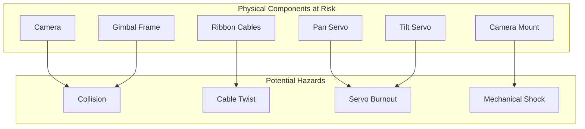
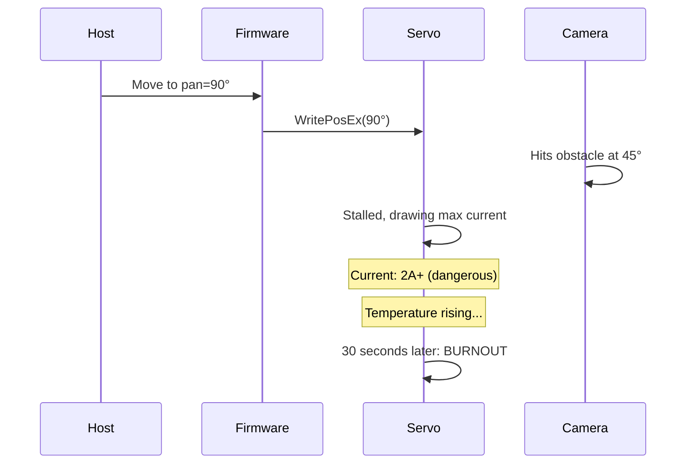
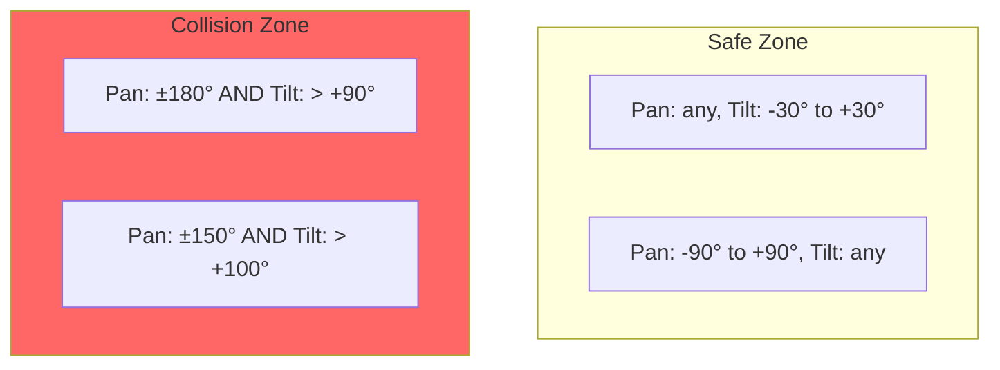
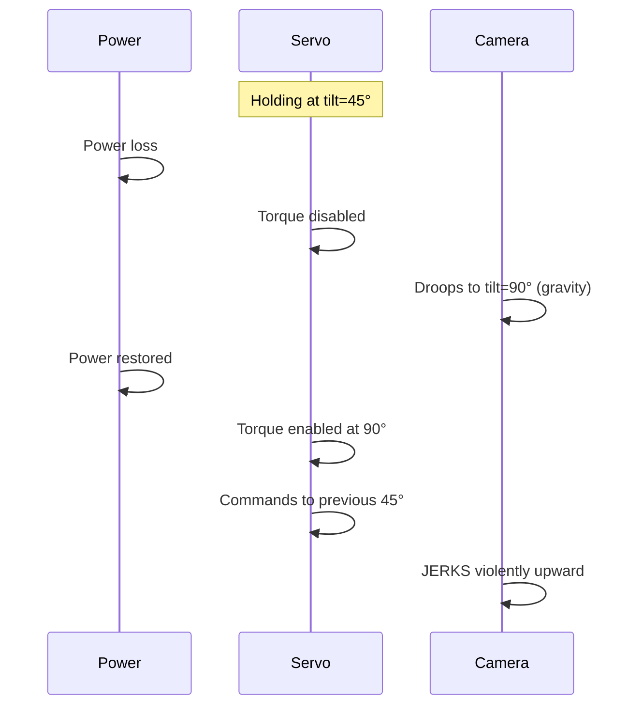
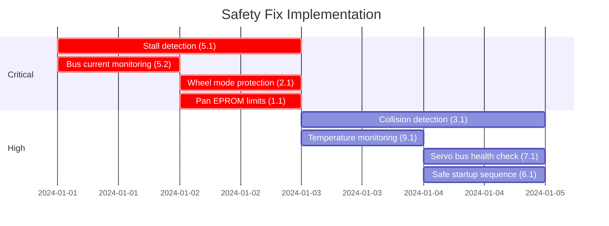

# Safety Analysis Report

**Project:** Pan-Tilt Gimbal Controller
**Date:** 2026-02-03
**Status:** For Review

---

## Executive Summary

This document identifies **25 safety gaps** in the gimbal control firmware that could cause physical damage to the camera, servos, or cables. Of these, **4 are critical** and **9 are high severity**.

The most dangerous issues are:
- No stall/overcurrent detection (servo burnout risk)
- Missing pan servo hardware limits (cable wrap risk)
- No collision detection (camera/frame impact risk)
- No thermal monitoring (overheating risk)

---

## System Overview



---

## Risk Summary Table

| # | Category | Severity | Issue | Impact |
|---|----------|----------|-------|--------|
| 1.1 | Servo Limits | HIGH | Pan servo lacks EPROM angle limits | Cable wrap, frame collision |
| 1.2 | Servo Limits | MODERATE | No max speed/accel validation | Violent movements |
| 1.3 | Servo Limits | MODERATE | Direct register writes bypass limits | Unprotected servo access |
| 2.1 | Cable Wrap | **CRITICAL** | No wheel mode protection | Cable destruction |
| 2.2 | Cable Wrap | HIGH | No cumulative rotation tracking | Cable twist/fatigue |
| 2.3 | Cable Wrap | MODERATE | No rotation velocity safeguard | Cable attachment failure |
| 3.1 | Collision | HIGH | No collision detection at angle extremes | Camera hits gimbal frame |
| 3.2 | Collision | MODERATE | No load-based collision alarm | Hardware crash undetected |
| 3.3 | Collision | MODERATE | Single-axis cmds ignore other axis | Unsafe angle combinations |
| 4.1 | Speed/Accel | MODERATE | No max speed enforcement | Uncontrolled motion |
| 4.2 | Speed/Accel | MODERATE | No acceleration limiting | Mechanical shock |
| 4.3 | Speed/Accel | LOW | No ramp-down before limits | Hard stop impact |
| 5.1 | Stall Detection | **CRITICAL** | No stall current detection | Servo burnout |
| 5.2 | Stall Detection | **CRITICAL** | No bus current limit monitoring | Electrical fire risk |
| 5.3 | Stall Detection | HIGH | No per-servo current feedback check | Individual stall undetected |
| 6.1 | Power Loss | HIGH | Servos droop on power loss | Camera drop on restore |
| 6.2 | Power Loss | MODERATE | No safe startup state | Jerky startup |
| 7.1 | Comm Failure | HIGH | Servo bus loss not detected | Blind execution |
| 7.2 | Comm Failure | MODERATE | Heartbeat independent of servo health | Uncorrelated safety |
| 7.3 | Comm Failure | LOW | Partial frame corruption possible | Malformed commands |
| 8.1 | Startup | MODERATE | No homing sequence | Unsafe power-up position |
| 8.2 | Startup | MODERATE | Torque enabled without position check | Sudden startup jerk |
| 8.3 | Startup | MODERATE | No self-test on startup | Broken gimbal undetected |
| 9.1 | Thermal | HIGH | No temperature monitoring | Servo overheat |
| 9.2 | Thermal | MODERATE | No thermal throttling | Servo burnout |
| 10.1 | Concurrency | MODERATE | No command rate limiting | Jerky motion |
| 10.2 | Concurrency | MODERATE | Lock/unlock race conditions | Inconsistent state |

---

## Critical Issues (Severity: CRITICAL)

### 5.1 No Stall Current Detection

**Risk Level:** CRITICAL
**Impact:** Servo burnout, potential fire

**Description:**
If the camera or gimbal hits an obstacle, the servo continues drawing maximum current trying to reach the commanded position. Without stall detection, the servo will overheat and burn out.

**Current Code:**
```cpp
// Servo current is read but never checked
out.current = st.ReadCurrent(-1);  // Value discarded
```

**Failure Scenario:**


**Recommended Fix:**
```cpp
// Add stall detection in main loop
void checkServoStall() {
    int panLoad = st.ReadLoad(PAN_SERVO_ID);
    int tiltLoad = st.ReadLoad(TILT_SERVO_ID);

    if (abs(panLoad) > STALL_THRESHOLD || abs(tiltLoad) > STALL_THRESHOLD) {
        stallCounter++;
        if (stallCounter > STALL_TIME_LIMIT) {
            emergencyStop();
            sendNack(0, ERROR_STALL_DETECTED);
        }
    } else {
        stallCounter = 0;
    }
}
```

---

### 5.2 No Bus Current Limit Monitoring

**Risk Level:** CRITICAL
**Impact:** Electrical fire, power supply damage

**Description:**
The INA219 power monitor reads bus current but never checks if it exceeds safe limits. A short circuit or dual-servo stall could draw dangerous current levels.

**Current Code:**
```cpp
current_mA = ina219.getCurrent_mA();  // Read but never validated
```

**Recommended Fix:**
```cpp
const float MAX_CURRENT_MA = 3000.0f;  // 3A limit

void updateIna219() {
    current_mA = ina219.getCurrent_mA();

    if (current_mA > MAX_CURRENT_MA) {
        emergencyStop();
        sendOvercurrentAlarm();
    }
}
```

---

### 2.1 No Wheel Mode Protection

**Risk Level:** CRITICAL
**Impact:** Cable destruction

**Description:**
ST3215 servos can operate in "wheel mode" (continuous rotation) or "position mode". The firmware sets position mode on startup but never verifies it remains in position mode. If the mode register corrupts, the pan servo could rotate continuously, destroying cables.

**Current Code:**
```cpp
void ensurePositionMode(int id) {
    byte mode = st.readByte(id, SMS_STS_MODE);
    if (mode != 0) {
        st.writeByte(id, SMS_STS_MODE, 0);  // Set once, never re-checked
    }
}
```

**Recommended Fix:**
```cpp
// Add periodic mode verification (every 1 second)
void verifyServoModes() {
    static uint32_t lastCheck = 0;
    if (millis() - lastCheck < 1000) return;
    lastCheck = millis();

    byte panMode = st.readByte(PAN_SERVO_ID, SMS_STS_MODE);
    byte tiltMode = st.readByte(TILT_SERVO_ID, SMS_STS_MODE);

    if (panMode != 0 || tiltMode != 0) {
        emergencyStop();
        sendNack(0, ERROR_MODE_CORRUPTION);
    }
}
```

---

### 1.1 Pan Servo Lacks EPROM Angle Limits

**Risk Level:** HIGH (borderline CRITICAL)
**Impact:** Cable wrap, frame collision

**Description:**
The tilt servo has hardware angle limits configured in EPROM, but the pan servo does not. If software clamping fails, the pan servo has no hardware protection.

**Current Code:**
```cpp
void setTiltServoAngleLimits() {
    // Only tilt has EPROM limits!
    st.unLockEprom(TILT_SERVO_ID);
    st.writeWord(TILT_SERVO_ID, SMS_STS_MIN_ANGLE_LIMIT_L, 683);   // +120°
    st.writeWord(TILT_SERVO_ID, SMS_STS_MAX_ANGLE_LIMIT_L, 3072);  // -90°
    st.LockEprom(TILT_SERVO_ID);
    // Pan servo: NO EPROM LIMITS SET
}
```

**Recommended Fix:**
```cpp
void setPanServoAngleLimits() {
    st.unLockEprom(PAN_SERVO_ID);
    st.writeWord(PAN_SERVO_ID, SMS_STS_MIN_ANGLE_LIMIT_L, 0);      // -180°
    st.writeWord(PAN_SERVO_ID, SMS_STS_MAX_ANGLE_LIMIT_L, 4095);   // +180°
    st.LockEprom(PAN_SERVO_ID);
}
```

---

## High Severity Issues

### 3.1 No Collision Detection

**Risk Level:** HIGH
**Impact:** Camera crashes into gimbal frame

**Description:**
At certain pan/tilt angle combinations, the camera can physically collide with the gimbal frame. The firmware clamps angles individually but doesn't check combined feasibility.

**Dangerous Combinations:**


**Recommended Fix:**
```cpp
bool isAngleCombinationSafe(float pan, float tilt) {
    // Define collision zones based on physical gimbal geometry
    float absPan = abs(pan);

    if (absPan > 150.0f && tilt > 100.0f) return false;
    if (absPan > 170.0f && tilt > 90.0f) return false;
    if (absPan > 175.0f && tilt > 80.0f) return false;

    return true;
}

void setPanTiltAbs(float pan, float tilt, ...) {
    if (!isAngleCombinationSafe(pan, tilt)) {
        sendNack(seq, ERROR_COLLISION_RISK);
        return;
    }
    // ... proceed with move
}
```

---

### 9.1 No Temperature Monitoring

**Risk Level:** HIGH
**Impact:** Servo overheating and failure

**Description:**
Servo temperature is read via feedback but never checked against thresholds. Under continuous high load, servos can overheat.

**Current Code:**
```cpp
out.temp = st.ReadTemper(-1);  // Read but never validated
```

**Recommended Fix:**
```cpp
const float SERVO_TEMP_WARNING = 60.0f;  // °C
const float SERVO_TEMP_CRITICAL = 70.0f;

void checkServoTemperature() {
    float panTemp = panFeedback.temp;
    float tiltTemp = tiltFeedback.temp;

    if (panTemp > SERVO_TEMP_CRITICAL || tiltTemp > SERVO_TEMP_CRITICAL) {
        emergencyStop();
        sendThermalAlarm(CRITICAL);
    } else if (panTemp > SERVO_TEMP_WARNING || tiltTemp > SERVO_TEMP_WARNING) {
        reduceSpeed(0.5);  // Thermal throttling
        sendThermalAlarm(WARNING);
    }
}
```

---

### 6.1 Unsafe Power Loss Behavior

**Risk Level:** HIGH
**Impact:** Camera drops, jerks on power restore

**Description:**
On power loss, servos lose holding torque and the gimbal droops under gravity. On power restore, servos immediately re-enable torque at whatever position they ended up, causing sudden jerky movement.

**Failure Scenario:**


**Recommended Fix:**
```cpp
void setup() {
    // ... initialization ...

    // Safe startup sequence
    readCurrentPositions();

    // Slowly move to safe position before enabling full control
    slowMoveToCenter();

    // Now enable normal operation
    st.EnableTorque(PAN_SERVO_ID, 1);
    st.EnableTorque(TILT_SERVO_ID, 1);
}

void slowMoveToCenter() {
    // Gradual movement to center with low speed
    st.WritePosEx(PAN_SERVO_ID, SERVO_CENTER, 500, 50);
    st.WritePosEx(TILT_SERVO_ID, SERVO_CENTER, 500, 50);
    delay(2000);  // Wait for centering
}
```

---

### 7.1 Servo Bus Communication Failure Not Detected

**Risk Level:** HIGH
**Impact:** Gimbal operates blind

**Description:**
If the servo bus (UART1) becomes disconnected or corrupted, the firmware doesn't detect this and continues sending commands. The gimbal could be in an unknown state.

**Recommended Fix:**
```cpp
int consecutiveFailures = 0;
const int MAX_FAILURES = 5;

bool sendServoCommand(...) {
    int result = st.WritePosEx(...);

    if (result == -1) {
        consecutiveFailures++;
        if (consecutiveFailures >= MAX_FAILURES) {
            gimbalState = IDLE;
            servoBusHealthy = false;
            sendNack(0, ERROR_SERVO_BUS_FAILURE);
        }
        return false;
    }

    consecutiveFailures = 0;
    return true;
}
```

---

### 2.2 No Cumulative Rotation Tracking

**Risk Level:** HIGH
**Impact:** Cable fatigue and failure over time

**Description:**
The pan axis allows ±180° rotation, but there's no tracking of cumulative rotation. Repeated commands like: +180°, -180°, +180°, -180° could cause cables to twist excessively over time.

**Recommended Fix:**
```cpp
float cumulativePanRotation = 0.0f;
const float MAX_CUMULATIVE_ROTATION = 720.0f;  // 2 full rotations

void trackPanRotation(float newPan) {
    float delta = newPan - panTargetDeg;
    cumulativePanRotation += delta;

    if (abs(cumulativePanRotation) > MAX_CUMULATIVE_ROTATION) {
        // Force unwind
        sendCableWrapWarning();
    }
}
```

---

## Moderate Severity Issues

### 4.1 No Max Speed/Acceleration Validation

**Description:**
Speed and acceleration parameters accept any uint16 value (0-65535) without bounds checking.

**Current Code:**
```cpp
if (spd == 0) spd = 3400;  // Only defaults, no MAX check
if (acc == 0) acc = 100;
```

**Fix:**
```cpp
const uint16_t MAX_SPEED = 4000;
const uint16_t MAX_ACCEL = 200;

spd = (spd == 0) ? 3400 : min(spd, MAX_SPEED);
acc = (acc == 0) ? 100 : min(acc, MAX_ACCEL);
```

---

### 8.1 No Homing Sequence

**Description:**
On startup, servos are enabled at whatever position they're in. No movement to a known safe position.

**Fix:** Add `slowMoveToCenter()` as shown in 6.1.

---

### 10.1 No Command Rate Limiting

**Description:**
Commands are processed immediately without rate limiting. A host could flood the gimbal with hundreds of commands per second.

**Fix:**
```cpp
const uint32_t MIN_COMMAND_INTERVAL_MS = 10;
uint32_t lastCommandTime = 0;

void processCommand(...) {
    if (millis() - lastCommandTime < MIN_COMMAND_INTERVAL_MS) {
        return;  // Rate limit
    }
    lastCommandTime = millis();
    // ... process command
}
```

---

## Recommended Implementation Priority

### Phase 1: Critical (Implement Before Use)



### Phase 2: High (Implement Before Deployment)

- Collision detection matrix
- Thermal throttling
- Cumulative rotation tracking
- Servo bus health monitoring

### Phase 3: Moderate (Next Iteration)

- Speed/acceleration validation
- Command rate limiting
- Homing sequence
- Self-test on startup

---

## Testing Checklist

### Stall Detection Test
- [ ] Block pan servo manually, verify emergency stop triggers
- [ ] Block tilt servo manually, verify emergency stop triggers
- [ ] Verify stall counter resets after normal operation

### Collision Detection Test
- [ ] Command pan=180°, tilt=120° - should be rejected
- [ ] Command pan=90°, tilt=90° - should succeed
- [ ] Verify all edge combinations in collision matrix

### Thermal Test
- [ ] Run servos under load for 10 minutes
- [ ] Verify temperature warnings at 60°C
- [ ] Verify emergency stop at 70°C

### Power Cycle Test
- [ ] Power off mid-movement, verify safe droop
- [ ] Power on, verify slow centering sequence
- [ ] No sudden jerky movements on restore

### Communication Failure Test
- [ ] Disconnect servo bus cable, verify detection within 500ms
- [ ] Verify gimbal enters safe state
- [ ] Reconnect, verify recovery

---

## Appendix: Emergency Stop Implementation

```cpp
void emergencyStop() {
    // Disable torque immediately
    st.EnableTorque(PAN_SERVO_ID, 0);
    st.EnableTorque(TILT_SERVO_ID, 0);

    // Update state
    panLocked = false;
    tiltLocked = false;
    gimbalState = IDLE;

    // Log event
    emergencyStopTriggered = true;
    emergencyStopTime = millis();
}
```

---

## Document History

| Version | Date | Author | Changes |
|---------|------|--------|---------|
| 1.0 | 2026-02-03 | Claude | Initial safety analysis |

---

## Approval

| Role | Name | Date | Signature |
|------|------|------|-----------|
| Developer | | | |
| Reviewer | | | |
| Safety Lead | | | |
