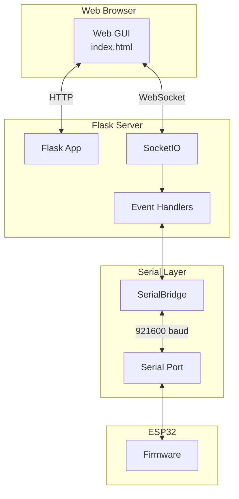
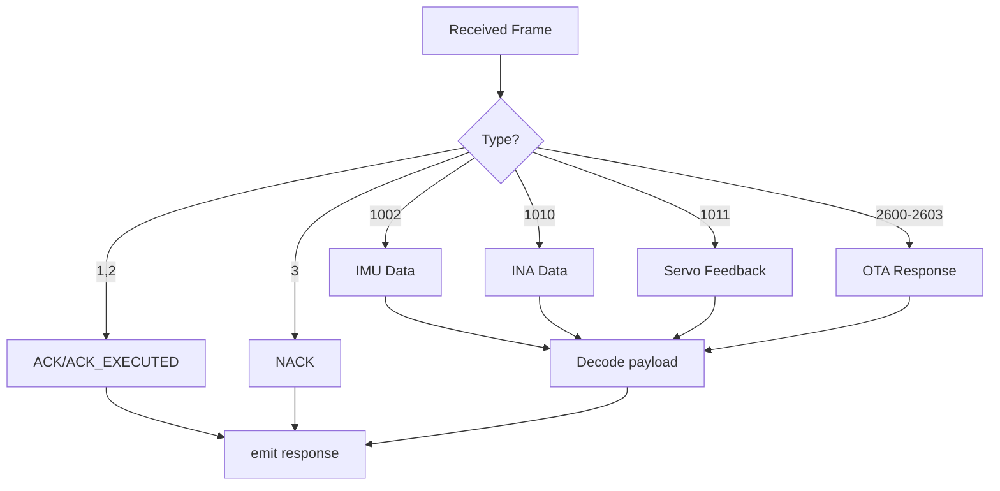
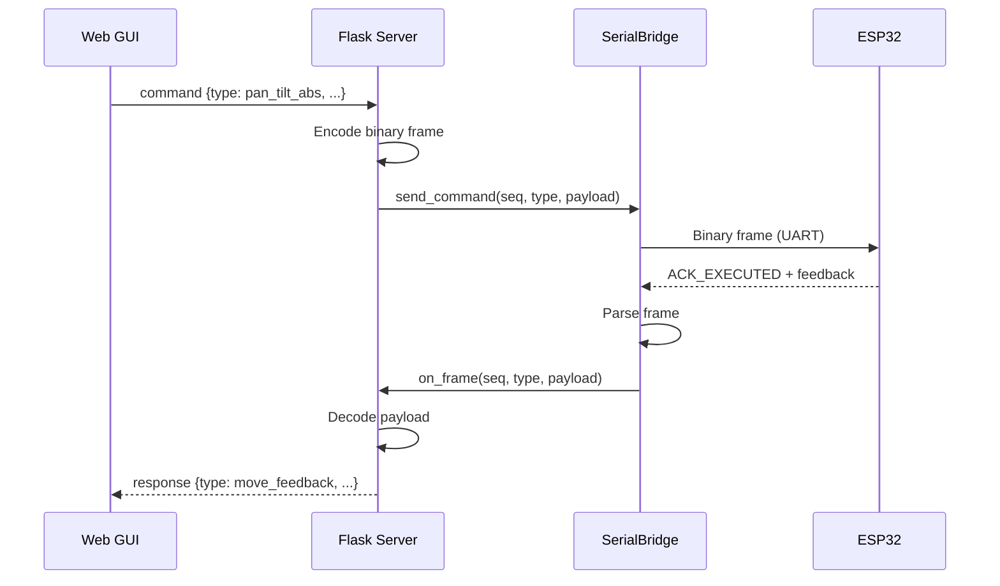

# Flask Server

**File:** `backend/app.py`

## Overview

The Flask server provides:
- HTTP server for Web GUI
- WebSocket (SocketIO) for real-time communication
- Serial port management
- Command encoding and dispatch

## Architecture



## Dependencies

```python
from flask import Flask, render_template, request
from flask_socketio import SocketIO, emit
import serial
import threading
```

---

## Configuration

| Parameter | Value | Description |
|-----------|-------|-------------|
| Host | `0.0.0.0` | Listen on all interfaces |
| Port | `5000` | HTTP port |
| Serial Baud | `921600` | UART baud rate |

---

## Flask Application

### Initialization

```python
app = Flask(__name__, static_folder='static')
socketio = SocketIO(app, cors_allowed_origins="*")
bridge = None  # SerialBridge instance
```

### Routes

#### GET /

Serves the main Web GUI.

```python
@app.route('/')
def index():
    return render_template('index.html')
```

**Returns:** `static/index.html`

---

## SocketIO Events

### Client → Server Events

#### connect

Handles new WebSocket connection.

```python
@socketio.on('connect')
def handle_connect():
    # Send current state
    # Send log history
```

**Emits:**
- `state` - Current connection state
- `log` - Recent debug log entries

---

#### command

Receives and processes control commands.

```python
@socketio.on('command')
def handle_command(data):
    # Parse command type
    # Encode binary frame
    # Send via SerialBridge
```

**Input (JSON):**
```json
{
    "type": "pan_tilt_abs",
    "pan": 45.0,
    "tilt": -30.0,
    "speed": 500,
    "accel": 100
}
```

**Supported Commands:**

| Type | Parameters |
|------|------------|
| `pan_tilt_abs` | pan, tilt, speed, accel |
| `pan_tilt_move` | pan, tilt, speed_x, speed_y |
| `pan_tilt_stop` | (none) |
| `get_imu` | (none) |
| `get_ina` | (none) |
| `enter_tracking` | (none) |
| `exit_tracking` | (none) |
| `pan_lock` | lock (0/1) |
| `tilt_lock` | lock (0/1) |
| `feedback_flow` | enable (0/1) |
| `feedback_interval` | ms |
| `heartbeat_set` | ms |

---

#### connect_serial

Opens serial port connection.

```python
@socketio.on('connect_serial')
def handle_connect_serial(data):
    # Create SerialBridge
    # Start read thread
```

**Input:**
```json
{
    "port": "COM9"
}
```

**Emits:**
- `serial_connected` - On success
- `serial_error` - On failure

---

#### disconnect_serial

Closes serial port.

```python
@socketio.on('disconnect_serial')
def handle_disconnect_serial():
    # Stop SerialBridge
    # Clean up
```

**Emits:**
- `serial_disconnected`

---

#### get_log

Requests debug log history.

```python
@socketio.on('get_log')
def handle_get_log():
    # Return log buffer
```

**Emits:**
- `log` - Array of log entries

---

### Server → Client Events

#### response

Sends parsed ESP32 response to GUI.

```python
socketio.emit('response', {
    'type': 'imu',
    'data': {...}
})
```

**Response Types:**

| Type | Data Fields |
|------|-------------|
| `ack` | seq |
| `nack` | seq, error_code |
| `imu` | roll, pitch, yaw, accel, gyro, mag, temp |
| `ina` | bus_v, shunt_mv, current_ma, power_mw |
| `servo` | pan_pos, pan_load, tilt_pos, tilt_load |
| `move_feedback` | pan_pos, pan_load, tilt_pos, tilt_load |

---

#### log

Sends debug log entry.

```python
socketio.emit('log', {
    'timestamp': '12:34:56.789',
    'direction': 'TX',
    'message': 'CMD_PAN_TILT_ABS seq=1 pan=45.0 tilt=-30.0'
})
```

---

#### serial_connected / serial_disconnected

Connection state updates.

```python
socketio.emit('serial_connected', {'port': 'COM9'})
socketio.emit('serial_disconnected')
```

---

#### serial_error

Error notification.

```python
socketio.emit('serial_error', {'message': 'Port not found'})
```

---

## SerialBridge Callbacks

### on_frame(seq, type_id, payload)

Called when complete frame received from ESP32.

```python
def on_frame(seq, type_id, payload):
    # Decode payload based on type
    # Emit 'response' event to GUI
    # Log to debug buffer
```

**Processing by Type:**



---

## Sequence Number Management

```python
_seq_counter = 0

def next_seq():
    global _seq_counter
    _seq_counter = (_seq_counter + 1) & 0xFFFF
    return _seq_counter
```

Each command sent increments the sequence number. Responses echo the sequence for correlation.

---

## Debug Logging

### DebugLog Class

```python
class DebugLog:
    def __init__(self, max_lines=500):
        self.buffer = []
        self.max_lines = max_lines

    def add(self, direction, message):
        entry = {
            'timestamp': datetime.now().strftime('%H:%M:%S.%f')[:-3],
            'direction': direction,
            'message': message
        }
        self.buffer.append(entry)
        if len(self.buffer) > self.max_lines:
            self.buffer.pop(0)
        socketio.emit('log', entry)

    def get_all(self):
        return self.buffer
```

---

## Sequence Diagram: Command Flow



---

## Running the Server

```bash
cd backend
pip install -r requirements.txt
python app.py
```

**Output:**
```
 * Running on http://0.0.0.0:5000
 * WebSocket enabled
```

Open browser to `http://localhost:5000`

---

## Related Documentation

- [Serial Bridge](serial-bridge.md) - Serial I/O thread
- [Protocol Encoder](protocol-encoder.md) - Binary encoding
- [Command Reference](../protocol/command-reference.md) - All commands
