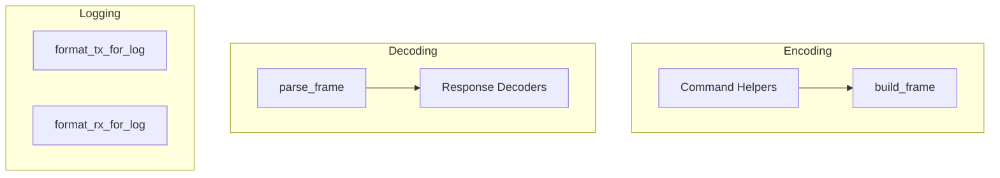

# Protocol Encoder

**File:** `backend/protocol.py`

## Overview

The protocol module provides:
- Binary frame encoding
- Frame parsing and decoding
- Command helper functions
- Response decoders
- Debug log formatting

## Architecture



---

## Frame Format

```
[STX] [LEN] [SEQ_L] [SEQ_H] [TYPE_L] [TYPE_H] [PAYLOAD...] [CRC8] [ETX]
```

| Field | Size | Description |
|-------|------|-------------|
| STX | 1 | Start byte (0x02) |
| LEN | 1 | Length of SEQ+TYPE+PAYLOAD |
| SEQ | 2 | Sequence number (little-endian) |
| TYPE | 2 | Command/response type (little-endian) |
| PAYLOAD | 0-251 | Variable payload |
| CRC8 | 1 | Checksum of LEN+SEQ+TYPE+PAYLOAD |
| ETX | 1 | End byte (0x03) |

---

## Constants

```python
STX = 0x02
ETX = 0x03
MAX_PAYLOAD = 251

# Command Types
CMD_PAN_TILT_ABS = 133
CMD_PAN_TILT_MOVE = 134
CMD_PAN_TILT_STOP = 135
CMD_GET_IMU = 126
CMD_GET_INA = 160
CMD_ENTER_TRACKING = 137
CMD_EXIT_CONFIG = 140
CMD_FEEDBACK_FLOW = 131
CMD_FEEDBACK_INTERVAL = 142
CMD_HEARTBEAT_SET = 136
CMD_PAN_LOCK = 170
CMD_TILT_LOCK = 171
CMD_OTA_START = 600
CMD_OTA_CHUNK = 601
CMD_OTA_END = 602
CMD_OTA_ABORT = 603
CMD_GET_FW_INFO = 610

# Response Types
RSP_ACK_RECEIVED = 1
RSP_ACK_EXECUTED = 2
RSP_NACK = 3
RSP_IMU = 1002
RSP_INA = 1010
RSP_SERVO = 1011
RSP_OTA_STARTED = 2600
RSP_OTA_CHUNK = 2601
RSP_OTA_DONE = 2602
RSP_OTA_NACK = 2603
RSP_FW_INFO = 2610
```

---

## Encoding Functions

### build_frame(seq, type_id, payload)

Builds a complete binary frame.

```python
def build_frame(seq, type_id, payload=b''):
    """
    Build a binary protocol frame.

    Args:
        seq: Sequence number (uint16)
        type_id: Command/response type (uint16)
        payload: Payload bytes

    Returns:
        bytes: Complete frame
    """
```

**Implementation:**

```python
def build_frame(seq, type_id, payload=b''):
    length = 4 + len(payload)  # SEQ(2) + TYPE(2) + PAYLOAD

    # Build data for CRC
    data = bytes([
        length,
        seq & 0xFF, (seq >> 8) & 0xFF,
        type_id & 0xFF, (type_id >> 8) & 0xFF
    ]) + payload

    crc = crc8(data)

    return bytes([STX]) + data + bytes([crc, ETX])
```

---

### Command Helper Functions

#### cmd_pan_tilt_abs(seq, pan, tilt, speed, accel)

Creates absolute position command.

```python
def cmd_pan_tilt_abs(seq, pan, tilt, speed, accel):
    """
    Create CMD_PAN_TILT_ABS frame.

    Args:
        seq: Sequence number
        pan: Pan angle (float, degrees)
        tilt: Tilt angle (float, degrees)
        speed: Movement speed (uint16)
        accel: Acceleration (uint16)

    Returns:
        bytes: Complete frame
    """
    payload = struct.pack('<ffHH', pan, tilt, speed, accel)
    return build_frame(seq, CMD_PAN_TILT_ABS, payload)
```

**Payload (12 bytes):**
```
[pan:f] [tilt:f] [speed:H] [accel:H]
```

---

#### cmd_pan_tilt_move(seq, pan, tilt, speed_x, speed_y)

Creates velocity movement command.

```python
def cmd_pan_tilt_move(seq, pan, tilt, speed_x, speed_y):
    payload = struct.pack('<ffHH', pan, tilt, speed_x, speed_y)
    return build_frame(seq, CMD_PAN_TILT_MOVE, payload)
```

---

#### cmd_pan_tilt_stop(seq)

Creates stop command.

```python
def cmd_pan_tilt_stop(seq):
    return build_frame(seq, CMD_PAN_TILT_STOP)
```

---

#### cmd_get_imu(seq)

Creates IMU query command.

```python
def cmd_get_imu(seq):
    return build_frame(seq, CMD_GET_IMU)
```

---

#### cmd_get_ina(seq)

Creates power query command.

```python
def cmd_get_ina(seq):
    return build_frame(seq, CMD_GET_INA)
```

---

#### cmd_feedback_flow(seq, enable)

Creates feedback flow control command.

```python
def cmd_feedback_flow(seq, enable):
    payload = bytes([1 if enable else 0])
    return build_frame(seq, CMD_FEEDBACK_FLOW, payload)
```

---

#### cmd_feedback_interval(seq, ms)

Creates feedback interval command.

```python
def cmd_feedback_interval(seq, ms):
    payload = struct.pack('<H', ms)
    return build_frame(seq, CMD_FEEDBACK_INTERVAL, payload)
```

---

#### cmd_heartbeat_set(seq, ms)

Creates heartbeat timeout command.

```python
def cmd_heartbeat_set(seq, ms):
    payload = struct.pack('<H', ms)
    return build_frame(seq, CMD_HEARTBEAT_SET, payload)
```

---

#### cmd_lock(seq, axis, lock)

Creates axis lock command.

```python
def cmd_lock(seq, axis, lock):
    """
    Args:
        axis: 'pan' or 'tilt'
        lock: True to lock, False to unlock
    """
    type_id = CMD_PAN_LOCK if axis == 'pan' else CMD_TILT_LOCK
    payload = bytes([1 if lock else 0])
    return build_frame(seq, type_id, payload)
```

---

### OTA Command Helpers

#### cmd_ota_start(seq, size, hash_type, expected_hash)

Creates OTA start command.

```python
def cmd_ota_start(seq, size, hash_type, expected_hash):
    """
    Args:
        size: Firmware size in bytes
        hash_type: 1 for CRC32, 2 for SHA256
        expected_hash: Hash value (4 bytes for CRC32, 32 for SHA256)
    """
    payload = struct.pack('<IB', size, hash_type) + expected_hash
    return build_frame(seq, CMD_OTA_START, payload)
```

---

#### cmd_ota_chunk(seq, offset, data)

Creates OTA chunk command.

```python
def cmd_ota_chunk(seq, offset, data):
    """
    Args:
        offset: Byte offset in firmware
        data: Chunk data (up to 2048 bytes)
    """
    payload = struct.pack('<IH', offset, len(data)) + data
    return build_frame(seq, CMD_OTA_CHUNK, payload)
```

---

#### cmd_ota_end(seq)

Creates OTA end command.

```python
def cmd_ota_end(seq):
    return build_frame(seq, CMD_OTA_END)
```

---

## Decoding Functions

### parse_frame(data)

Parses a binary frame.

```python
def parse_frame(data):
    """
    Parse a binary frame.

    Args:
        data: Raw frame bytes

    Returns:
        tuple: (seq, type_id, payload) or None if invalid
    """
```

**Implementation:**

```python
def parse_frame(data):
    if len(data) < 8:
        return None
    if data[0] != STX or data[-1] != ETX:
        return None

    length = data[1]
    if len(data) != 1 + 1 + length + 1 + 1:
        return None

    # Validate CRC
    crc_data = data[1:-2]
    if crc8(crc_data) != data[-2]:
        return None

    seq = data[2] | (data[3] << 8)
    type_id = data[4] | (data[5] << 8)
    payload = data[6:-2]

    return (seq, type_id, payload)
```

---

### Response Decoders

#### decode_move_feedback(payload)

Decodes ACK_EXECUTED move feedback.

```python
def decode_move_feedback(payload):
    """
    Decode 8-byte move feedback payload.

    Returns:
        dict: {pan_load, pan_pos, tilt_load, tilt_pos}
    """
    pan_load, pan_pos, tilt_load, tilt_pos = struct.unpack('<hhhh', payload)
    return {
        'pan_load': pan_load,
        'pan_pos': pan_pos,
        'tilt_load': tilt_load,
        'tilt_pos': tilt_pos
    }
```

---

#### decode_imu(payload)

Decodes IMU response.

```python
def decode_imu(payload):
    """
    Decode 50-byte IMU payload.

    Returns:
        dict: {roll, pitch, yaw, ax, ay, az, gx, gy, gz, mx, my, mz, temp}
    """
    values = struct.unpack('<fffffffffhhhf', payload[:46])
    return {
        'roll': values[0],
        'pitch': values[1],
        'yaw': values[2],
        'ax': values[3],
        'ay': values[4],
        'az': values[5],
        'gx': values[6],
        'gy': values[7],
        'gz': values[8],
        'mx': values[9],
        'my': values[10],
        'mz': values[11],
        'temp': values[12]
    }
```

---

#### decode_ina(payload)

Decodes INA219 response.

```python
def decode_ina(payload):
    """
    Decode 21-byte INA payload.

    Returns:
        dict: {bus_v, shunt_mv, load_v, current_ma, power_mw, overflow}
    """
    values = struct.unpack('<fffffB', payload)
    return {
        'bus_v': values[0],
        'shunt_mv': values[1],
        'load_v': values[2],
        'current_ma': values[3],
        'power_mw': values[4],
        'overflow': bool(values[5])
    }
```

---

#### decode_ota_started(payload)

Decodes OTA started response.

```python
def decode_ota_started(payload):
    """
    Returns:
        dict: {inactive_slot, slot_size}
    """
    slot, size = struct.unpack('<BI', payload[:5])
    return {
        'inactive_slot': slot,
        'slot_size': size
    }
```

---

#### decode_fw_info(payload)

Decodes firmware info response.

```python
def decode_fw_info(payload):
    """
    Returns:
        dict: {active_slot, version_a, version_b}
    """
    active = payload[0]
    ver_a = payload[1:33].decode('utf-8').rstrip('\x00')
    ver_b = payload[33:65].decode('utf-8').rstrip('\x00')
    return {
        'active_slot': active,
        'version_a': ver_a,
        'version_b': ver_b
    }
```

---

## Logging Functions

### format_tx_for_log(seq, type_id, payload)

Formats TX frame for debug log.

```python
def format_tx_for_log(seq, type_id, payload):
    """
    Format transmitted frame for logging.

    Returns:
        str: Human-readable log string
    """
    type_name = CMD_NAMES.get(type_id, f'CMD_{type_id}')
    return f"TX seq={seq} {type_name} len={len(payload)}"
```

---

### format_rx_for_log(seq, type_id, payload)

Formats RX frame for debug log.

```python
def format_rx_for_log(seq, type_id, payload):
    """
    Format received frame for logging.

    Returns:
        str: Human-readable log string
    """
    type_name = RSP_NAMES.get(type_id, f'RSP_{type_id}')
    return f"RX seq={seq} {type_name} len={len(payload)}"
```

---

## CRC8 Function

```python
def crc8(data):
    """
    Calculate CRC8 (polynomial 0x07, init 0x00).
    """
    crc = 0x00
    for byte in data:
        crc ^= byte
        for _ in range(8):
            if crc & 0x80:
                crc = (crc << 1) ^ 0x07
            else:
                crc <<= 1
            crc &= 0xFF
    return crc
```

---

## Usage Examples

### Sending Commands

```python
from protocol import cmd_pan_tilt_abs, cmd_get_imu

# Create move command
frame = cmd_pan_tilt_abs(seq=1, pan=45.0, tilt=-30.0, speed=500, accel=100)
serial.write(frame)

# Create query command
frame = cmd_get_imu(seq=2)
serial.write(frame)
```

### Parsing Responses

```python
from protocol import parse_frame, decode_imu, RSP_IMU

data = serial.read(...)
result = parse_frame(data)
if result:
    seq, type_id, payload = result
    if type_id == RSP_IMU:
        imu = decode_imu(payload)
        print(f"Roll: {imu['roll']}, Pitch: {imu['pitch']}")
```

---

## Related Documentation

- [Serial Bridge](serial-bridge.md) - Frame transport
- [Binary Protocol](../protocol/binary-protocol.md) - Protocol spec
- [Command Reference](../protocol/command-reference.md) - All commands
