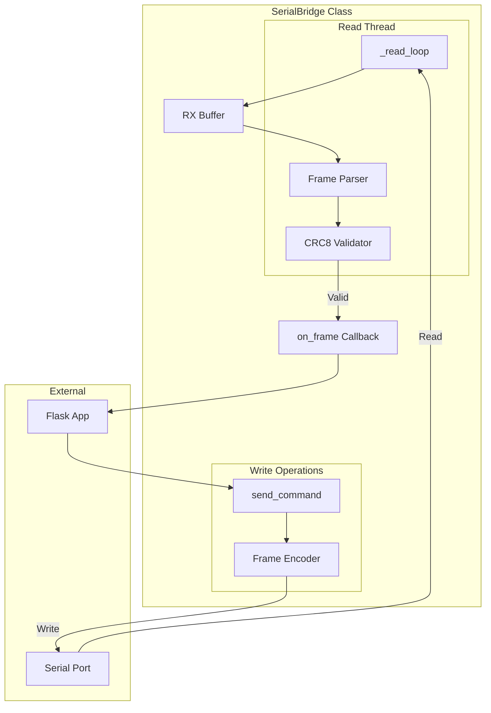
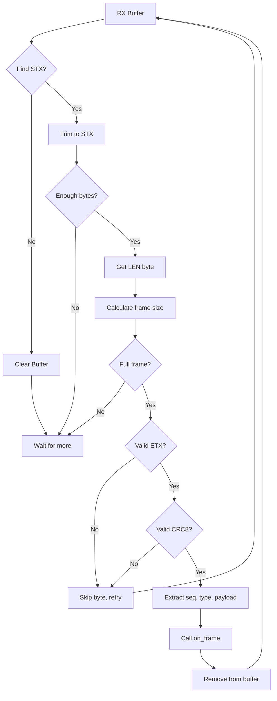

# Serial Bridge

**File:** `backend/serial_bridge.py`

## Overview

The SerialBridge class provides:
- Threaded serial I/O
- Binary frame parsing
- CRC8 validation
- Callback-based response handling

## Architecture



## Class Definition

```python
class SerialBridge:
    def __init__(self, port, baudrate=921600, on_frame=None):
        """
        Initialize serial bridge.

        Args:
            port: Serial port name (e.g., 'COM9', '/dev/ttyUSB0')
            baudrate: Baud rate (default: 921600)
            on_frame: Callback function(seq, type_id, payload)
        """

    def start(self):
        """Start the read thread."""

    def stop(self):
        """Stop the read thread and close port."""

    def send_command(self, seq, type_id, payload=b''):
        """
        Send a command frame.

        Args:
            seq: Sequence number (uint16)
            type_id: Command type (uint16)
            payload: Payload bytes
        """

    def is_connected(self):
        """Check if serial port is open."""
```

---

## Constructor

### `__init__(port, baudrate, on_frame)`

```python
def __init__(self, port, baudrate=921600, on_frame=None):
    self.port = port
    self.baudrate = baudrate
    self.on_frame = on_frame
    self.serial = None
    self.running = False
    self.thread = None
    self.rx_buffer = bytearray()
```

**Parameters:**

| Name | Type | Default | Description |
|------|------|---------|-------------|
| `port` | `str` | required | Serial port path |
| `baudrate` | `int` | 921600 | Baud rate |
| `on_frame` | `callable` | None | Frame callback |

---

## Methods

### start()

Opens serial port and starts read thread.

```python
def start(self):
    self.serial = serial.Serial(
        self.port,
        self.baudrate,
        timeout=0.1
    )
    self.running = True
    self.thread = threading.Thread(target=self._read_loop)
    self.thread.daemon = True
    self.thread.start()
```

**Raises:** `serial.SerialException` if port unavailable.

---

### stop()

Stops read thread and closes port.

```python
def stop(self):
    self.running = False
    if self.thread:
        self.thread.join(timeout=1.0)
    if self.serial:
        self.serial.close()
```

---

### send_command(seq, type_id, payload)

Sends a binary command frame.

```python
def send_command(self, seq, type_id, payload=b''):
    frame = build_frame(seq, type_id, payload)
    self.serial.write(frame)
```

**Parameters:**

| Name | Type | Description |
|------|------|-------------|
| `seq` | `int` | Sequence number (0-65535) |
| `type_id` | `int` | Command type ID |
| `payload` | `bytes` | Payload data |

---

### is_connected()

Returns connection status.

```python
def is_connected(self):
    return self.serial is not None and self.serial.is_open
```

---

## Internal Methods

### _read_loop()

Main read thread loop.

```python
def _read_loop(self):
    while self.running:
        if self.serial.in_waiting:
            data = self.serial.read(min(256, self.serial.in_waiting))
            self.rx_buffer.extend(data)
            self._process_buffer()
        else:
            time.sleep(0.001)
```

---

### _process_buffer()

Extracts and validates frames from buffer.

```python
def _process_buffer(self):
    while True:
        # Find STX
        stx_idx = self.rx_buffer.find(STX)
        if stx_idx == -1:
            self.rx_buffer.clear()
            return
        if stx_idx > 0:
            del self.rx_buffer[:stx_idx]

        # Check minimum length
        if len(self.rx_buffer) < 8:
            return

        # Get length
        length = self.rx_buffer[1]
        frame_size = 1 + 1 + length + 1 + 1  # STX + LEN + data + CRC + ETX

        if len(self.rx_buffer) < frame_size:
            return

        # Extract frame
        frame = bytes(self.rx_buffer[:frame_size])

        # Validate ETX
        if frame[-1] != ETX:
            del self.rx_buffer[0]
            continue

        # Validate CRC
        crc_data = frame[1:-2]  # LEN + SEQ + TYPE + PAYLOAD
        expected_crc = frame[-2]
        if crc8(crc_data) != expected_crc:
            del self.rx_buffer[0]
            continue

        # Parse frame
        seq = frame[2] | (frame[3] << 8)
        type_id = frame[4] | (frame[5] << 8)
        payload = frame[6:-2]

        # Remove from buffer
        del self.rx_buffer[:frame_size]

        # Callback
        if self.on_frame:
            self.on_frame(seq, type_id, payload)
```

---

## Frame Parsing Flow



---

## CRC8 Function

```python
def crc8(data):
    """
    Calculate CRC8 checksum.

    Polynomial: 0x07
    Initial: 0x00
    No final XOR
    """
    crc = 0x00
    for byte in data:
        crc ^= byte
        for _ in range(8):
            if crc & 0x80:
                crc = (crc << 1) ^ 0x07
            else:
                crc <<= 1
            crc &= 0xFF
    return crc
```

---

## Usage Example

```python
from serial_bridge import SerialBridge
from protocol import cmd_pan_tilt_abs

def on_frame(seq, type_id, payload):
    print(f"Received: seq={seq}, type={type_id}, len={len(payload)}")

# Create bridge
bridge = SerialBridge('COM9', on_frame=on_frame)
bridge.start()

# Send command
seq = 1
frame = cmd_pan_tilt_abs(seq, pan=45.0, tilt=-30.0, speed=500, accel=100)
bridge.serial.write(frame)

# Or use send_command
bridge.send_command(seq=2, type_id=133, payload=b'...')

# Cleanup
bridge.stop()
```

---

## Thread Safety

- Read thread runs independently
- Write operations (`send_command`) are thread-safe due to pyserial's internal locking
- Callback (`on_frame`) executes in read thread context
- Use Flask-SocketIO's thread-safe emit for GUI updates

---

## Error Handling

| Error | Handling |
|-------|----------|
| Port not found | `SerialException` raised on `start()` |
| Port disconnected | Read thread exits, `is_connected()` returns False |
| Invalid frame | Skipped, buffer continues parsing |
| CRC mismatch | Frame discarded, logged |

---

## Related Documentation

- [Flask Server](flask-server.md) - Application layer
- [Protocol Encoder](protocol-encoder.md) - Frame building
- [Binary Protocol](../protocol/binary-protocol.md) - Frame format
