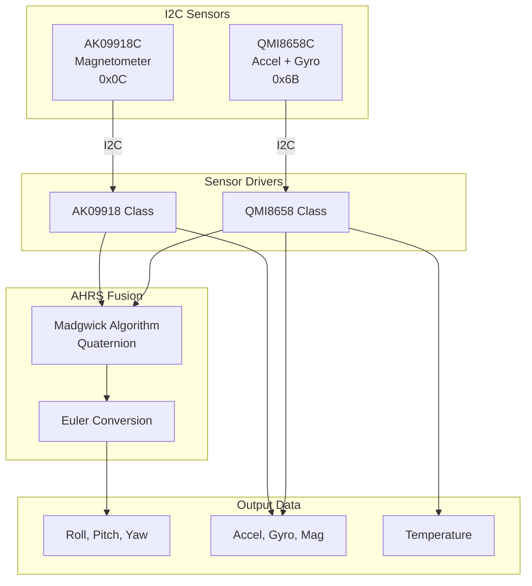

# IMU Module

**Files:** `IMU.h`, `IMU.cpp`, `QMI8658.h`, `QMI8658.cpp`, `AK09918.h`, `AK09918.cpp`

## Overview

The IMU module provides 9-axis sensor fusion using:
- **QMI8658C** - 6-axis accelerometer/gyroscope
- **AK09918C** - 3-axis magnetometer
- **AHRS** - Attitude and Heading Reference System (Madgwick algorithm)

Output: Euler angles (roll, pitch, yaw) at 100 Hz.

## Architecture



## Data Flow

```mermaid
sequenceDiagram
    participant Loop as Main Loop
    participant IMU as IMU Module
    participant QMI as QMI8658
    participant AK as AK09918
    participant AHRS as AHRS Fusion

    Loop->>IMU: updateImu() [every 10ms]
    IMU->>QMI: read_sensor_data()
    QMI-->>IMU: accel[3], gyro[3]
    IMU->>AK: getData()
    AK-->>IMU: mag[3]
    IMU->>AHRS: imuAHRSupdate(gx,gy,gz,ax,ay,az,mx,my,mz)
    AHRS->>AHRS: Update quaternion
    AHRS-->>IMU: q0, q1, q2, q3
    IMU->>IMU: Convert to Euler
    IMU-->>Loop: roll, pitch, yaw
```

---

## QMI8658 Class

### Overview

Driver for the QMI8658C 6-axis IMU (accelerometer + gyroscope).

### Class Definition

```cpp
class QMI8658 {
public:
    void begin();
    void config_acc(uint8_t range, uint8_t odr, uint8_t lpf);
    void config_gyro(uint8_t range, uint8_t odr, uint8_t lpf);
    void read_sensor_data(float acc[3], float gyro[3]);
    void read_acc(float acc[3]);
    void read_gyro(float gyro[3]);
    uint8_t get_id();
    void dump_reg();
    void autoOffsets();

private:
    void read_reg(uint8_t reg, uint8_t* data, uint8_t len);
    void write_reg(uint8_t reg, uint8_t data);
    int16_t readWord_reg(uint8_t reg);
};
```

### Methods

#### begin()

Initializes the QMI8658C sensor.

```cpp
void begin()
```

**Behavior:**
1. Soft reset
2. Configure accelerometer (default: 8g, 470Hz)
3. Configure gyroscope (default: 512dps, 470Hz)
4. Enable sensors

---

#### config_acc(range, odr, lpf)

Configures accelerometer parameters.

```cpp
void config_acc(uint8_t range, uint8_t odr, uint8_t lpf)
```

**Parameters:**

| Name | Type | Values |
|------|------|--------|
| `range` | `uint8_t` | 0=2g, 1=4g, 2=8g, 3=16g |
| `odr` | `uint8_t` | Output data rate (Hz) |
| `lpf` | `uint8_t` | Low-pass filter setting |

---

#### config_gyro(range, odr, lpf)

Configures gyroscope parameters.

```cpp
void config_gyro(uint8_t range, uint8_t odr, uint8_t lpf)
```

**Parameters:**

| Name | Type | Values |
|------|------|--------|
| `range` | `uint8_t` | 0=16dps, 1=32dps, 2=64dps, 3=128dps, 4=256dps, 5=512dps, 6=1024dps, 7=2048dps |
| `odr` | `uint8_t` | Output data rate |
| `lpf` | `uint8_t` | Low-pass filter setting |

---

#### read_sensor_data(acc, gyro)

Reads both accelerometer and gyroscope data.

```cpp
void read_sensor_data(float acc[3], float gyro[3])
```

**Parameters:**

| Name | Type | Description |
|------|------|-------------|
| `acc` | `float[3]` | Output accelerometer X,Y,Z (mg) |
| `gyro` | `float[3]` | Output gyroscope X,Y,Z (dps) |

---

### Constants

| Constant | Value | Description |
|----------|-------|-------------|
| `QMI8658_I2C_ADDR` | 0x6B | I2C address |
| `QMI8658_WHO_AM_I` | 0x05 | Expected chip ID |

---

## AK09918 Class

### Overview

Driver for the AK09918C 3-axis magnetometer.

### Class Definition

```cpp
class AK09918 {
public:
    int initialize(uint8_t mode);
    int getData(int16_t* x, int16_t* y, int16_t* z);
    int getRawData(int16_t* x, int16_t* y, int16_t* z);
    int switchMode(uint8_t mode);
    bool isDataReady();
    bool isDataSkip();
    int selfTest();
    int reset();

private:
    void writeByte(uint8_t reg, uint8_t data);
    uint8_t readByte(uint8_t reg);
    void readBytes(uint8_t reg, uint8_t* data, uint8_t len);
};
```

### Methods

#### initialize(mode)

Initializes the magnetometer with specified mode.

```cpp
int initialize(uint8_t mode)
```

**Parameters:**

| Name | Type | Values |
|------|------|--------|
| `mode` | `uint8_t` | 0=Power-down, 1=Single, 2=10Hz, 4=20Hz, 6=50Hz, 8=100Hz |

**Returns:** `int` - 0 on success, error code on failure

---

#### getData(x, y, z)

Reads magnetometer data in microtesla.

```cpp
int getData(int16_t* x, int16_t* y, int16_t* z)
```

**Parameters:**

| Name | Type | Description |
|------|------|-------------|
| `x` | `int16_t*` | Output X-axis (uT) |
| `y` | `int16_t*` | Output Y-axis (uT) |
| `z` | `int16_t*` | Output Z-axis (uT) |

**Returns:** `int` - 0 on success

---

#### switchMode(mode)

Changes the operating mode.

```cpp
int switchMode(uint8_t mode)
```

---

### Constants

| Constant | Value | Description |
|----------|-------|-------------|
| `AK09918_I2C_ADDR` | 0x0C | I2C address |
| `AK09918_MODE_CONT_100HZ` | 0x08 | 100 Hz continuous mode |

---

## IMU Wrapper Functions

### imuInit()

Initializes both sensors and AHRS.

```cpp
void imuInit()
```

**Behavior:**
1. Initialize QMI8658C
2. Initialize AK09918C in 100Hz continuous mode
3. Reset quaternion state
4. Perform initial magnetometer calibration offset

---

### imuDataGet()

Updates AHRS and outputs Euler angles.

```cpp
void imuDataGet()
```

**Behavior:**
1. Read QMI8658C accelerometer + gyroscope
2. Read AK09918C magnetometer
3. Apply magnetometer offset calibration
4. Call `imuAHRSupdate()` with all 9 axes
5. Convert quaternion to Euler angles

**Output Variables:**
- `imuAngles.roll` - Roll angle (degrees)
- `imuAngles.pitch` - Pitch angle (degrees)
- `imuAngles.yaw` - Yaw angle (degrees)
- `imuAccel[]` - Raw accelerometer (mg)
- `imuGyro[]` - Raw gyroscope (dps)
- `imuMagn[]` - Raw magnetometer (uT)
- `imuTemp` - Temperature (C)

---

### imuAHRSupdate(gx, gy, gz, ax, ay, az, mx, my, mz)

Madgwick AHRS quaternion update.

```cpp
void imuAHRSupdate(float gx, float gy, float gz,
                   float ax, float ay, float az,
                   float mx, float my, float mz)
```

**Parameters:**

| Name | Type | Description |
|------|------|-------------|
| `gx, gy, gz` | `float` | Gyroscope (rad/s) |
| `ax, ay, az` | `float` | Accelerometer (normalized) |
| `mx, my, mz` | `float` | Magnetometer (normalized) |

**Algorithm:**
1. Normalize accelerometer and magnetometer
2. Compute reference direction of Earth's magnetic field
3. Compute gradient descent step
4. Apply proportional and integral feedback
5. Integrate gyroscope with feedback
6. Normalize quaternion

**Tuning Constants:**
- `Kp` = 4.5 (proportional gain)
- `Ki` = 1.0 (integral gain)

---

## Data Structures

### EulerAngles

```cpp
struct EulerAngles {
    float roll;   // Roll angle (degrees)
    float pitch;  // Pitch angle (degrees)
    float yaw;    // Yaw angle (degrees)
};
```

### IMU_ST_SENSOR_DATA_FLOAT

```cpp
struct IMU_ST_SENSOR_DATA_FLOAT {
    float X, Y, Z;  // 3-axis sensor data
};
```

### IMU_ST_SENSOR_DATA

```cpp
struct IMU_ST_SENSOR_DATA {
    short int s16X, s16Y, s16Z;  // 3-axis sensor data (int16)
};
```

---

## Global State

| Variable | Type | Description |
|----------|------|-------------|
| `q0, q1, q2, q3` | `float` | Quaternion state |
| `exInt, eyInt, ezInt` | `float` | Integral error terms |
| `imuAngles` | `EulerAngles` | Current Euler angles |
| `imuAccel` | `float[3]` | Last accelerometer reading |
| `imuGyro` | `float[3]` | Last gyroscope reading |
| `imuMagn` | `int16_t[3]` | Last magnetometer reading |
| `imuTemp` | `float` | Last temperature reading |

---

## Binary Response Format

### IMU Response (Type 1002)

**Payload (50 bytes):**

| Offset | Type | Field |
|--------|------|-------|
| 0 | float | roll (degrees) |
| 4 | float | pitch (degrees) |
| 8 | float | yaw (degrees) |
| 12 | float | accel_x (mg) |
| 16 | float | accel_y (mg) |
| 20 | float | accel_z (mg) |
| 24 | float | gyro_x (dps) |
| 28 | float | gyro_y (dps) |
| 32 | float | gyro_z (dps) |
| 36 | int16 | mag_x (uT) |
| 38 | int16 | mag_y (uT) |
| 40 | int16 | mag_z (uT) |
| 42 | float | temperature (C) |

---

## Calibration

### Magnetometer Offset

The magnetometer requires offset calibration for accurate heading. The offset is applied before AHRS fusion:

```cpp
mx_calibrated = mx_raw - offset_x;
my_calibrated = my_raw - offset_y;
mz_calibrated = mz_raw - offset_z;
```

Offset values are determined during initialization or can be set via configuration.

---

## Related Documentation

- [Main Controller](main-controller.md) - IMU update loop
- [Response Reference](../protocol/response-reference.md) - IMU response format
- [Hardware Interfaces](../hardware/interfaces.md) - I2C connections
