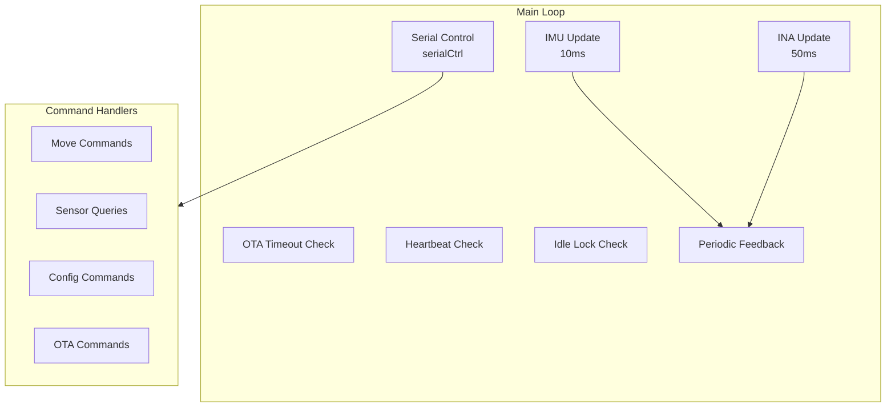
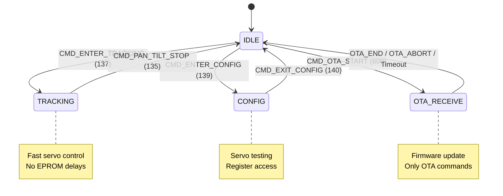
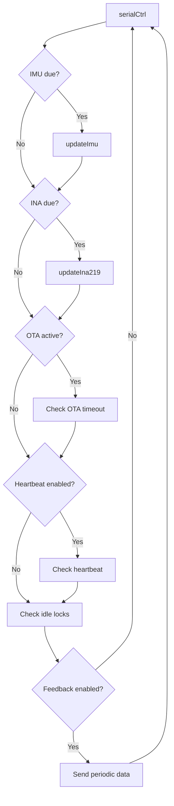
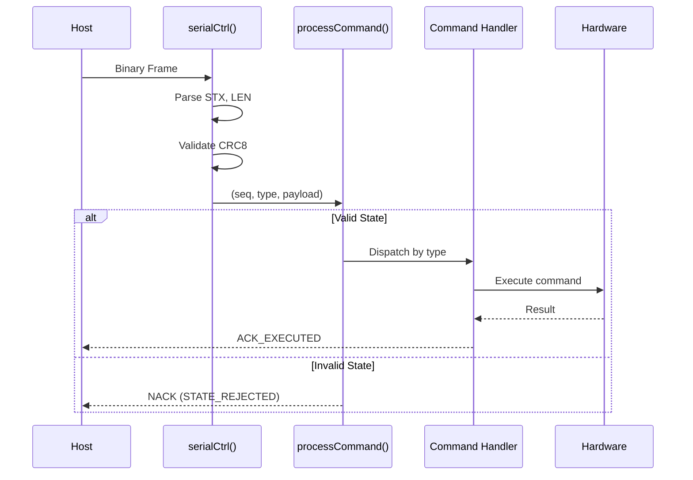

# Main Controller

**File:** `pan_tilt_serial_project.ino`

## Overview

The main controller is the core firmware application running on the ESP32-S3. It implements:
- Binary protocol parsing over USB-UART
- State machine for operational modes
- Command dispatch and execution
- Periodic sensor updates and feedback
- Safety watchdogs (heartbeat, auto-lock)

## Architecture



## State Machine



## Constants

### Serial Configuration

| Constant | Value | Description |
|----------|-------|-------------|
| `SERIAL_BAUD` | 921600 | USB-UART baud rate |
| `SERVO_BAUD` | 1000000 | Servo bus baud rate |

### Pin Assignments

| Constant | Value | Description |
|----------|-------|-------------|
| `S_SCL` | 33 | I2C clock pin |
| `S_SDA` | 32 | I2C data pin |
| `SERVO_RXD` | 18 | Servo UART RX |
| `SERVO_TXD` | 19 | Servo UART TX |

### Servo Configuration

| Constant | Value | Description |
|----------|-------|-------------|
| `PAN_SERVO_ID` | 1 | Pan axis servo ID |
| `TILT_SERVO_ID` | 2 | Tilt axis servo ID |
| `PAN_MIN_DEG` | -180.0 | Pan minimum angle |
| `PAN_MAX_DEG` | 180.0 | Pan maximum angle |
| `TILT_MIN_DEG` | -90.0 | Tilt minimum angle |
| `TILT_MAX_DEG` | 120.0 | Tilt maximum angle |
| `SERVO_CENTER` | 2048 | Center position value |

### Timing

| Constant | Value | Description |
|----------|-------|-------------|
| `IMU_UPDATE_MS` | 10 | IMU update interval (100 Hz) |
| `INA_UPDATE_MS` | 50 | Power monitor interval (20 Hz) |
| `SERVO_FB_MS` | 50 | Servo feedback interval (20 Hz) |
| `DEFAULT_FEEDBACK_MS` | 100 | Periodic response interval |
| `DEFAULT_HEARTBEAT_MS` | 0 | Heartbeat timeout (0=disabled) |
| `DEFAULT_IDLE_LOCK_MS` | 500 | Auto-lock after idle |
| `OTA_TIMEOUT_MS` | 60000 | OTA chunk timeout |

---

## Enums

### GimbalState

```cpp
enum GimbalState {
    IDLE = 0,        // Idle, accepts all commands
    TRACKING = 1,    // Fast tracking mode
    CONFIG = 2,      // Configuration/testing mode
    OTA_RECEIVE = 3  // Receiving firmware update
};
```

---

## Data Structures

### ServoFeedback

```cpp
struct ServoFeedback {
    bool ok;         // Read successful
    int pos;         // Position (0-4095)
    int speed;       // Speed (servo units)
    int load;        // Torque load
    float voltage;   // Supply voltage (V)
    float current;   // Current draw (A)
    float temp;      // Temperature (C)
    byte mode;       // Mode register value
};
```

---

## Global State Variables

### Servo State

| Variable | Type | Description |
|----------|------|-------------|
| `panLocked` | `bool` | Pan axis torque enabled |
| `tiltLocked` | `bool` | Tilt axis torque enabled |
| `panTargetDeg` | `float` | Current pan target (degrees) |
| `tiltTargetDeg` | `float` | Current tilt target (degrees) |
| `panFeedback` | `ServoFeedback` | Pan axis feedback data |
| `tiltFeedback` | `ServoFeedback` | Tilt axis feedback data |

### IMU State

| Variable | Type | Description |
|----------|------|-------------|
| `imuAngles` | `EulerAngles` | Roll, pitch, yaw (degrees) |
| `imuGyro` | `float[3]` | Gyroscope data (dps) |
| `imuAccel` | `float[3]` | Accelerometer data (mg) |
| `imuMagn` | `int16_t[3]` | Magnetometer data (uT) |
| `imuTemp` | `float` | IMU temperature (C) |

### Power State

| Variable | Type | Description |
|----------|------|-------------|
| `busVoltage_V` | `float` | Bus voltage (V) |
| `shuntVoltage_mV` | `float` | Shunt voltage (mV) |
| `loadVoltage_V` | `float` | Load voltage (V) |
| `current_mA` | `float` | Current (mA) |
| `power_mW` | `float` | Power (mW) |
| `ina219_overflow` | `bool` | Overflow flag |

### Timing State

| Variable | Type | Description |
|----------|------|-------------|
| `lastCmdRecvTime` | `uint32_t` | Last command timestamp |
| `heartbeatTimeoutMs` | `uint16_t` | Heartbeat timeout |
| `heartbeatStopActive` | `bool` | Heartbeat triggered stop |
| `lastPanCmdMs` | `uint32_t` | Last pan command time |
| `lastTiltCmdMs` | `uint32_t` | Last tilt command time |

---

## Core Functions

### setup()

Initializes all hardware and peripherals.

```cpp
void setup()
```

**Initialization Sequence:**
1. `Serial.begin(921600)` - USB-UART
2. `Wire.begin(S_SDA, S_SCL)` - I2C bus
3. `Serial1.begin(SERVO_BAUD)` - Servo bus
4. `st.pSerial = &Serial1` - SCServo setup
5. `ina219.init()` - Power monitor
6. `imuInit()` - IMU sensors
7. `ensurePositionMode()` - Servo mode check
8. `setServoTorqueLimitMax()` - Torque limits
9. `st.EnableTorque()` - Enable servos
10. Timer setup for 10ms tick

---

### loop()

Main application loop.

```cpp
void loop()
```

**Loop Sequence:**



---

### serialCtrl()

Non-blocking serial protocol parser.

```cpp
void serialCtrl()
```

**Description:**
Reads available serial bytes, extracts complete frames, validates CRC8, and dispatches to `processCommand()`.

**Frame Detection:**
1. Find STX (0x02)
2. Read LEN byte
3. Accumulate SEQ + TYPE + PAYLOAD
4. Validate CRC8
5. Check ETX (0x03)

---

### processCommand(seq, type, payload, len)

Command dispatcher based on current state.

```cpp
void processCommand(uint16_t seq, uint16_t type, uint8_t* payload, size_t len)
```

**Parameters:**

| Name | Type | Description |
|------|------|-------------|
| `seq` | `uint16_t` | Sequence number (echoed in response) |
| `type` | `uint16_t` | Command type ID |
| `payload` | `uint8_t*` | Payload data |
| `len` | `size_t` | Payload length |

**State Validation:**
- IDLE: All commands allowed
- TRACKING: Move commands only
- CONFIG: Config commands only
- OTA_RECEIVE: OTA commands only

**Returns:** Sends ACK_EXECUTED, ACK_RECEIVED, or NACK response.

---

## Response Functions

### sendFrame(seq, type, payload, len)

Builds and sends a binary response frame.

```cpp
void sendFrame(uint16_t seq, uint16_t type, uint8_t* payload, size_t len)
```

**Parameters:**

| Name | Type | Description |
|------|------|-------------|
| `seq` | `uint16_t` | Sequence number |
| `type` | `uint16_t` | Response type ID |
| `payload` | `uint8_t*` | Payload data (nullable) |
| `len` | `size_t` | Payload length |

**Frame Format:**
```
[STX] [LEN] [SEQ_L] [SEQ_H] [TYPE_L] [TYPE_H] [PAYLOAD...] [CRC8] [ETX]
```

---

### sendNack(seq, errorCode)

Sends a NACK response with error code.

```cpp
void sendNack(uint16_t seq, uint8_t errorCode)
```

**Error Codes:**

| Code | Name | Description |
|------|------|-------------|
| 1 | CHECKSUM | CRC8 validation failed |
| 2 | UNKNOWN | Unknown command type |
| 3 | STATE_REJECTED | Command invalid in current state |
| 4 | EXEC_FAILED | Command execution failed |

---

### sendMoveFeedback(seq, panLoad, panPos, tiltLoad, tiltPos)

Sends ACK_EXECUTED with servo feedback.

```cpp
void sendMoveFeedback(uint16_t seq, int16_t panLoad, int16_t panPos,
                      int16_t tiltLoad, int16_t tiltPos)
```

**Payload (8 bytes):**
```
[panLoad:h] [panPos:h] [tiltLoad:h] [tiltPos:h]
```

---

## Utility Functions

### crc8(data, len)

Calculates CRC8 checksum.

```cpp
uint8_t crc8(const uint8_t* data, size_t len)
```

**Algorithm:** Polynomial 0x07, initial value 0x00, no final XOR.

---

### clampFloat(value, minVal, maxVal)

Clamps a float value to a range.

```cpp
float clampFloat(float value, float minVal, float maxVal)
```

---

### touchHeartbeat()

Resets the heartbeat watchdog timer.

```cpp
void touchHeartbeat()
```

---

## Sequence Diagram: Command Processing



---

## Related Documentation

- [Servo Control](servo-control.md) - ST3215 servo interface
- [IMU Module](imu-module.md) - Sensor fusion
- [Binary Protocol](../protocol/binary-protocol.md) - Frame format
- [Command Reference](../protocol/command-reference.md) - All commands
