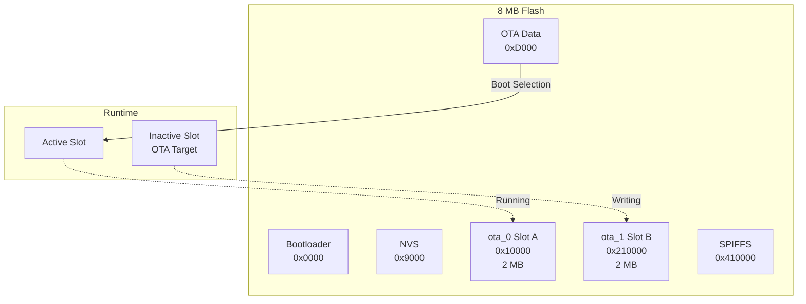
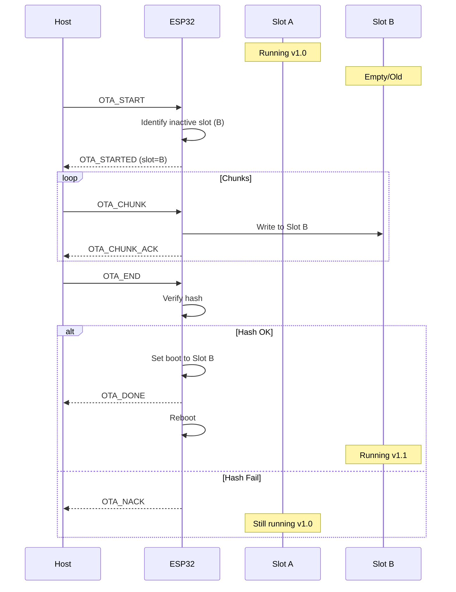
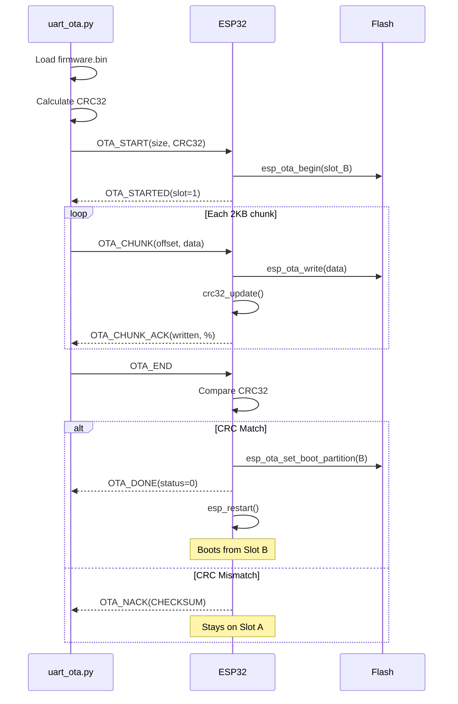

# OTA Handler

**File:** `pan_tilt_serial_project.ino` (OTA functions)

## Overview

The OTA (Over-The-Air) handler provides secure firmware updates via UART using an A/B partition scheme. Key features:
- **A/B Partitions** - Two firmware slots for safe updates
- **Hash Verification** - CRC32/SHA256 validation before commit
- **Rollback Safety** - Bad images never become boot target
- **Timeout Protection** - Abort on chunk timeout (60 sec)

## Architecture



## A/B Partition Scheme



## OTA State Machine

```mermaid
stateDiagram-v2
    [*] --> IDLE

    IDLE --> OTA_RECEIVE: OTA_START
    note right of OTA_RECEIVE: Only OTA commands allowed

    OTA_RECEIVE --> OTA_RECEIVE: OTA_CHUNK
    OTA_RECEIVE --> IDLE: OTA_END (hash OK) → Reboot
    OTA_RECEIVE --> IDLE: OTA_END (hash fail)
    OTA_RECEIVE --> IDLE: OTA_ABORT
    OTA_RECEIVE --> IDLE: Timeout (60s)
```



---

## Constants

| Constant | Value | Description |
|----------|-------|-------------|
| `OTA_TIMEOUT_MS` | 60000 | Chunk timeout (60 sec) |
| `OTA_CHUNK_MAX` | 2048 | Maximum chunk size |
| `HASH_TYPE_CRC32` | 1 | CRC32 hash type |
| `HASH_TYPE_SHA256` | 2 | SHA256 hash type |

---

## OTA State Variables

| Variable | Type | Description |
|----------|------|-------------|
| `otaHandle` | `esp_ota_handle_t` | OTA write handle |
| `otaPartition` | `esp_partition_t*` | Target partition |
| `otaTotalSize` | `uint32_t` | Expected firmware size |
| `otaBytesWritten` | `uint32_t` | Bytes written so far |
| `otaHashType` | `uint8_t` | Hash algorithm (1=CRC32, 2=SHA256) |
| `otaExpectedCrc32` | `uint32_t` | Expected CRC32 |
| `otaRunningCrc32` | `uint32_t` | Running CRC32 calculation |
| `otaLastChunkTime` | `uint32_t` | Last chunk timestamp |

---

## Functions

### handleOtaStart(seq, payload, len)

Begins OTA session.

```cpp
void handleOtaStart(uint16_t seq, uint8_t* payload, size_t len)
```

**Payload Format (9+ bytes):**

| Offset | Type | Field |
|--------|------|-------|
| 0 | uint32 | total_size |
| 4 | uint8 | hash_type (1=CRC32, 2=SHA256) |
| 5 | uint32/32B | expected_hash |

**Behavior:**
1. Parse total size and hash type
2. Get next OTA partition (`esp_ota_get_next_update_partition`)
3. Begin OTA (`esp_ota_begin`)
4. Store expected hash
5. Initialize running CRC32
6. Set state to `OTA_RECEIVE`
7. Send `OTA_STARTED` response

**Response (OTA_STARTED = 2600):**

| Offset | Type | Field |
|--------|------|-------|
| 0 | uint8 | inactive_slot (0=A, 1=B) |
| 1 | uint32 | slot_size |

---

### handleOtaChunk(seq, payload, len)

Writes firmware chunk to flash.

```cpp
void handleOtaChunk(uint16_t seq, uint8_t* payload, size_t len)
```

**Payload Format:**

| Offset | Type | Field |
|--------|------|-------|
| 0 | uint32 | offset |
| 4 | uint16 | chunk_len |
| 6 | bytes | data[chunk_len] |

**Behavior:**
1. Validate offset matches `otaBytesWritten`
2. Write chunk (`esp_ota_write`)
3. Update running CRC32
4. Update `otaBytesWritten`
5. Update `otaLastChunkTime`
6. Send `OTA_CHUNK_ACK` response

**Response (OTA_CHUNK_ACK = 2601):**

| Offset | Type | Field |
|--------|------|-------|
| 0 | uint32 | bytes_written |
| 4 | uint8 | progress_percent |

---

### handleOtaEnd(seq)

Finalizes OTA and commits if hash matches.

```cpp
void handleOtaEnd(uint16_t seq)
```

**Behavior:**
1. Call `esp_ota_end()` to finalize write
2. Compare running CRC32 with expected
3. **If match:**
   - `esp_ota_set_boot_partition()` to new partition
   - Send `OTA_DONE` response
   - Delay 100ms
   - `esp_restart()`
4. **If mismatch:**
   - Send `OTA_NACK` with `ERROR_CHECKSUM`
   - Return to IDLE state (old partition still active)

**Response (OTA_DONE = 2602):**

| Offset | Type | Field |
|--------|------|-------|
| 0 | uint8 | status (0=OK) |

---

### handleOtaAbort(seq)

Aborts OTA session.

```cpp
void handleOtaAbort(uint16_t seq)
```

**Behavior:**
1. Call `esp_ota_abort()` if handle valid
2. Clean up OTA state
3. Return to IDLE state
4. Send `OTA_NACK` with `ERROR_ABORTED`

---

### otaAbortCleanup()

Cleans up OTA state variables.

```cpp
void otaAbortCleanup()
```

**Resets:**
- `otaHandle = 0`
- `otaPartition = nullptr`
- `otaTotalSize = 0`
- `otaBytesWritten = 0`
- `gimbalState = IDLE`

---

### handleGetFwInfo(seq)

Returns firmware version information.

```cpp
void handleGetFwInfo(uint16_t seq)
```

**Response (FW_INFO = 2610):**

| Offset | Type | Field |
|--------|------|-------|
| 0 | uint8 | active_slot (0=A, 1=B) |
| 1 | char[32] | version_a |
| 33 | char[32] | version_b |

---

### handleSwitchFw(seq, payload)

Switches boot partition and reboots.

```cpp
void handleSwitchFw(uint16_t seq, uint8_t* payload)
```

**Payload:**

| Offset | Type | Field |
|--------|------|-------|
| 0 | uint8 | target_slot (0=A, 1=B) |

**Behavior:**
1. Get partition by slot number
2. `esp_ota_set_boot_partition()`
3. Send ACK
4. `esp_restart()`

---

### getPartitionVersion(partition)

Extracts version string from partition.

```cpp
const char* getPartitionVersion(const esp_partition_t* partition)
```

**Returns:** Version string from firmware header, or "unknown".

---

### crc32_update(crc, data, len)

Updates running CRC32 calculation.

```cpp
uint32_t crc32_update(uint32_t crc, const uint8_t* data, size_t len)
```

**Parameters:**

| Name | Type | Description |
|------|------|-------------|
| `crc` | `uint32_t` | Current CRC value |
| `data` | `uint8_t*` | Data buffer |
| `len` | `size_t` | Data length |

**Returns:** Updated CRC32 value.

---

## Error Codes

### OTA_NACK Error Codes

| Code | Name | Description |
|------|------|-------------|
| 1 | ERROR_SIZE | Invalid firmware size |
| 2 | ERROR_CHECKSUM | Hash mismatch |
| 3 | ERROR_FLASH | Flash write error |
| 4 | ERROR_TIMEOUT | Chunk timeout |
| 5 | ERROR_ABORTED | User aborted |

---

## Timeout Handling

In main loop:
```cpp
if (gimbalState == OTA_RECEIVE) {
    if (millis() - otaLastChunkTime > OTA_TIMEOUT_MS) {
        otaAbortCleanup();
        sendOtaNack(seq, ERROR_TIMEOUT);
    }
}
```

---

## Sequence Diagram: Complete OTA Flow



---

## Safety Features

1. **Hash-Before-Commit**: New partition only becomes boot target after hash verification
2. **Timeout Protection**: Aborts if no chunk received for 60 seconds
3. **State Isolation**: Only OTA commands accepted during OTA_RECEIVE state
4. **Rollback Ready**: If new firmware crashes before marking valid, bootloader can roll back

---

## Related Documentation

- [Main Controller](main-controller.md) - State machine
- [OTA Uploader Tool](../tools/ota-uploader.md) - Host-side tool
- [Command Reference](../protocol/command-reference.md) - OTA commands
