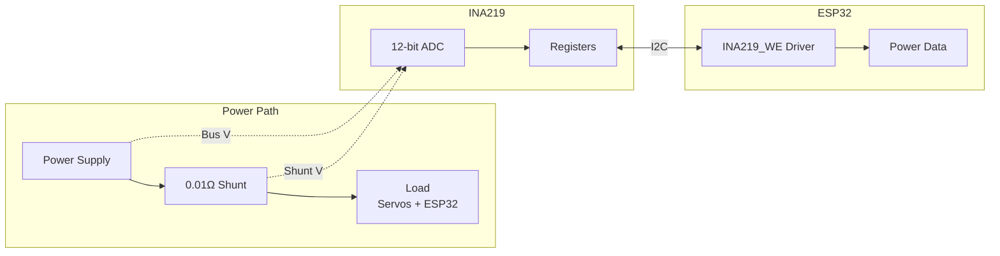

# Power Monitor

**File:** `pan_tilt_serial_project.ino` (INA219 functions)

## Overview

The power monitor uses an INA219 current/voltage sensor to track:
- Bus voltage
- Shunt voltage
- Load voltage
- Current draw
- Power consumption

Update rate: 20 Hz (50 ms interval).

## Architecture



## Configuration

### Hardware Setup

| Parameter | Value |
|-----------|-------|
| I2C Address | 0x42 |
| Shunt Resistor | 0.01 Ω |
| Bus Voltage Range | 16V |
| Shunt Voltage Range | 320 mV |
| ADC Resolution | 9-bit |

### Initialization

```cpp
INA219_WE ina219(0x42);

void setupIna219() {
    ina219.init();
    ina219.setADCMode(INA219_BIT_MODE_9);
    ina219.setPGain(INA219_PG_320);
    ina219.setBusRange(INA219_BRNG_16);
    ina219.setShuntSizeInOhms(0.01f);
}
```

---

## Functions

### updateIna219()

Reads all power parameters from INA219.

```cpp
void updateIna219()
```

**Updates:**
- `busVoltage_V` - Bus voltage (V)
- `shuntVoltage_mV` - Shunt voltage drop (mV)
- `loadVoltage_V` - Load voltage (V) = bus + shunt
- `current_mA` - Current draw (mA)
- `power_mW` - Power consumption (mW)
- `ina219_overflow` - Overflow flag

**Call Rate:** Every 50 ms in main loop.

---

### sendInaBinary(seq)

Sends INA219 data as binary response.

```cpp
void sendInaBinary(uint16_t seq)
```

**Parameters:**

| Name | Type | Description |
|------|------|-------------|
| `seq` | `uint16_t` | Sequence number for response |

**Response Type:** 1010 (FEEDBACK_INA)

---

## Global Variables

| Variable | Type | Description |
|----------|------|-------------|
| `busVoltage_V` | `float` | Bus voltage (V) |
| `shuntVoltage_mV` | `float` | Shunt voltage (mV) |
| `loadVoltage_V` | `float` | Load voltage (V) |
| `current_mA` | `float` | Current (mA) |
| `power_mW` | `float` | Power (mW) |
| `ina219_overflow` | `bool` | Overflow flag |

---

## Binary Response Format

### INA Response (Type 1010)

**Payload (21 bytes):**

| Offset | Type | Field |
|--------|------|-------|
| 0 | float | bus_voltage_v |
| 4 | float | shunt_voltage_mv |
| 8 | float | load_voltage_v |
| 12 | float | current_ma |
| 16 | float | power_mw |
| 20 | uint8 | overflow (0/1) |

---

## INA219_WE Library Reference

### Methods Used

| Method | Returns | Description |
|--------|---------|-------------|
| `init()` | `bool` | Initialize sensor |
| `getShuntVoltage_mV()` | `float` | Shunt voltage (mV) |
| `getBusVoltage_V()` | `float` | Bus voltage (V) |
| `getCurrent_mA()` | `float` | Current (mA) |
| `getBusPower()` | `float` | Power (mW) |
| `getOverflow()` | `bool` | Overflow flag |
| `setADCMode(mode)` | `void` | Set ADC resolution |
| `setPGain(gain)` | `void` | Set shunt voltage range |
| `setBusRange(range)` | `void` | Set bus voltage range |
| `setShuntSizeInOhms(val)` | `void` | Set shunt resistance |

### ADC Modes

| Mode | Resolution | Conversion Time |
|------|------------|-----------------|
| `INA219_BIT_MODE_9` | 9-bit | 84 µs |
| `INA219_BIT_MODE_10` | 10-bit | 148 µs |
| `INA219_BIT_MODE_11` | 11-bit | 276 µs |
| `INA219_BIT_MODE_12` | 12-bit | 532 µs |

### PGain Settings

| Setting | Shunt Voltage Range |
|---------|---------------------|
| `INA219_PG_40` | ±40 mV |
| `INA219_PG_80` | ±80 mV |
| `INA219_PG_160` | ±160 mV |
| `INA219_PG_320` | ±320 mV |

---

## Calculations

### Current Calculation

```
current_mA = shuntVoltage_mV / shuntResistance_Ohms
           = shuntVoltage_mV / 0.01
           = shuntVoltage_mV * 100
```

### Load Voltage Calculation

```
loadVoltage_V = busVoltage_V + (shuntVoltage_mV / 1000)
```

### Power Calculation

```
power_mW = loadVoltage_V * current_mA
```

---

## Typical Values

| Parameter | Typical Range | Notes |
|-----------|---------------|-------|
| Bus Voltage | 5.0 - 8.4 V | Battery dependent |
| Current (Idle) | 50 - 150 mA | ESP32 + sensors |
| Current (Moving) | 200 - 800 mA | Servo dependent |
| Current (Stall) | 1000+ mA | Motor stall |

---

## Related Documentation

- [Main Controller](main-controller.md) - Update loop
- [Response Reference](../protocol/response-reference.md) - INA response format
- [Hardware Interfaces](../hardware/interfaces.md) - I2C connections
