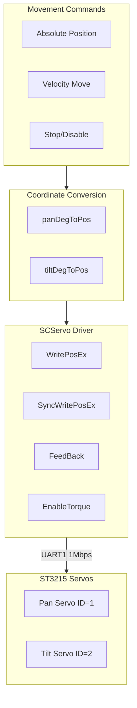
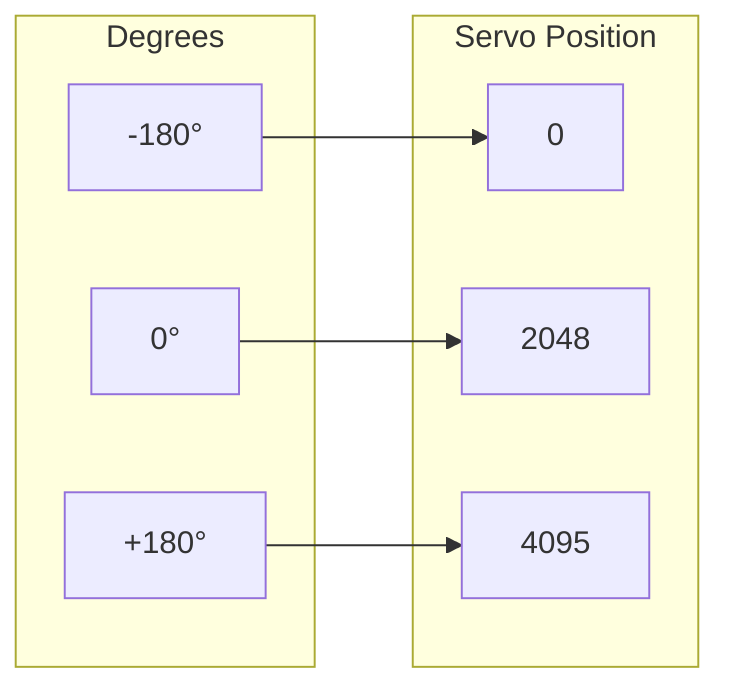
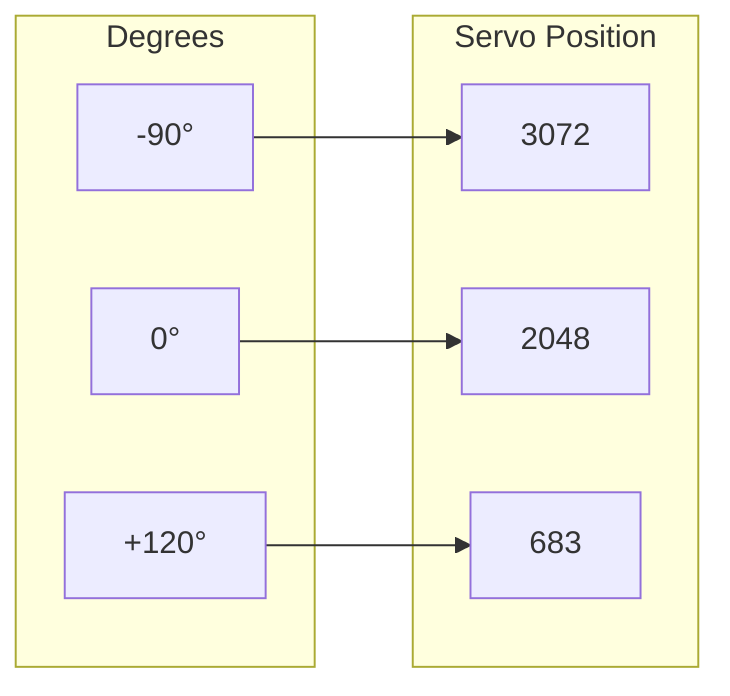
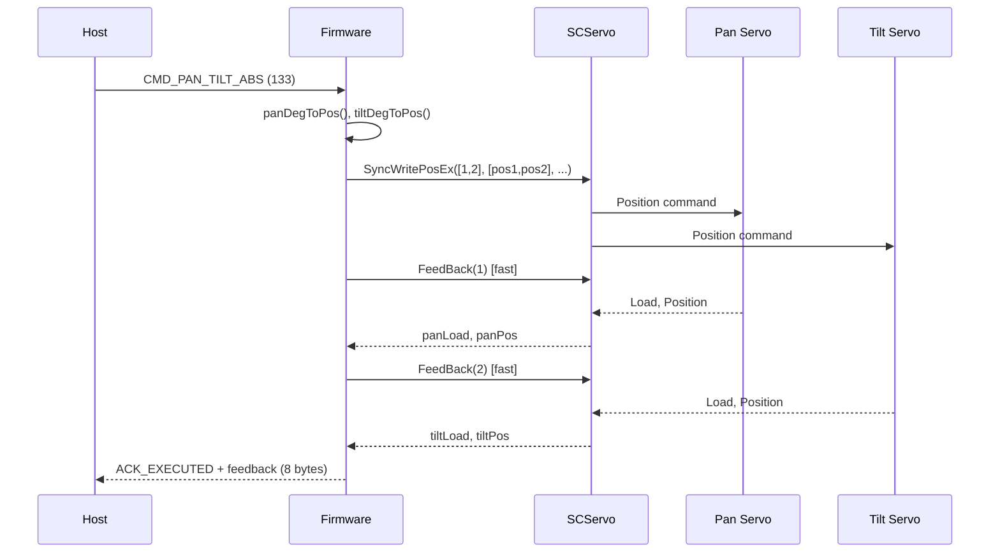

# Servo Control

**Files:** `pan_tilt_serial_project.ino` (servo functions)

## Overview

The servo control module manages two ST3215 serial bus servos for pan and tilt axes. It provides:
- Degree-to-position conversion
- Absolute and velocity-based motion
- Torque control (lock/unlock)
- Feedback polling
- EPROM configuration

## Architecture



## Position Mapping

### Pan Axis



**Formula:**
```cpp
pos = SERVO_CENTER + (deg * DEG_TO_POS)
    = 2048 + (deg * 11.375)
```

### Tilt Axis (Inverted)



**Formula:**
```cpp
pos = SERVO_CENTER - (deg * DEG_TO_POS)
    = 2048 - (deg * 11.375)
```

---

## Constants

| Constant | Value | Description |
|----------|-------|-------------|
| `PAN_SERVO_ID` | 1 | Pan servo bus ID |
| `TILT_SERVO_ID` | 2 | Tilt servo bus ID |
| `SERVO_CENTER` | 2048 | Center position (0°) |
| `DEG_TO_POS` | 11.375 | Degrees to position factor |
| `PAN_MIN_DEG` | -180.0 | Pan minimum angle |
| `PAN_MAX_DEG` | 180.0 | Pan maximum angle |
| `TILT_MIN_DEG` | -90.0 | Tilt minimum angle |
| `TILT_MAX_DEG` | 120.0 | Tilt maximum angle |

---

## Functions

### Coordinate Conversion

#### panDegToPos(deg)

Converts pan angle to servo position.

```cpp
int panDegToPos(float deg)
```

**Parameters:**

| Name | Type | Description |
|------|------|-------------|
| `deg` | `float` | Angle in degrees (-180 to +180) |

**Returns:** `int` - Servo position (0-4095)

**Example:**
```cpp
int pos = panDegToPos(45.0f);  // Returns ~2560
```

---

#### tiltDegToPos(deg)

Converts tilt angle to servo position (inverted).

```cpp
int tiltDegToPos(float deg)
```

**Parameters:**

| Name | Type | Description |
|------|------|-------------|
| `deg` | `float` | Angle in degrees (-90 to +120) |

**Returns:** `int` - Servo position (0-4095)

**Example:**
```cpp
int pos = tiltDegToPos(-45.0f);  // Returns ~2560
```

---

### Movement Functions

#### setPanTiltAbs(pan, tilt, speed, accel)

Sets both axes to absolute positions (non-tracking mode).

```cpp
void setPanTiltAbs(float pan, float tilt, uint16_t speed, uint16_t accel)
```

**Parameters:**

| Name | Type | Description |
|------|------|-------------|
| `pan` | `float` | Pan angle (degrees) |
| `tilt` | `float` | Tilt angle (degrees) |
| `speed` | `uint16_t` | Movement speed (servo units) |
| `accel` | `uint16_t` | Acceleration (servo units) |

**Behavior:**
1. Clamps angles to valid range
2. Converts to servo positions
3. Calls `ensurePositionMode()` for each servo
4. Calls `setServoTorqueLimitMax()` for each servo
5. Executes `st.SyncWritePosEx()`
6. Updates `panTargetDeg`, `tiltTargetDeg`

---

#### setPanTiltAbsTracking(pan, tilt, speed, accel)

Fast absolute positioning for TRACKING mode.

```cpp
void setPanTiltAbsTracking(float pan, float tilt, uint16_t speed, uint16_t accel)
```

**Parameters:** Same as `setPanTiltAbs()`

**Behavior:**
1. Clamps angles to valid range
2. Converts to servo positions
3. Executes `st.SyncWritePosEx()` **immediately** (no EPROM operations)
4. Updates target variables

**Note:** Mode and torque limits are configured once in `onEnterTracking()`.

---

#### setPanTiltMove(pan, tilt, speedX, speedY)

Velocity-based movement for both axes.

```cpp
void setPanTiltMove(float pan, float tilt, uint16_t speedX, uint16_t speedY)
```

**Parameters:**

| Name | Type | Description |
|------|------|-------------|
| `pan` | `float` | Pan velocity (degrees/unit) |
| `tilt` | `float` | Tilt velocity (degrees/unit) |
| `speedX` | `uint16_t` | Pan speed limit |
| `speedY` | `uint16_t` | Tilt speed limit |

---

#### setPanAbs(deg, speed, accel) / setTiltAbs(deg, speed, accel)

Single-axis absolute positioning.

```cpp
void setPanAbs(float deg, uint16_t speed, uint16_t accel)
void setTiltAbs(float deg, uint16_t speed, uint16_t accel)
```

---

#### setPanMove(deg, speed) / setTiltMove(deg, speed)

Single-axis velocity movement.

```cpp
void setPanMove(float deg, uint16_t speed)
void setTiltMove(float deg, uint16_t speed)
```

---

#### stopPanTilt()

Stops motion and disables torque on both axes.

```cpp
void stopPanTilt()
```

**Behavior:**
1. `st.EnableTorque(PAN_SERVO_ID, 0)`
2. `st.EnableTorque(TILT_SERVO_ID, 0)`
3. Sets `panLocked = false`, `tiltLocked = false`

---

### Torque Control

#### lockAxis(id, feedback, locked_flag)

Enables torque and holds current position.

```cpp
void lockAxis(int id, ServoFeedback& fb, bool& locked_flag)
```

**Parameters:**

| Name | Type | Description |
|------|------|-------------|
| `id` | `int` | Servo ID |
| `fb` | `ServoFeedback&` | Feedback struct to update |
| `locked_flag` | `bool&` | Lock state flag |

**Behavior:**
1. Reads current position via `readServoFeedback()`
2. Enables torque via `st.EnableTorque(id, 1)`
3. Commands position hold via `st.WritePosEx(id, fb.pos, ...)`
4. Sets `locked_flag = true`

---

#### unlockAxis(id, locked_flag)

Disables torque on specified axis.

```cpp
void unlockAxis(int id, bool& locked_flag)
```

**Behavior:**
1. `st.EnableTorque(id, 0)`
2. Sets `locked_flag = false`

---

### Feedback Functions

#### readServoFeedback(id, out)

Full feedback read with delays.

```cpp
bool readServoFeedback(int id, ServoFeedback& out)
```

**Parameters:**

| Name | Type | Description |
|------|------|-------------|
| `id` | `int` | Servo ID |
| `out` | `ServoFeedback&` | Output struct |

**Returns:** `bool` - Success status

**Populated Fields:**
- `pos` - Position (0-4095)
- `speed` - Speed (servo units)
- `load` - Torque load
- `voltage` - Supply voltage
- `current` - Current draw
- `temp` - Temperature
- `mode` - Mode register

**Note:** Includes small delays between reads for bus stability.

---

#### readServoFeedbackTracking(id, load, pos)

Fast feedback for TRACKING mode (load + position only).

```cpp
bool readServoFeedbackTracking(int id, int16_t& load, int16_t& pos)
```

**Parameters:**

| Name | Type | Description |
|------|------|-------------|
| `id` | `int` | Servo ID |
| `load` | `int16_t&` | Output load value |
| `pos` | `int16_t&` | Output position value |

**Returns:** `bool` - Success status

**Note:** No delays, minimal bus traffic for real-time feedback.

---

### Configuration Functions

#### ensurePositionMode(id)

Verifies servo is in position control mode.

```cpp
bool ensurePositionMode(int id)
```

**Behavior:**
1. Reads mode register
2. If mode != 0, writes 0 (position mode)
3. Returns success status

---

#### setServoTorqueLimitMax(id)

Sets torque limit to maximum (1000).

```cpp
void setServoTorqueLimitMax(int id)
```

**Behavior:**
1. `st.unLockEprom(id)`
2. `st.writeWord(id, TORQUE_LIMIT_REG, 1000)`
3. `st.LockEprom(id)`

---

#### setTiltServoAngleLimits()

Configures tilt axis angle limits in EPROM.

```cpp
void setTiltServoAngleLimits()
```

**Limits:**
- Min: 683 (corresponds to +120°)
- Max: 3072 (corresponds to -90°)

---

## Sequence Diagram: Tracking Mode Move



---

## SCServo Library Reference

### Key Methods Used

| Method | Description |
|--------|-------------|
| `WritePosEx(id, pos, speed, acc)` | Write single servo position |
| `SyncWritePosEx(ids[], pos[], spd[], acc[])` | Synchronous multi-servo write |
| `EnableTorque(id, enable)` | Enable/disable torque |
| `FeedBack(id)` | Request feedback packet |
| `ReadPos(-1)` | Get last position from feedback |
| `ReadLoad(-1)` | Get last load from feedback |
| `ReadSpeed(-1)` | Get last speed from feedback |
| `readByte(id, addr)` | Read EPROM byte |
| `writeByte(id, addr, val)` | Write EPROM byte |
| `readWord(id, addr)` | Read EPROM word |
| `writeWord(id, addr, val)` | Write EPROM word |
| `unLockEprom(id)` | Unlock EPROM for writing |
| `LockEprom(id)` | Lock EPROM |

---

## Related Documentation

- [Main Controller](main-controller.md) - Command processing
- [Command Reference](../protocol/command-reference.md) - Move commands
- [Hardware Interfaces](../hardware/interfaces.md) - Pin mappings
