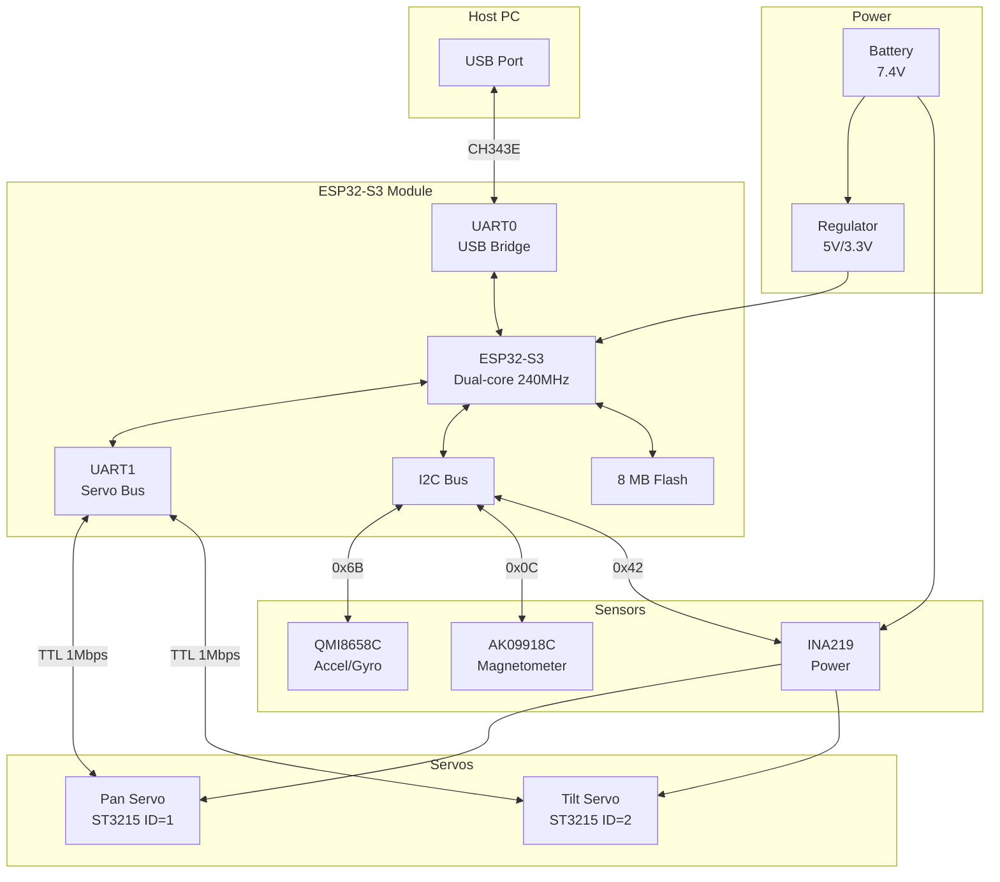
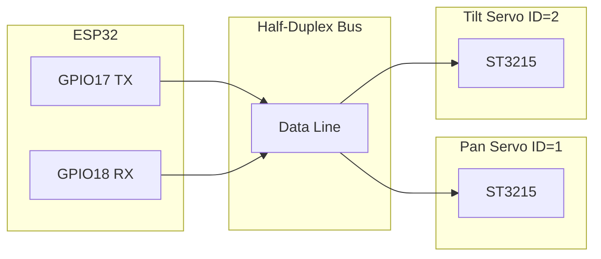
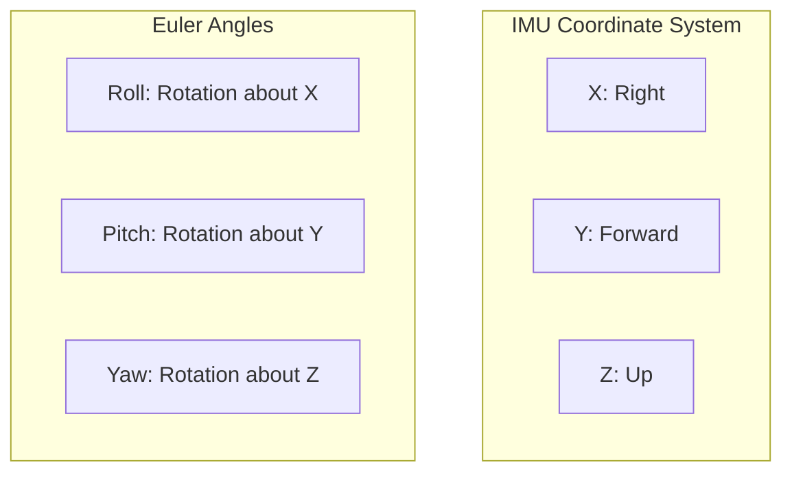
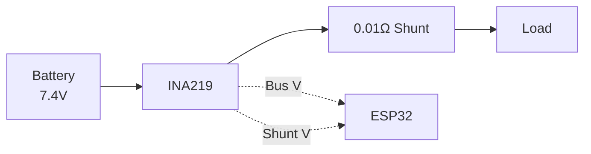
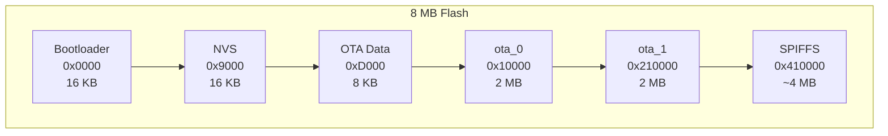

# Hardware Interfaces

## Overview

The Pan-Tilt Controller hardware consists of:
- ESP32-S3 microcontroller
- Two ST3215 serial bus servos
- QMI8658C + AK09918C IMU
- INA219 power monitor
- USB-Serial bridge

## System Block Diagram



---

## Pin Assignments

### ESP32-S3 GPIO Map

| GPIO | Function | Description |
|------|----------|-------------|
| 43 | UART0 TX | USB bridge TX |
| 44 | UART0 RX | USB bridge RX |
| 17 | UART1 TX | Servo bus TX |
| 18 | UART1 RX | Servo bus RX |
| 11 | I2C SDA | Sensor data |
| 12 | I2C SCL | Sensor clock |

### Firmware Constants

```cpp
// I2C Pins (from code: S_SDA=32, S_SCL=33 - may vary by board revision)
#define S_SDA 32
#define S_SCL 33

// Servo UART Pins
#define SERVO_RXD 18
#define SERVO_TXD 19
```

---

## Communication Interfaces

### UART0 - Host Communication

| Parameter | Value |
|-----------|-------|
| Baud Rate | 921600 |
| Data Bits | 8 |
| Parity | None |
| Stop Bits | 1 |
| Bridge IC | CH343E (USB-Serial) |
| Protocol | Binary frames |

### UART1 - Servo Bus

| Parameter | Value |
|-----------|-------|
| Baud Rate | 1,000,000 (1 Mbps) |
| Data Bits | 8 |
| Parity | None |
| Stop Bits | 1 |
| Mode | Half-duplex TTL |
| Protocol | Feetech serial bus |

### I2C Bus

| Parameter | Value |
|-----------|-------|
| Speed | 400 kHz (Fast mode) |
| Pull-ups | External 4.7kΩ |
| Voltage | 3.3V |

---

## Servo Interface (ST3215)

### Physical Connection



### Servo Configuration

| Parameter | Pan (ID=1) | Tilt (ID=2) |
|-----------|------------|-------------|
| Position Range | 0-4095 | 0-4095 |
| Angle Range | -180° to +180° | -90° to +120° |
| Center Position | 2048 | 2048 |
| Torque Limit | 1000 | 1000 |
| Mode | Position (0) | Position (0) |

### Angle Mapping

**Pan Axis:**
```
Position = 2048 + (degrees × 11.375)

-180° → 0
0° → 2048
+180° → 4095
```

**Tilt Axis (Inverted):**
```
Position = 2048 - (degrees × 11.375)

-90° → 3072
0° → 2048
+120° → 683
```

### Key Registers

| Address | Name | Size | Description |
|---------|------|------|-------------|
| 0x05 | ID | 1 | Servo ID |
| 0x06 | Baud Rate | 1 | Communication speed |
| 0x09 | Min Angle Limit | 2 | Minimum position |
| 0x0B | Max Angle Limit | 2 | Maximum position |
| 0x10 | Torque Limit | 2 | Max torque |
| 0x21 | Torque Enable | 1 | Enable/disable |
| 0x29 | Goal Position | 2 | Target position |
| 0x38 | Present Position | 2 | Current position |
| 0x3C | Present Load | 2 | Current torque |
| 0x3E | Present Voltage | 1 | Supply voltage |
| 0x3F | Present Temp | 1 | Temperature |

---

## IMU Interface

### QMI8658C (Accelerometer/Gyroscope)

| Parameter | Value |
|-----------|-------|
| I2C Address | 0x6B |
| Accel Range | ±8g (configurable) |
| Gyro Range | ±512 dps (configurable) |
| ODR | 470 Hz |
| Interface | I2C @ 400 kHz |

### AK09918C (Magnetometer)

| Parameter | Value |
|-----------|-------|
| I2C Address | 0x0C |
| Range | ±4900 µT |
| Resolution | 0.15 µT/LSB |
| Mode | Continuous 100 Hz |
| Interface | I2C @ 400 kHz |

### IMU Orientation



---

## Power Monitor Interface

### INA219 Configuration

| Parameter | Value |
|-----------|-------|
| I2C Address | 0x42 |
| Shunt Resistor | 0.01 Ω |
| Bus Voltage Range | 16V |
| Shunt Voltage Range | ±320 mV |
| ADC Resolution | 9-bit |

### Measurement Capabilities

| Measurement | Range | Resolution |
|-------------|-------|------------|
| Bus Voltage | 0-16V | 4 mV |
| Shunt Voltage | ±320 mV | 0.1 mV |
| Current | ±32A | 0.1 mA |
| Power | 0-512W | Calculated |

### Power Path



---

## Flash Memory Layout

### Partition Table (8 MB)



| Partition | Offset | Size | Purpose |
|-----------|--------|------|---------|
| bootloader | 0x0000 | 16 KB | ESP32 bootloader |
| nvs | 0x9000 | 16 KB | Non-volatile storage |
| otadata | 0xD000 | 8 KB | OTA boot selection |
| ota_0 | 0x10000 | 2 MB | Application Slot A |
| ota_1 | 0x210000 | 2 MB | Application Slot B |
| spiffs | 0x410000 | ~4 MB | Filesystem |

---

## Power Requirements

### Voltage Rails

| Rail | Voltage | Source |
|------|---------|--------|
| Battery | 7.4V (2S LiPo) | External |
| Servo | 7.4V | Direct from battery |
| ESP32 | 3.3V | On-board regulator |
| Sensors | 3.3V | On-board regulator |

### Current Consumption

| State | Current | Notes |
|-------|---------|-------|
| Idle | 100-150 mA | ESP32 + sensors |
| Moving | 300-800 mA | Depends on load |
| Stall | 1000+ mA | Motor stall condition |

---

## Board Connections

### Waveshare General Driver for Robots

| Connector | Purpose | Notes |
|-----------|---------|-------|
| USB-C | Host communication | CH343E bridge |
| Servo | ST3215 bus | 3-pin TTL |
| I2C | IMU + INA219 | 4-pin |
| Power | Battery input | 7.4V nominal |

---

## Related Documentation

- [Servo Control](../firmware/servo-control.md) - Servo driver
- [IMU Module](../firmware/imu-module.md) - IMU driver
- [Power Monitor](../firmware/power-monitor.md) - INA219 driver
