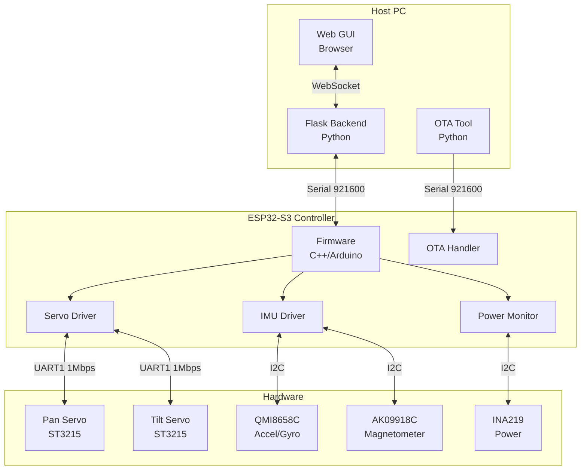
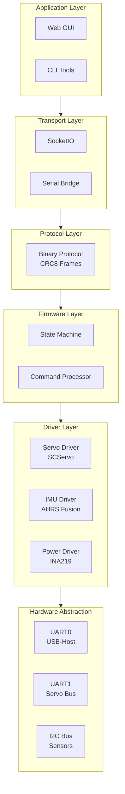
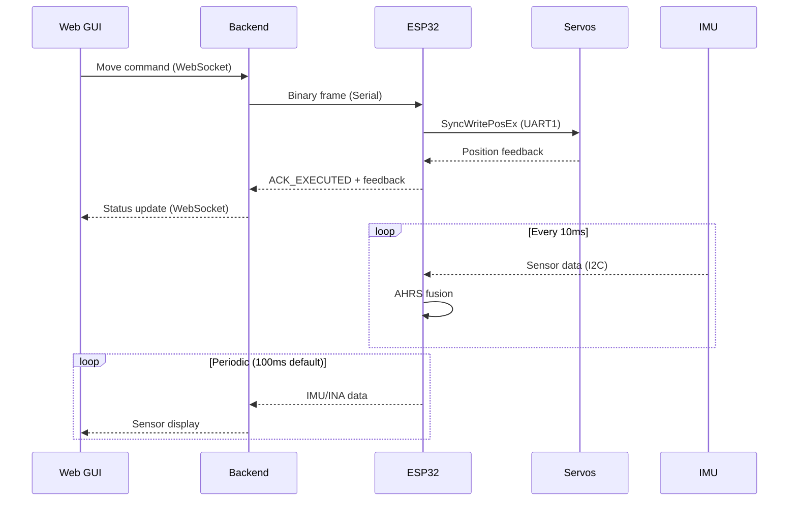
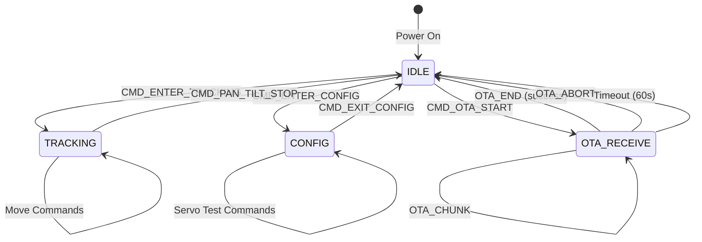
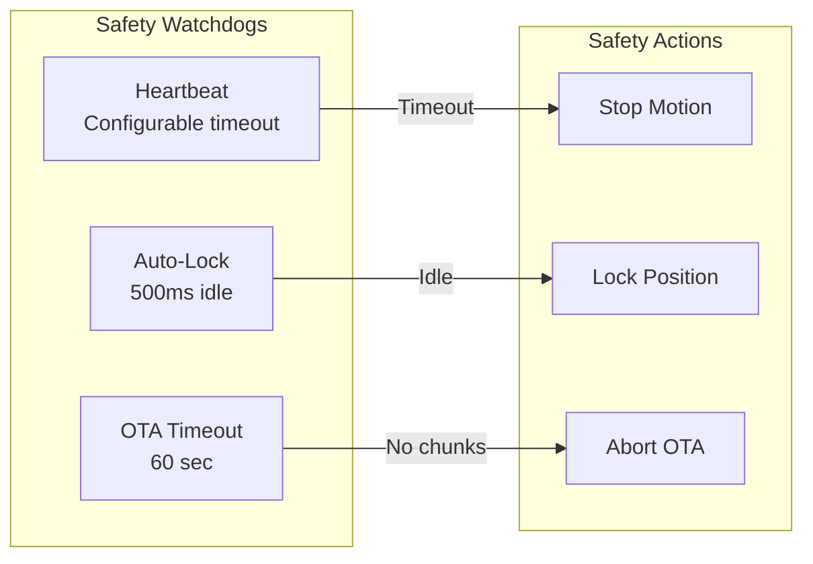

# Pan-Tilt Controller - Design Documentation

## Navigation

| Document | Description |
|----------|-------------|
| [Package Overview](packages.md) | Module hierarchy and dependencies |
| **Firmware** | |
| [Main Controller](firmware/main-controller.md) | ESP32 main loop and state machine |
| [Servo Control](firmware/servo-control.md) | ST3215 servo bus interface |
| [IMU Module](firmware/imu-module.md) | QMI8658 + AK09918 sensor fusion |
| [Power Monitor](firmware/power-monitor.md) | INA219 power tracking |
| [OTA Handler](firmware/ota-handler.md) | A/B partition firmware updates |
| **Backend** | |
| [Flask Server](backend/flask-server.md) | Web server and SocketIO handlers |
| [Serial Bridge](backend/serial-bridge.md) | Serial communication thread |
| [Protocol Encoder](backend/protocol-encoder.md) | Binary frame encoding/decoding |
| **Protocol** | |
| [Binary Protocol](protocol/binary-protocol.md) | Frame format and CRC8 |
| [Command Reference](protocol/command-reference.md) | All command types |
| [Response Reference](protocol/response-reference.md) | All response types |
| **Hardware** | |
| [Hardware Interfaces](hardware/interfaces.md) | Pin mappings and connections |
| **Tools** | |
| [OTA Uploader](tools/ota-uploader.md) | UART OTA firmware tool |

---

## High-Level Design (HLD)

### 1. System Overview

The Pan-Tilt Controller is a custom firmware and tooling system for the **Waveshare 2-Axis Pan-Tilt Camera Module** using an **ESP32-S3** microcontroller and **ST3215 serial bus servos**.

### 2. Architecture Layers

### 3. Key Features

| Feature | Description |
|---------|-------------|
| **Binary Protocol** | Custom UART protocol at 921600 baud with CRC8 checksums |
| **OTA Updates** | A/B partition scheme with hash verification before commit |
| **Real-time Control** | 100 Hz IMU fusion, 20 Hz servo feedback |
| **State Machine** | IDLE, TRACKING, CONFIG, OTA_RECEIVE states |
| **Safety Watchdog** | Heartbeat timeout and auto-lock mechanisms |
| **Web GUI** | Real-time control via Flask + SocketIO |

### 4. Data Flow

### 5. State Machine

### 6. Communication Interfaces

| Interface | Speed | Protocol | Purpose |
|-----------|-------|----------|---------|
| USB-UART (UART0) | 921600 baud | Binary frames | Host communication |
| Servo Bus (UART1) | 1 Mbps | Half-duplex TTL | ST3215 control |
| I2C | 400 kHz | Standard I2C | IMU + Power monitor |

### 7. Update Rates

| Component | Rate | Period |
|-----------|------|--------|
| IMU Sensor Read | 100 Hz | 10 ms |
| AHRS Fusion | 100 Hz | 10 ms |
| Power Monitor | 20 Hz | 50 ms |
| Servo Feedback | 20 Hz | 50 ms |
| Periodic Response | 10 Hz | 100 ms (default) |

### 8. Safety Mechanisms

---

## Technology Stack

| Layer | Technology |
|-------|------------|
| Microcontroller | ESP32-S3 (dual-core 240 MHz) |
| Firmware | Arduino/PlatformIO (C++) |
| Backend | Python 3, Flask, SocketIO |
| Protocol | Custom binary, CRC8 |
| Servos | ST3215 (SCServo library) |
| IMU | QMI8658C + AK09918C |
| Power | INA219 |
| OTA | ESP-IDF OTA API, A/B partitions |

---

## Version History

| Version | Date | Changes |
|---------|------|---------|
| 1.0 | 2024 | Initial release with basic control |
| 1.1 | 2024 | Added OTA support, A/B scheme |
| 1.2 | 2024 | TRACKING mode optimization |
