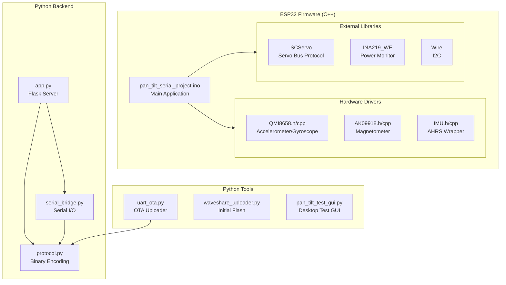
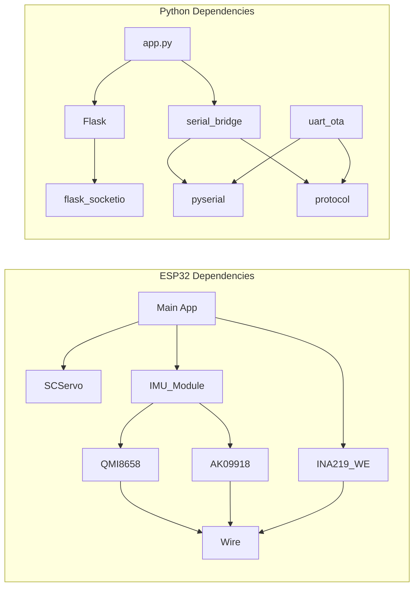

# Package Overview

## Module Hierarchy



---

## Firmware Modules

### Core Application

| File | Purpose | Dependencies |
|------|---------|--------------|
| `pan_tilt_serial_project.ino` | Main application, state machine, command processing | All drivers |

### IMU Drivers

| File | Class | Purpose |
|------|-------|---------|
| `QMI8658.h/cpp` | `QMI8658` | 6-axis accelerometer/gyroscope driver |
| `AK09918.h/cpp` | `AK09918` | 3-axis magnetometer driver |
| `IMU.h/cpp` | (functions) | AHRS fusion wrapper, Euler angle output |

### External Libraries

| Library | Purpose | Source |
|---------|---------|--------|
| `SCServo` | ST3215 servo protocol | Waveshare/Feetech |
| `INA219_WE` | Power monitor driver | Wolfgang Ewald |
| `Wire` | I2C communication | Arduino core |

---

## Backend Modules

### Flask Server

| File | Purpose | Exports |
|------|---------|---------|
| `app.py` | HTTP server, WebSocket handlers | Flask app instance |

### Serial Communication

| File | Purpose | Exports |
|------|---------|---------|
| `serial_bridge.py` | Threaded serial I/O, frame parsing | `SerialBridge` class |

### Protocol

| File | Purpose | Exports |
|------|---------|---------|
| `protocol.py` | Binary frame encoding/decoding | `build_frame()`, `parse_frame()`, command helpers |

---

## Tools

| File | Purpose | Usage |
|------|---------|-------|
| `uart_ota.py` | UART OTA firmware upload | `python uart_ota.py -p COM9` |
| `waveshare_uploader.py` | Initial ESP32 flash | `python waveshare_uploader.py --port COM9` |
| `pan_tilt_test_gui.py` | Desktop test GUI | `python pan_tilt_test_gui.py` |
| `platformio_upload.py` | PlatformIO wrapper | Called by PlatformIO |

---

## Dependency Graph



---

## File Structure

```
pan_tilt_serial_project/
├── pan_tilt_serial_project.ino    # Main firmware
├── QMI8658.h                       # Accel/gyro header
├── QMI8658.cpp                     # Accel/gyro implementation
├── AK09918.h                       # Magnetometer header
├── AK09918.cpp                     # Magnetometer implementation
├── IMU.h                           # AHRS wrapper header
├── IMU.cpp                         # AHRS wrapper implementation
├── platformio.ini                  # PlatformIO config
│
├── backend/
│   ├── app.py                      # Flask server
│   ├── serial_bridge.py            # Serial I/O thread
│   ├── protocol.py                 # Binary protocol
│   ├── requirements.txt            # Python dependencies
│   └── static/
│       └── index.html              # Web GUI
│
├── tools/
│   ├── uart_ota.py                 # OTA uploader
│   ├── waveshare_uploader.py       # Initial flash
│   ├── pan_tilt_test_gui.py        # Test GUI
│   └── requirements.txt            # Tool dependencies
│
├── tester/
│   ├── run_tests.py                # Test runner
│   └── protocol.py                 # Test protocol defs
│
├── docs/
│   ├── NEW_PANTILT_DEVICE_GUIDE.md
│   ├── UART_OTA_BUILD_GUIDE.md
│   └── UART_OTA_LOAD_GUIDE.md
│
└── extra_scripts/
    ├── delay_before_upload.py
    └── upload_fixed.py
```

---

## Build Configurations

### PlatformIO Environments

| Environment | Target | Features |
|-------------|--------|----------|
| `esp32s3_ota` | ESP32-S3 | OTA-enabled, A/B partitions |
| `esp32s3_debug` | ESP32-S3 | Debug symbols, serial logging |

### Partition Table (8 MB Flash)

| Partition | Offset | Size | Purpose |
|-----------|--------|------|---------|
| bootloader | 0x0000 | 16 KB | ESP32 bootloader |
| nvs | 0x9000 | 16 KB | Non-volatile storage |
| otadata | 0xD000 | 8 KB | OTA boot selection |
| ota_0 | 0x10000 | 2 MB | Application Slot A |
| ota_1 | 0x210000 | 2 MB | Application Slot B |
| spiffs | 0x410000 | ~4 MB | Filesystem |
