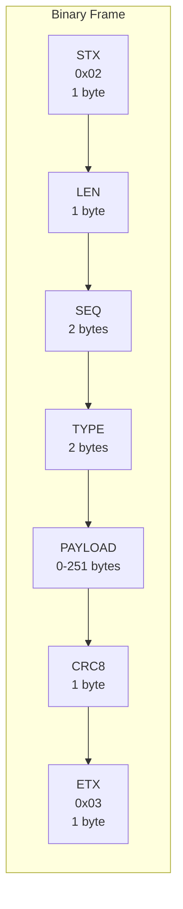
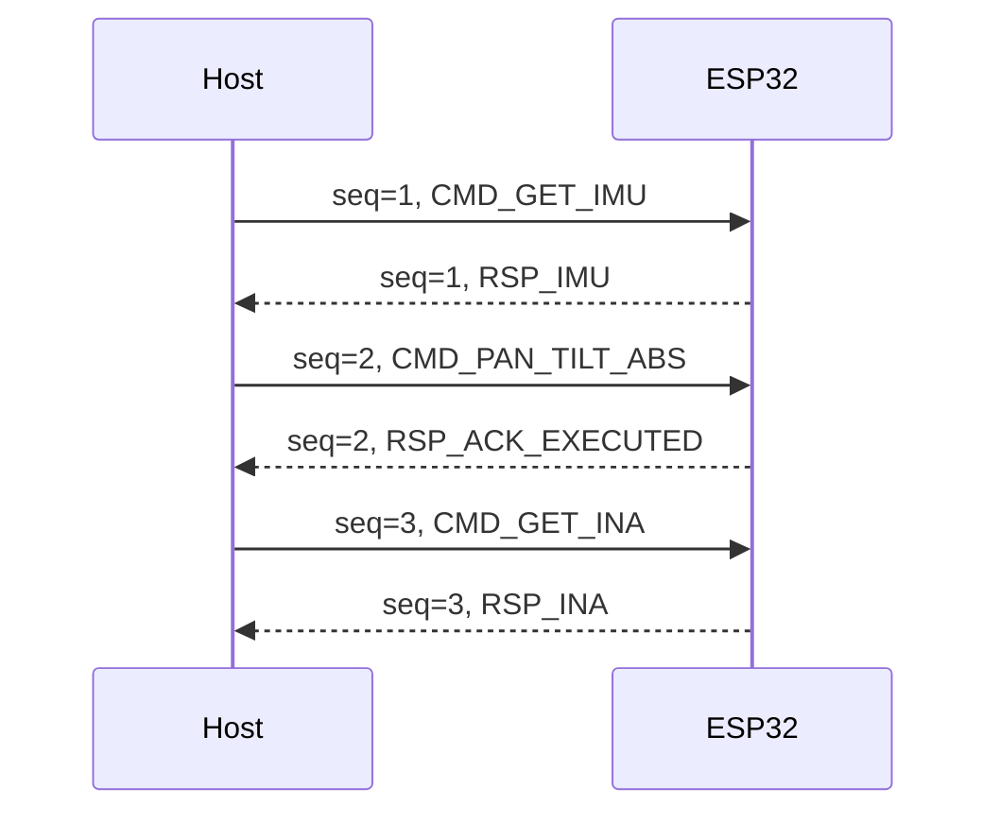
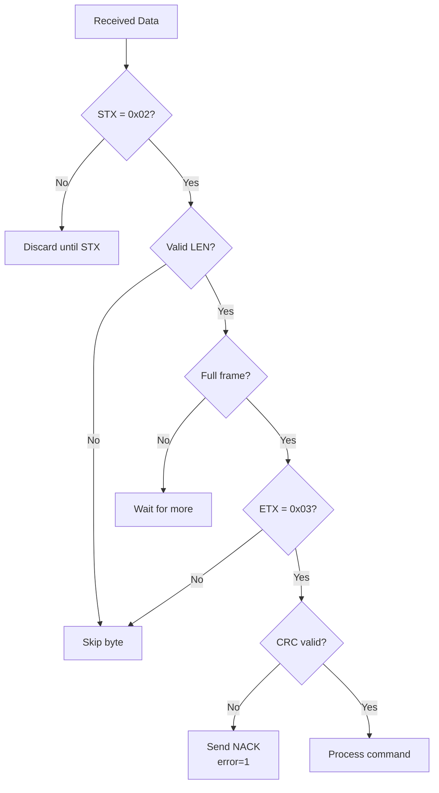

# Binary Protocol Specification

## Overview

The Pan-Tilt Controller uses a custom binary protocol over UART for communication between the host PC and ESP32. The protocol provides:
- Compact binary encoding
- CRC8 error detection
- Sequence number tracking
- Bidirectional communication

## Physical Layer

| Parameter | Value |
|-----------|-------|
| Interface | UART (USB-Serial) |
| Baud Rate | 921600 |
| Data Bits | 8 |
| Parity | None |
| Stop Bits | 1 |
| Flow Control | None |

---

## Frame Format



### Field Definitions

| Field | Size | Description |
|-------|------|-------------|
| STX | 1 byte | Start of frame marker (0x02) |
| LEN | 1 byte | Length of SEQ + TYPE + PAYLOAD (4-255) |
| SEQ | 2 bytes | Sequence number (little-endian) |
| TYPE | 2 bytes | Command/Response type (little-endian) |
| PAYLOAD | 0-251 bytes | Variable data |
| CRC8 | 1 byte | Checksum of LEN+SEQ+TYPE+PAYLOAD |
| ETX | 1 byte | End of frame marker (0x03) |

### Frame Size

- Minimum: 8 bytes (no payload)
- Maximum: 259 bytes (251 byte payload)
- Formula: `frame_size = 1 + 1 + LEN + 1 + 1 = LEN + 4`

---

## Byte Order

All multi-byte values are **little-endian**:

```
uint16_t value = 0x1234
Wire format: [0x34] [0x12]

uint32_t value = 0x12345678
Wire format: [0x78] [0x56] [0x34] [0x12]

float value (IEEE 754 single precision)
Wire format: 4 bytes, little-endian
```

---

## CRC8 Checksum

### Algorithm

| Parameter | Value |
|-----------|-------|
| Polynomial | 0x07 |
| Initial Value | 0x00 |
| Final XOR | 0x00 |
| Reflect Input | No |
| Reflect Output | No |

### Coverage

CRC8 is calculated over: `LEN + SEQ_L + SEQ_H + TYPE_L + TYPE_H + PAYLOAD`

### Implementation (C)

```c
uint8_t crc8(const uint8_t* data, size_t len) {
    uint8_t crc = 0x00;
    for (size_t i = 0; i < len; i++) {
        crc ^= data[i];
        for (int j = 0; j < 8; j++) {
            if (crc & 0x80)
                crc = (crc << 1) ^ 0x07;
            else
                crc <<= 1;
        }
    }
    return crc;
}
```

### Implementation (Python)

```python
def crc8(data):
    crc = 0x00
    for byte in data:
        crc ^= byte
        for _ in range(8):
            if crc & 0x80:
                crc = (crc << 1) ^ 0x07
            else:
                crc <<= 1
            crc &= 0xFF
    return crc
```

---

## Sequence Numbers

### Purpose

- Request/response correlation
- Duplicate detection
- Out-of-order detection

### Rules

1. Host increments sequence for each command
2. ESP32 echoes sequence in response
3. Range: 0-65535 (wraps around)
4. Independent counters for host and device

### Example



---

## Message Types

### Command Types (Host → ESP32)

| Range | Category |
|-------|----------|
| 100-199 | Motion commands |
| 200-299 | Sensor queries |
| 300-399 | Configuration |
| 500-599 | Servo direct access |
| 600-699 | OTA commands |

### Response Types (ESP32 → Host)

| Range | Category |
|-------|----------|
| 1-10 | Acknowledgments |
| 1000-1099 | Sensor data |
| 2600-2699 | OTA responses |

---

## Frame Construction Example

### Command: Move to pan=45°, tilt=-30°

**Parameters:**
- seq = 1
- type = 133 (CMD_PAN_TILT_ABS)
- pan = 45.0 (float)
- tilt = -30.0 (float)
- speed = 500
- accel = 100

**Payload (12 bytes):**
```
pan (float):   34 00 00 42  (45.0 in IEEE 754 LE)
tilt (float):  00 00 F0 C1  (-30.0 in IEEE 754 LE)
speed (H):     F4 01        (500)
accel (H):     64 00        (100)
```

**Frame Construction:**
```
LEN = 4 + 12 = 16 (0x10)

CRC data: 10 01 00 85 00 34 00 00 42 00 00 F0 C1 F4 01 64 00
CRC8 = calculated value

Frame: 02 10 01 00 85 00 34 00 00 42 00 00 F0 C1 F4 01 64 00 [CRC] 03
```

---

## Error Handling

### Frame Validation



### NACK Error Codes

| Code | Name | Description |
|------|------|-------------|
| 1 | CHECKSUM | CRC8 validation failed |
| 2 | UNKNOWN | Unknown command type |
| 3 | STATE_REJECTED | Command invalid in current state |
| 4 | EXEC_FAILED | Command execution failed |

---

## Timing Considerations

### Response Timing

| Command Type | Typical Response Time |
|--------------|----------------------|
| Query (IMU/INA) | < 5 ms |
| Move (Tracking) | 5-10 ms |
| Move (Non-tracking) | 20-50 ms |
| OTA chunk | 10-50 ms |

### Timeouts

| Scenario | Timeout |
|----------|---------|
| Command response | 1000 ms |
| OTA chunk | 60000 ms |
| Heartbeat | Configurable |

---

## Data Type Encoding

### Primitive Types

| Type | Size | Encoding |
|------|------|----------|
| `uint8` / `B` | 1 | Unsigned byte |
| `int8` / `b` | 1 | Signed byte |
| `uint16` / `H` | 2 | Little-endian unsigned |
| `int16` / `h` | 2 | Little-endian signed |
| `uint32` / `I` | 4 | Little-endian unsigned |
| `int32` / `i` | 4 | Little-endian signed |
| `float` / `f` | 4 | IEEE 754 single, LE |

### Struct Pack Format (Python)

```python
import struct

# Little-endian format
struct.pack('<ffHH', pan, tilt, speed, accel)
# < = little-endian
# f = float (4 bytes)
# H = uint16 (2 bytes)
```

---

## Periodic Data

### Feedback Flow

When enabled, ESP32 sends periodic sensor data without host requests.

**Enable:**
```
CMD_FEEDBACK_FLOW (131) with payload [0x01]
```

**Disable:**
```
CMD_FEEDBACK_FLOW (131) with payload [0x00]
```

**Interval:**
```
CMD_FEEDBACK_INTERVAL (142) with payload [ms_low, ms_high]
```

### Periodic Response Types

| Type | Content | Default Rate |
|------|---------|--------------|
| 1002 | IMU data | 10 Hz |
| 1010 | INA data | 10 Hz |
| 1011 | Servo feedback | 10 Hz |

---

## Related Documentation

- [Command Reference](command-reference.md) - All command types
- [Response Reference](response-reference.md) - All response types
- [Protocol Encoder](../backend/protocol-encoder.md) - Python implementation
