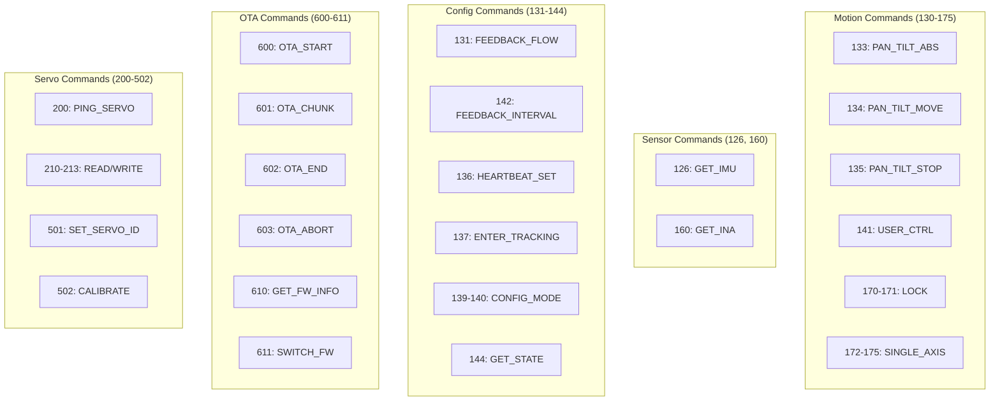

# Command Reference

## Overview

Commands are sent from Host to ESP32. Each command has a type ID, optional payload, and receives a response.

## Command Categories



---

## Motion Commands

### CMD_PAN_TILT_ABS (133)

Moves both axes to absolute positions.

**Payload (12 bytes):**

| Offset | Type | Field | Range |
|--------|------|-------|-------|
| 0 | float | pan | -180.0 to 180.0 |
| 4 | float | tilt | -90.0 to 120.0 |
| 8 | uint16 | speed | 0-65535 |
| 10 | uint16 | accel | 0-65535 |

**Response:** ACK_EXECUTED (2) with 8-byte servo feedback

**Example:**
```python
payload = struct.pack('<ffHH', 45.0, -30.0, 500, 100)
```

---

### CMD_PAN_TILT_MOVE (134)

Velocity-based movement for both axes.

**Payload (12 bytes):**

| Offset | Type | Field | Description |
|--------|------|-------|-------------|
| 0 | float | pan | Pan velocity |
| 4 | float | tilt | Tilt velocity |
| 8 | uint16 | speed_x | Pan speed limit |
| 10 | uint16 | speed_y | Tilt speed limit |

**Response:** ACK_EXECUTED (2)

---

### CMD_PAN_TILT_STOP (135)

Stops motion and disables torque.

**Payload:** None

**Response:** ACK_EXECUTED (2)

**Behavior:**
- Disables torque on both servos
- Sets state to IDLE
- Resets locked flags

---

### CMD_USER_CTRL (141)

Relative movement control.

**Payload (5 bytes):**

| Offset | Type | Field | Values |
|--------|------|-------|--------|
| 0 | int8 | x | -1, 0, 1, 2 |
| 1 | int8 | y | -1, 0, 1, 2 |
| 2 | uint16 | speed | Movement speed |

**Values:**
- -1: Move negative direction
- 0: Stop
- 1: Move positive direction
- 2: Move fast positive

**Response:** ACK_EXECUTED (2)

---

### CMD_PAN_LOCK (170) / CMD_TILT_LOCK (171)

Lock or unlock individual axis.

**Payload (1 byte):**

| Offset | Type | Field | Values |
|--------|------|-------|--------|
| 0 | uint8 | cmd | 0=unlock, 1=lock |

**Response:** ACK_EXECUTED (2)

**Behavior:**
- Lock: Enable torque, hold current position
- Unlock: Disable torque, allow free movement

---

### CMD_PAN_ONLY_ABS (172) / CMD_TILT_ONLY_ABS (173)

Single axis absolute positioning.

**Payload (8 bytes):**

| Offset | Type | Field |
|--------|------|-------|
| 0 | float | angle |
| 4 | uint16 | speed |
| 6 | uint16 | accel |

**Response:** ACK_EXECUTED (2)

---

### CMD_PAN_ONLY_MOVE (174) / CMD_TILT_ONLY_MOVE (175)

Single axis velocity movement.

**Payload (6 bytes):**

| Offset | Type | Field |
|--------|------|-------|
| 0 | float | velocity |
| 4 | uint16 | speed |

**Response:** ACK_EXECUTED (2)

---

## Sensor Commands

### CMD_GET_IMU (126)

Requests IMU sensor data.

**Payload:** None

**Response:** RSP_IMU (1002) with 46-50 bytes

---

### CMD_GET_INA (160)

Requests power monitor data.

**Payload:** None

**Response:** RSP_INA (1010) with 21 bytes

---

## Configuration Commands

### CMD_FEEDBACK_FLOW (131)

Enables/disables periodic feedback.

**Payload (1 byte):**

| Offset | Type | Field | Values |
|--------|------|-------|--------|
| 0 | uint8 | enable | 0=disable, 1=enable |

**Response:** ACK_EXECUTED (2)

---

### CMD_FEEDBACK_INTERVAL (142)

Sets periodic feedback interval.

**Payload (2 bytes):**

| Offset | Type | Field | Range |
|--------|------|-------|-------|
| 0 | uint16 | ms | 10-65535 |

**Response:** ACK_EXECUTED (2)

---

### CMD_HEARTBEAT_SET (136)

Sets heartbeat watchdog timeout.

**Payload (2 bytes):**

| Offset | Type | Field | Description |
|--------|------|-------|-------------|
| 0 | uint16 | ms | Timeout (0=disable) |

**Response:** ACK_EXECUTED (2)

**Behavior:** If no command received within timeout, motion stops and torque disables.

---

### CMD_ENTER_TRACKING (137)

Enters TRACKING state for fast motion control.

**Payload:** None

**Response:** ACK_EXECUTED (2)

**Behavior:**
- Configures servos once (mode, torque limits)
- Enables fast command processing
- Disables EPROM operations per move

---

### CMD_ENTER_CONFIG (139)

Enters CONFIG state for servo testing.

**Payload:** None

**Response:** ACK_EXECUTED (2)

**Allowed Commands:** Servo register read/write, calibration

---

### CMD_EXIT_CONFIG (140)

Exits CONFIG state, returns to IDLE.

**Payload:** None

**Response:** ACK_EXECUTED (2)

---

### CMD_GET_STATE (144)

Queries current gimbal state.

**Payload:** None

**Response:** RSP_STATE (1013) with 1 byte

---

## OTA Commands

### CMD_OTA_START (600)

Begins firmware update session.

**Payload (9+ bytes):**

| Offset | Type | Field | Description |
|--------|------|-------|-------------|
| 0 | uint32 | size | Firmware size |
| 4 | uint8 | hash_type | 1=CRC32, 2=SHA256 |
| 5 | 4/32 bytes | hash | Expected hash |

**Response:** RSP_OTA_STARTED (2600) or RSP_OTA_NACK (2603)

---

### CMD_OTA_CHUNK (601)

Sends firmware data chunk.

**Payload (6+N bytes):**

| Offset | Type | Field | Description |
|--------|------|-------|-------------|
| 0 | uint32 | offset | Byte offset |
| 4 | uint16 | len | Chunk length |
| 6 | bytes | data | Chunk data (max 2048) |

**Response:** RSP_OTA_CHUNK (2601) or RSP_OTA_NACK (2603)

---

### CMD_OTA_END (602)

Finalizes OTA and requests verification.

**Payload:** None

**Response:** RSP_OTA_DONE (2602) or RSP_OTA_NACK (2603)

**Behavior:** Verifies hash, commits if valid, reboots.

---

### CMD_OTA_ABORT (603)

Aborts OTA session.

**Payload:** None

**Response:** RSP_OTA_NACK (2603) with error=ABORTED

---

### CMD_GET_FW_INFO (610)

Queries firmware version information.

**Payload:** None

**Response:** RSP_FW_INFO (2610) with 65 bytes

---

### CMD_SWITCH_FW (611)

Switches to alternate firmware slot.

**Payload (1 byte):**

| Offset | Type | Field | Values |
|--------|------|-------|--------|
| 0 | uint8 | slot | 0=A, 1=B |

**Response:** ACK_EXECUTED (2) then reboot

---

## Servo Commands

### CMD_PING_SERVO (200)

Tests servo communication.

**Payload (1 byte):**

| Offset | Type | Field |
|--------|------|-------|
| 0 | uint8 | servo_id |

**Response:** ACK_EXECUTED (2) or NACK (3)

---

### CMD_READ_BYTE (210) / CMD_READ_WORD (212)

Reads servo register.

**Payload (2 bytes):**

| Offset | Type | Field |
|--------|------|-------|
| 0 | uint8 | servo_id |
| 1 | uint8 | address |

**Response:** ACK_EXECUTED (2) with 1 or 2 byte payload

---

### CMD_WRITE_BYTE (211) / CMD_WRITE_WORD (213)

Writes servo register.

**Payload (3-4 bytes):**

| Offset | Type | Field |
|--------|------|-------|
| 0 | uint8 | servo_id |
| 1 | uint8 | address |
| 2 | 1-2 bytes | value |

**Response:** ACK_EXECUTED (2) or NACK (3)

---

### CMD_SET_SERVO_ID (501)

Changes servo ID.

**Payload (2 bytes):**

| Offset | Type | Field |
|--------|------|-------|
| 0 | uint8 | from_id |
| 1 | uint8 | to_id |

**Response:** ACK_EXECUTED (2)

---

### CMD_CALIBRATE (502)

Servo calibration command.

**Payload (1 byte):**

| Offset | Type | Field |
|--------|------|-------|
| 0 | uint8 | servo_id |

**Response:** ACK_EXECUTED (2)

---

## Command Summary Table

| ID | Name | Payload | Response |
|----|------|---------|----------|
| 126 | GET_IMU | 0 | IMU (1002) |
| 131 | FEEDBACK_FLOW | 1 | ACK (2) |
| 133 | PAN_TILT_ABS | 12 | ACK (2) + feedback |
| 134 | PAN_TILT_MOVE | 12 | ACK (2) |
| 135 | PAN_TILT_STOP | 0 | ACK (2) |
| 136 | HEARTBEAT_SET | 2 | ACK (2) |
| 137 | ENTER_TRACKING | 0 | ACK (2) |
| 139 | ENTER_CONFIG | 0 | ACK (2) |
| 140 | EXIT_CONFIG | 0 | ACK (2) |
| 141 | USER_CTRL | 5 | ACK (2) |
| 142 | FEEDBACK_INTERVAL | 2 | ACK (2) |
| 144 | GET_STATE | 0 | STATE (1013) |
| 160 | GET_INA | 0 | INA (1010) |
| 170 | PAN_LOCK | 1 | ACK (2) |
| 171 | TILT_LOCK | 1 | ACK (2) |
| 172 | PAN_ONLY_ABS | 8 | ACK (2) |
| 173 | TILT_ONLY_ABS | 8 | ACK (2) |
| 174 | PAN_ONLY_MOVE | 6 | ACK (2) |
| 175 | TILT_ONLY_MOVE | 6 | ACK (2) |
| 200 | PING_SERVO | 1 | ACK (2) |
| 210 | READ_BYTE | 2 | ACK (2) + 1 |
| 211 | WRITE_BYTE | 3 | ACK (2) |
| 212 | READ_WORD | 2 | ACK (2) + 2 |
| 213 | WRITE_WORD | 4 | ACK (2) |
| 501 | SET_SERVO_ID | 2 | ACK (2) |
| 502 | CALIBRATE | 1 | ACK (2) |
| 600 | OTA_START | 9+ | OTA_STARTED (2600) |
| 601 | OTA_CHUNK | 6+N | OTA_CHUNK (2601) |
| 602 | OTA_END | 0 | OTA_DONE (2602) |
| 603 | OTA_ABORT | 0 | OTA_NACK (2603) |
| 610 | GET_FW_INFO | 0 | FW_INFO (2610) |
| 611 | SWITCH_FW | 1 | ACK (2) |

---

## Related Documentation

- [Response Reference](response-reference.md) - Response types
- [Binary Protocol](binary-protocol.md) - Frame format
