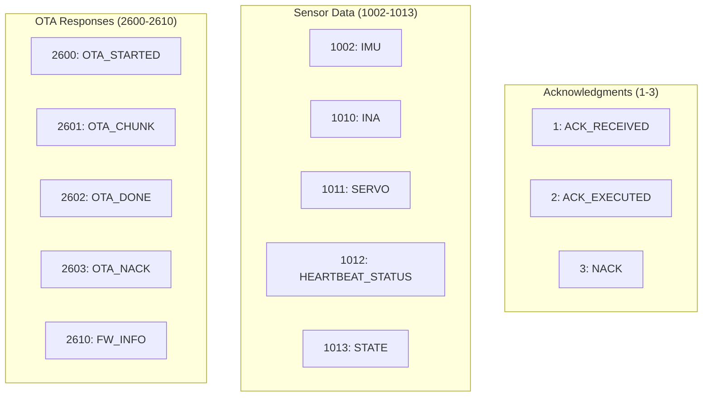

# Response Reference

## Overview

Responses are sent from ESP32 to Host. Each response echoes the command sequence number and contains type-specific payload.

## Response Categories



---

## Acknowledgment Responses

### RSP_ACK_RECEIVED (1)

Confirms frame was received and parsed.

**Payload:** None (0 bytes)

**Usage:** Optional acknowledgment for non-critical commands.

---

### RSP_ACK_EXECUTED (2)

Confirms command was executed successfully.

**Payload:** Variable (depends on command)

**For Move Commands (8 bytes):**

| Offset | Type | Field | Description |
|--------|------|-------|-------------|
| 0 | int16 | pan_load | Pan torque load |
| 2 | int16 | pan_pos | Pan position (0-4095) |
| 4 | int16 | tilt_load | Tilt torque load |
| 6 | int16 | tilt_pos | Tilt position (0-4095) |

**For Other Commands:** None (0 bytes)

---

### RSP_NACK (3)

Indicates command failed.

**Payload (1 byte):**

| Offset | Type | Field | Values |
|--------|------|-------|--------|
| 0 | uint8 | error_code | See table |

**Error Codes:**

| Code | Name | Description |
|------|------|-------------|
| 1 | CHECKSUM | CRC8 validation failed |
| 2 | UNKNOWN | Unknown command type |
| 3 | STATE_REJECTED | Command invalid in current state |
| 4 | EXEC_FAILED | Command execution failed |

---

## Sensor Data Responses

### RSP_IMU (1002)

IMU sensor data (accelerometer, gyroscope, magnetometer).

**Payload (46-50 bytes):**

| Offset | Type | Field | Unit |
|--------|------|-------|------|
| 0 | float | roll | degrees |
| 4 | float | pitch | degrees |
| 8 | float | yaw | degrees |
| 12 | float | accel_x | mg |
| 16 | float | accel_y | mg |
| 20 | float | accel_z | mg |
| 24 | float | gyro_x | dps |
| 28 | float | gyro_y | dps |
| 32 | float | gyro_z | dps |
| 36 | int16 | mag_x | uT |
| 38 | int16 | mag_y | uT |
| 40 | int16 | mag_z | uT |
| 42 | float | temperature | Celsius |

**Decoding (Python):**
```python
def decode_imu(payload):
    values = struct.unpack('<fffffffffhhhf', payload[:46])
    return {
        'roll': values[0],
        'pitch': values[1],
        'yaw': values[2],
        'ax': values[3], 'ay': values[4], 'az': values[5],
        'gx': values[6], 'gy': values[7], 'gz': values[8],
        'mx': values[9], 'my': values[10], 'mz': values[11],
        'temp': values[12]
    }
```

---

### RSP_INA (1010)

Power monitor data (INA219).

**Payload (21 bytes):**

| Offset | Type | Field | Unit |
|--------|------|-------|------|
| 0 | float | bus_voltage | V |
| 4 | float | shunt_voltage | mV |
| 8 | float | load_voltage | V |
| 12 | float | current | mA |
| 16 | float | power | mW |
| 20 | uint8 | overflow | 0/1 |

**Decoding (Python):**
```python
def decode_ina(payload):
    values = struct.unpack('<fffffB', payload)
    return {
        'bus_v': values[0],
        'shunt_mv': values[1],
        'load_v': values[2],
        'current_ma': values[3],
        'power_mw': values[4],
        'overflow': bool(values[5])
    }
```

---

### RSP_SERVO (1011)

Servo feedback data.

**Payload (8 bytes):**

| Offset | Type | Field | Description |
|--------|------|-------|-------------|
| 0 | int16 | pan_pos | Pan position (0-4095) |
| 2 | int16 | pan_load | Pan torque load |
| 4 | int16 | tilt_pos | Tilt position (0-4095) |
| 6 | int16 | tilt_load | Tilt torque load |

**Decoding (Python):**
```python
def decode_servo(payload):
    values = struct.unpack('<hhhh', payload)
    return {
        'pan_pos': values[0],
        'pan_load': values[1],
        'tilt_pos': values[2],
        'tilt_load': values[3]
    }
```

---

### RSP_HEARTBEAT_STATUS (1012)

Heartbeat watchdog status.

**Payload (3 bytes):**

| Offset | Type | Field | Description |
|--------|------|-------|-------------|
| 0 | uint8 | alive | 1=alive, 0=timeout triggered |
| 1 | uint16 | timeout_ms | Current timeout setting |

---

### RSP_STATE (1013)

Current gimbal state.

**Payload (1 byte):**

| Offset | Type | Field | Values |
|--------|------|-------|--------|
| 0 | uint8 | state | See table |

**State Values:**

| Value | State | Description |
|-------|-------|-------------|
| 0 | IDLE | Ready, accepts all commands |
| 1 | TRACKING | Fast motion control |
| 2 | CONFIG | Servo configuration mode |
| 3 | OTA_RECEIVE | Receiving firmware update |

---

## OTA Responses

### RSP_OTA_STARTED (2600)

OTA session started successfully.

**Payload (5 bytes):**

| Offset | Type | Field | Description |
|--------|------|-------|-------------|
| 0 | uint8 | inactive_slot | 0=A, 1=B (target slot) |
| 1 | uint32 | slot_size | Maximum firmware size |

---

### RSP_OTA_CHUNK (2601)

OTA chunk written successfully.

**Payload (5 bytes):**

| Offset | Type | Field | Description |
|--------|------|-------|-------------|
| 0 | uint32 | bytes_written | Total bytes written |
| 4 | uint8 | progress_pct | Progress 0-100% |

---

### RSP_OTA_DONE (2602)

OTA completed successfully.

**Payload (1 byte):**

| Offset | Type | Field | Values |
|--------|------|-------|--------|
| 0 | uint8 | status | 0=OK (will reboot) |

**Note:** Device reboots shortly after sending this response.

---

### RSP_OTA_NACK (2603)

OTA error occurred.

**Payload (1 byte):**

| Offset | Type | Field | Values |
|--------|------|-------|--------|
| 0 | uint8 | error | See table |

**OTA Error Codes:**

| Code | Name | Description |
|------|------|-------------|
| 1 | SIZE | Invalid firmware size |
| 2 | CHECKSUM | Hash verification failed |
| 3 | FLASH | Flash write error |
| 4 | TIMEOUT | Chunk timeout (60s) |
| 5 | ABORTED | User aborted |

---

### RSP_FW_INFO (2610)

Firmware version information.

**Payload (65 bytes):**

| Offset | Type | Field | Description |
|--------|------|-------|-------------|
| 0 | uint8 | active_slot | 0=A, 1=B |
| 1 | char[32] | version_a | Slot A version string |
| 33 | char[32] | version_b | Slot B version string |

**Decoding (Python):**
```python
def decode_fw_info(payload):
    active = payload[0]
    ver_a = payload[1:33].decode('utf-8').rstrip('\x00')
    ver_b = payload[33:65].decode('utf-8').rstrip('\x00')
    return {
        'active_slot': active,
        'version_a': ver_a,
        'version_b': ver_b
    }
```

---

## Response Summary Table

| ID | Name | Payload Size | Description |
|----|------|--------------|-------------|
| 1 | ACK_RECEIVED | 0 | Frame parsed OK |
| 2 | ACK_EXECUTED | 0 or 8 | Command executed |
| 3 | NACK | 1 | Command failed |
| 1002 | IMU | 46-50 | IMU sensor data |
| 1010 | INA | 21 | Power monitor data |
| 1011 | SERVO | 8 | Servo feedback |
| 1012 | HEARTBEAT_STATUS | 3 | Watchdog status |
| 1013 | STATE | 1 | Gimbal state |
| 2600 | OTA_STARTED | 5 | OTA session ready |
| 2601 | OTA_CHUNK | 5 | Chunk written |
| 2602 | OTA_DONE | 1 | OTA complete |
| 2603 | OTA_NACK | 1 | OTA error |
| 2610 | FW_INFO | 65 | Firmware versions |

---

## Periodic Responses

When feedback flow is enabled, these responses are sent automatically:

| Response | Content | Default Interval |
|----------|---------|------------------|
| RSP_IMU (1002) | IMU data | 100 ms |
| RSP_INA (1010) | Power data | 100 ms |
| RSP_SERVO (1011) | Servo feedback | 100 ms |

The interval can be changed with CMD_FEEDBACK_INTERVAL (142).

---

## Related Documentation

- [Command Reference](command-reference.md) - Command types
- [Binary Protocol](binary-protocol.md) - Frame format
