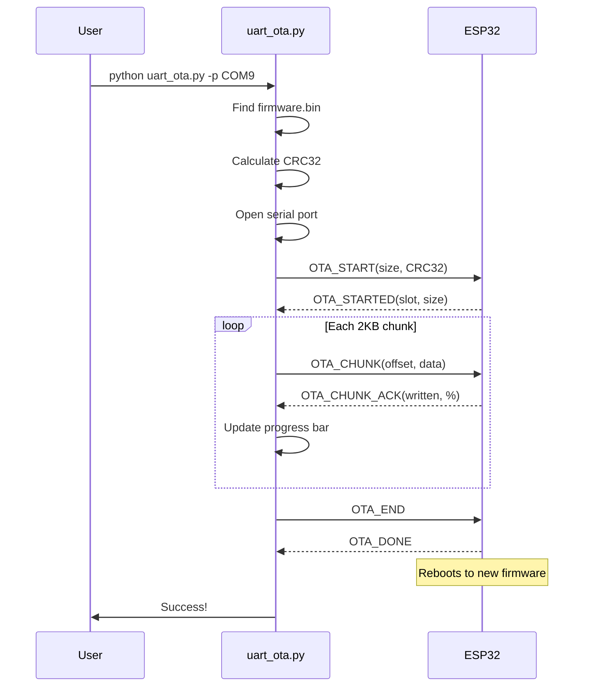

# OTA Uploader Tool

**File:** `tools/uart_ota.py`

## Overview

The UART OTA tool uploads firmware to the ESP32 without requiring manual bootloader mode. It uses the custom binary protocol to stream firmware chunks with hash verification.

## Features

- Automatic firmware discovery from PlatformIO build
- CRC32 hash verification
- Progress display with ETA
- Retry on failure
- Background operation support

## Usage

### Basic Usage

```bash
python uart_ota.py -p <PORT>
```

**Example:**
```bash
# Windows
python uart_ota.py -p COM9

# Linux/Mac
python uart_ota.py -p /dev/ttyUSB0
```

### With Explicit Firmware Path

```bash
python uart_ota.py -p <PORT> -f <FIRMWARE_PATH>
```

**Example:**
```bash
python uart_ota.py -p COM9 -f ../.pio/build/esp32s3_ota/firmware.bin
```

### Command Line Options

| Option | Short | Description | Default |
|--------|-------|-------------|---------|
| `--port` | `-p` | Serial port | Required |
| `--firmware` | `-f` | Firmware file path | Auto-detect |
| `--baud` | `-b` | Baud rate | 921600 |
| `--chunk-size` | `-c` | Chunk size (bytes) | 2048 |
| `--timeout` | `-t` | Response timeout (sec) | 5 |
| `--verbose` | `-v` | Verbose output | False |

---

## Operation Flow



---

## Implementation Details

### Firmware Discovery

```python
def find_firmware():
    """
    Search for firmware.bin in standard PlatformIO locations.
    """
    search_paths = [
        '../.pio/build/esp32s3_ota/firmware.bin',
        '.pio/build/esp32s3_ota/firmware.bin',
        'firmware.bin'
    ]
    for path in search_paths:
        if os.path.exists(path):
            return path
    return None
```

### CRC32 Calculation

```python
import zlib

def calculate_crc32(data):
    """
    Calculate CRC32 checksum of firmware.
    """
    return zlib.crc32(data) & 0xFFFFFFFF
```

### Chunk Transmission

```python
def send_chunks(serial, firmware_data, chunk_size=2048):
    """
    Send firmware in chunks with progress tracking.
    """
    total_size = len(firmware_data)
    offset = 0
    seq = 0

    while offset < total_size:
        chunk = firmware_data[offset:offset + chunk_size]
        frame = cmd_ota_chunk(seq, offset, chunk)
        serial.write(frame)

        # Wait for ACK
        response = wait_for_response(serial, timeout=5)
        if not response or response['type'] != RSP_OTA_CHUNK:
            raise OTAError("Chunk failed")

        offset += len(chunk)
        seq += 1

        # Update progress
        progress = (offset / total_size) * 100
        print(f"\rProgress: {progress:.1f}%", end='')
```

---

## Error Handling

### OTA Errors

| Error | Cause | Recovery |
|-------|-------|----------|
| SIZE | Firmware too large | Check partition size |
| CHECKSUM | Hash mismatch | Retry upload |
| FLASH | Write failure | Check flash health |
| TIMEOUT | No response | Check connection |
| ABORTED | User cancelled | Retry |

### Error Recovery

```python
def upload_with_retry(port, firmware_path, max_retries=3):
    """
    Attempt upload with retry on failure.
    """
    for attempt in range(max_retries):
        try:
            upload_firmware(port, firmware_path)
            return True
        except OTAError as e:
            print(f"Attempt {attempt + 1} failed: {e}")
            if attempt < max_retries - 1:
                print("Retrying...")
                time.sleep(2)
    return False
```

---

## Progress Display

### Console Output

```
Loading firmware: firmware.bin (524288 bytes)
CRC32: 0xA1B2C3D4
Opening COM9 at 921600 baud...
Starting OTA to slot B...
Progress: [████████████████████░░░░░░░░░░] 67.3% | 352KB/524KB | ETA: 12s
```

### Verbose Mode

```
[DEBUG] TX: OTA_START size=524288 hash_type=1 crc32=0xA1B2C3D4
[DEBUG] RX: OTA_STARTED slot=1 size=2097152
[DEBUG] TX: OTA_CHUNK offset=0 len=2048
[DEBUG] RX: OTA_CHUNK_ACK written=2048 progress=0%
[DEBUG] TX: OTA_CHUNK offset=2048 len=2048
...
```

---

## Integration with PlatformIO

### Build and Upload Script

```bash
#!/bin/bash
# Build and upload via OTA

# Build firmware
pio run -e esp32s3_ota

# Upload via OTA
python tools/uart_ota.py -p $1
```

### platformio.ini Configuration

```ini
[env:esp32s3_ota]
platform = espressif32
board = esp32-s3-devkitc-1
framework = arduino
board_build.partitions = partitions_ota.csv
upload_protocol = custom
upload_command = python tools/uart_ota.py -p $UPLOAD_PORT
```

---

## Troubleshooting

### Common Issues

| Issue | Cause | Solution |
|-------|-------|----------|
| Port not found | Wrong port name | Check `ls /dev/tty*` or Device Manager |
| Timeout on START | Device not responding | Reset device, check connection |
| Checksum fail | Transmission error | Retry, check cable |
| Stuck at 0% | Protocol mismatch | Check firmware version |

### Debug Commands

```bash
# List serial ports
python -m serial.tools.list_ports

# Test connection
python -c "import serial; s=serial.Serial('COM9', 921600); print('OK')"

# Verbose upload
python uart_ota.py -p COM9 -v
```

---

## Alternative: Manual Bootloader

If OTA fails, use manual bootloader mode:

```bash
# 1. Hold BOOT button
# 2. Press RESET button
# 3. Release BOOT button
# 4. Run upload
python waveshare_uploader.py --port COM9 --manual
```

---

## Related Documentation

- [OTA Handler](../firmware/ota-handler.md) - ESP32 OTA implementation
- [Binary Protocol](../protocol/binary-protocol.md) - Frame format
- [Command Reference](../protocol/command-reference.md) - OTA commands
